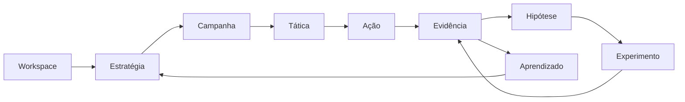
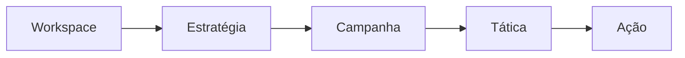
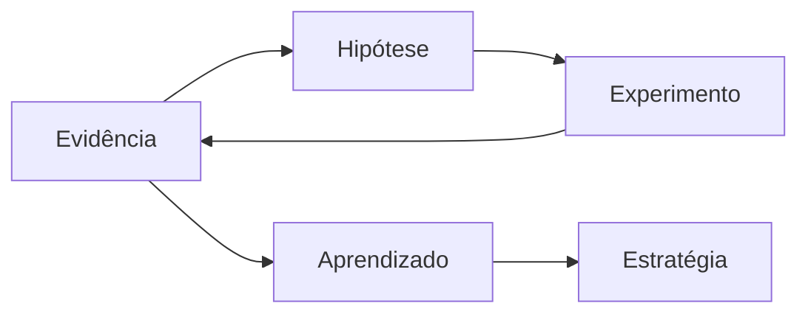

# VEKTOR — Modelo de Domínio

Sintetiza o modelo de domínio oficial definido no [Product Blueprint](../product-blueprint.md), Capítulo 3 ("Product Architecture") e Capítulo 6 ("Growth Framework"). Este documento cobre exclusivamente o domínio — entidades, responsabilidades e relações. Não documenta telas, UX ou implementação técnica; para isso, ver [`navigation.md`](./navigation.md) e [`ai.md`](./ai.md).

> Convenção: nome de entidade aparece sempre no singular (Hipótese, Experimento, Evidência, Aprendizado), mesmo quando o domínio acumula muitas instâncias delas. (Blueprint, Cap. 3.3)

## Entidades oficiais

| Entidade | Existe dentro de | Responsabilidade |
|---|---|---|
| **Workspace** | — | O limite de tenant: uma empresa, seus dados, sua equipe. |
| **Estratégia** | Workspace | Registra a intenção — o que a empresa decidiu perseguir e por quê. Torna toda Ação futura justificável. |
| **Campanha** | Estratégia | Traduz a intenção em uma aposta concreta — a iniciativa que operacionaliza um pedaço da Estratégia. |
| **Tática** | Campanha | Define a abordagem dentro da aposta — o "como" de uma Campanha. |
| **Ação** | Tática | A unidade executável — o que de fato é feito, agendado ou publicado. |
| **Evidência** | Ação ou Experimento | O registro bruto do que aconteceu — a materialização do princípio "todo trabalho gera evidências". |
| **Hipótese** | Evidência | Nasce de uma Evidência observada — nunca de opinião. Justifica um Experimento; não é, ela própria, onde o Experimento roda. |
| **Experimento** | Tática ou Ação | Um teste estruturado, sempre justificado por uma Hipótese — existe para gerar nova Evidência com intenção, não por acaso. |
| **Aprendizado** | Evidência (interpretada) | A conclusão acionável — o que a Evidência significa e o que fazer a respeito. Alimenta a próxima Estratégia. |

Não há entidades além destas nove. Módulos como Relatórios, Biblioteca e Configurações (ver [`navigation.md`](./navigation.md)) operam sobre estas entidades — não introduzem entidades próprias.

### Composição interna da Estratégia

A entidade Estratégia não é um campo único — é o resultado de uma metodologia estruturada (Blueprint, Cap. 5, "Marketing Planning Framework"): Diagnóstico, Mercado, Concorrentes, SWOT, ICP, Personas, Jornada do Cliente, Funis, Objetivos e Posicionamento são elementos que compõem a Estratégia, não entidades de domínio independentes. Ver Blueprint Cap. 5 para a cadeia de dependência completa entre eles.

## Hierarquia completa

## Fluxo de criação

A cadeia de criação é linear e hierárquica — cada entidade é filha da anterior:

Nenhum passo desta cadeia pode ser saltado: uma Ação não existe sem uma Tática, uma Tática não existe sem uma Campanha, uma Campanha não existe sem uma Estratégia (Blueprint, Cap. 3.1, princípio "Estratégia antes da execução"; Cap. 4, "Regra de entrada, não só princípio").

## Fluxo de aprendizagem

Ação e Experimento produzem Evidência. A partir daí, Evidência e Hipótese entram em loop até virarem Aprendizado, que realimenta a Estratégia:

Este loop é a mecânica interna do Growth Framework (Blueprint, Cap. 6.2), que o descreve em nível de processo: Resultados → Hipótese → Priorização → Experimento → Evidência → Aprendizado → Evolução da Estratégia. O diagrama acima é a mesma mecânica, em nível de domínio.

Aprendizado aponta de volta para Estratégia não como uma seta a mais — é literalmente o insumo que origina a próxima Estratégia do Workspace (Blueprint, Cap. 3.3).

## Regras de integridade do domínio

Estas regras são decisões arquiteturais registradas em [`DECISIONS.md`](../DECISIONS.md) — citadas aqui por completude do modelo:

- Um Workspace tem exatamente uma Estratégia ativa a qualquer momento (ADR-003).
- Uma Estratégia encerrada nunca recebe nova Campanha, Tática, Ação ou Experimento (ADR-004).
- Toda Campanha, Tática, Ação ou Experimento nasce dentro de uma Estratégia — nunca de forma independente (ADR-008).
