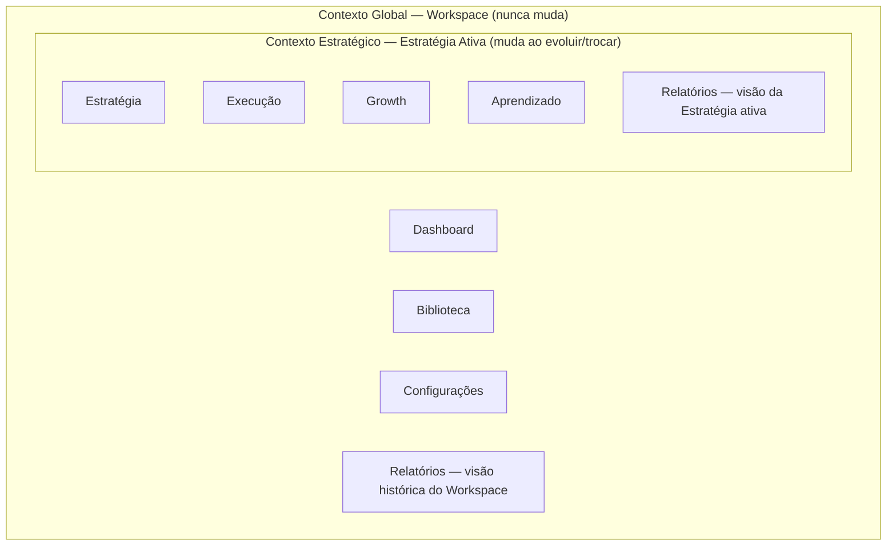
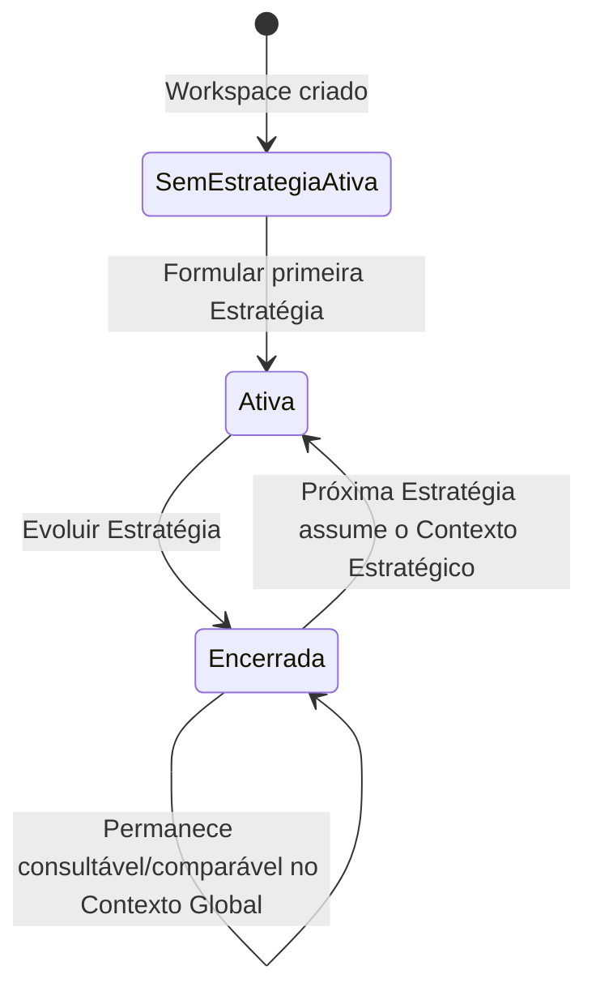

# VEKTOR — Navegação Oficial

Sintetiza a navegação definida no [Product Blueprint](../product-blueprint.md), Capítulo 3.5–3.6 ("Arquitetura da informação" e "Navegação e contexto") e Capítulo 4 ("UX Blueprint"). Cobre exclusivamente estrutura de navegação — para o modelo de dados por trás dela, ver [`domain.md`](./domain.md).

## Os dois níveis de contexto

Toda a navegação da VEKTOR opera em dois níveis, que nunca se confundem (ADR-007 em [`DECISIONS.md`](../DECISIONS.md)):

### Contexto Global — Workspace

Representa a empresa. Concentra o histórico completo — todas as Estratégias, passadas e a presente. **Nunca muda** quando o usuário navega entre Estratégias.

O usuário está no Contexto Global quando: consulta o Dashboard, navega pela Biblioteca, ajusta Configurações, ou olha a visão histórica de Relatórios comparando Estratégias diferentes.

### Contexto Estratégico — Estratégia Ativa

Toda Execução, Growth e Aprendizado acontecem sempre dentro de uma Estratégia específica — a Estratégia ativa. É onde o usuário passa o dia.

O usuário está no Contexto Estratégico quando: trabalha em Execução (Campanhas, Táticas, Ações), revisa recomendações em Growth, registra ou consulta Aprendizado, ou olha a visão de Relatórios da Estratégia em curso.

**Relatórios é a exceção parcial**: tem uma visão presa ao Contexto Estratégico e outra que pertence ao Contexto Global (ADR-005).

> O Workspace preserva a memória da empresa. A Estratégia concentra o trabalho ativo. (Blueprint, Cap. 3.6)

## Dashboard

Dashboard não é um módulo (ADR-001) — é a visão composta do Contexto Global. Aparece ao entrar no Workspace, sintetizando Estratégia + Execução + Growth + Aprendizado de todas as Estratégias (não só a ativa), para responder "o que merece minha atenção hoje" (Blueprint, Cap. 1, Proposta de valor).

## Navegação lateral (Sidebar)

A Sidebar lista os sete módulos oficiais e é o único elemento de navegação visível nos dois contextos simultaneamente:

| Módulo | Contexto |
|---|---|
| Estratégia | Estratégico |
| Execução | Estratégico |
| Growth | Estratégico |
| Aprendizado | Estratégico |
| Relatórios | Ambos (visão dupla — ver acima) |
| Biblioteca | Global |
| Configurações | Global |

Dashboard e "Evoluir Estratégia" não aparecem na Sidebar como destinos: Dashboard é a tela de entrada do Contexto Global (não um módulo, ver acima); "Evoluir Estratégia" é uma ação, não um destino (ADR-002).

## Navegação contextual

| Elemento | Nível | Função |
|---|---|---|
| **Seletor de Workspace** | Global | Qual empresa/tenant está ativo — sempre visível porque a plataforma é multi-tenant desde a base. |
| **Seletor de Estratégia Ativa** | Estratégico | Qual Estratégia, dentre as várias do Workspace, está sendo trabalhada agora — determina o que Execução, Growth e Aprendizado mostram, e qual é o recorte "ativo" de Relatórios. |
| **Breadcrumb** | Estratégico | Mostra a posição na cadeia de domínio (Estratégia › Campanha › Tática) dentro da Estratégia Ativa — o usuário nunca perde de vista de qual Estratégia aquela Ação depende. |

## Transição entre Estratégias

Uma Estratégia encerrada nunca retorna ao estado Ativa (ADR-004) — a transição `Encerrada --> Ativa` no diagrama acima refere-se sempre a uma **nova** Estratégia assumindo o Contexto Estratégico, nunca à reabertura da anterior.
