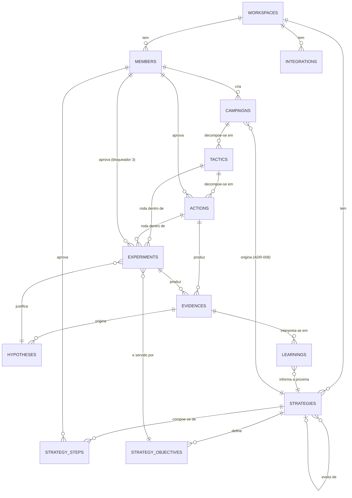
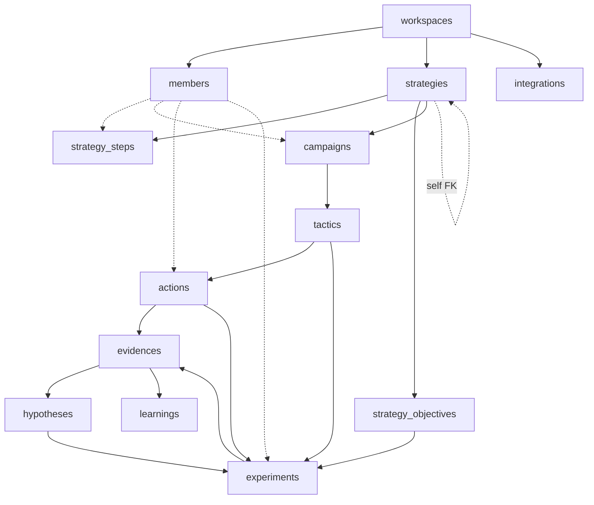

# VEKTOR — Modelo de Dados v1

> Papel de origem: Principal Database Architect. Este artefato transforma a especificação já congelada (Product Canon, Product Blueprint, `DECISIONS.md`, `architecture/*`, RFC-001 a RFC-008, `implementation-plan.md`, `docs/implementation/*`) em modelo de dados. Não redefine produto, não resolve lacunas de produto, não contém SQL nem migrations — apenas o modelo completo que os precede.

Toda tabela, coluna e constraint deste modelo aponta para a RFC/ADR que a origina. Onde a especificação registra uma lacuna (Bloqueadores 1, 2 e 3 da auditoria arquitetural), o modelo marca a estrutura correspondente como **🚧 pendente** — não inventa a decisão que falta.

## Legenda usada em todo o modelo

| Símbolo | Significado |
|---|---|
| 🔒 | Confirmado diretamente por RFC/ADR — nenhuma inferência. |
| ⚠️ | Inferência de engenharia necessária para o modelo funcionar — não há fonte de produto que afirme isso, mas nenhuma o contradiz. |
| 🚧 | Bloqueado por lacuna de produto ainda não resolvida (Bloqueador 1, 2 ou 3 da auditoria) — estrutura desenhada para não fechar a decisão pendente. |

## Convenção de nomenclatura

Tabelas e colunas em `snake_case`, inglês — convenção de schema/Drizzle/Postgres. A linguagem de domínio (Estratégia, Campanha, Ação...) permanece em português em toda a documentação de produto; este modelo é a tradução técnica, com cada tabela referenciando explicitamente seu nome de entidade oficial em `architecture/domain.md`.

## Documentos deste conjunto

- [`conceptual-model.md`](./conceptual-model.md) — entidades, relacionamentos, cardinalidades, ownership.
- [`logical-model.md`](./logical-model.md) — tabela por tabela: colunas, tipos, constraints, índices, chaves, origem, otimizações.
- [`physical-model.md`](./physical-model.md) — decisões de compatibilidade PostgreSQL/Supabase/Drizzle ORM.
- [`rls-policies.md`](./rls-policies.md) — políticas de Row Level Security.
- [`migrations-strategy.md`](./migrations-strategy.md) — estratégia de migrations, incluindo a resolução de uma dependência circular real entre três tabelas.
- [`versioning-strategy.md`](./versioning-strategy.md) — versionamento do banco ao longo do roadmap.

## Tabelas do modelo (13)

| Tabela | Entidade oficial (`domain.md`) | Origem |
|---|---|---|
| `workspaces` | Workspace | `domain.md`; ADR-003 |
| `members` | — (Identity/Access, fora das nove entidades do ciclo) 🔒 | ADR-011, ADR-012 (`DECISIONS.md`); RFC-008 |
| `strategies` | Estratégia | RFC-001; ADR-003; ADR-004 |
| `strategy_steps` | Composição interna da Estratégia | RFC-001 (Marketing Planning Framework) |
| `strategy_objectives` | Composição interna da Estratégia (etapa Objetivos) | RFC-001; RFC-003 critério nº2 |
| `campaigns` | Campanha | RFC-002 |
| `tactics` | Tática | RFC-002 |
| `actions` | Ação | RFC-002; RFC-004 |
| `evidences` | Evidência | RFC-002; RFC-003 |
| `hypotheses` | Hipótese | RFC-003; RFC-004 |
| `experiments` | Experimento | RFC-002; RFC-003; RFC-004 |
| `learnings` | Aprendizado | RFC-005 |
| `integrations` | — (Configurações) | RFC-008; Implementation Plan Fase 9 |

**Sem tabela própria, por decisão já registrada nas fontes:** Biblioteca (RFC-006: "não é, ela própria, uma entidade de domínio") e Relatórios (RFC-007: idem) são camadas de leitura/agregação sobre as tabelas acima — nenhuma delas introduz uma tabela nova. Dashboard (ADR-001) pelo mesmo motivo.

## ERD (Mermaid)

## Ordem de criação das tabelas

A ordem segue as dependências de chave estrangeira, com uma exceção real (dependência circular) resolvida explicitamente — ver [`migrations-strategy.md`](./migrations-strategy.md) para o detalhe completo:

1. `workspaces`
2. `members`
3. `strategies`
4. `strategy_steps`
5. `strategy_objectives`
6. `campaigns`
7. `tactics`
8. `actions`
9. `evidences` — criada **sem** a constraint de chave estrangeira para `experiments` (coluna existe, constraint é adicionada no passo 12).
10. `hypotheses`
11. `experiments`
12. **Alteração:** adicionar a chave estrangeira pendente de `evidences.experiment_id → experiments.id`.
13. `learnings`
14. `integrations`

## Dependências entre tabelas

A seta pontilhada `EX --> EV` e `HY --> EX` junto com `EV --> HY` formam o único ciclo real do modelo: `evidences → experiments → hypotheses → evidences`. Não é um erro de modelagem — reflete o próprio ciclo de Growth Framework descrito em `architecture/domain.md` ("Fluxo de aprendizagem": Evidência → Hipótese → Experimento → Evidência). Resolvido na criação de schema conforme `migrations-strategy.md`.

## Checklist para implementação em Drizzle

- [x] Decisão do Bloqueador 1 (Membro) confirmada — **ADR-011** (`DECISIONS.md`) ratifica a estrutura de `members`. Pendente apenas gerar a migration física (Migration 1, `migrations-strategy.md`).
- [x] Decisão do Bloqueador 3 (aprovação de Experimento) confirmada — **ADR-012** (`DECISIONS.md`): Membro com `role = 'admin'` aprova. `experiments.approved_by` pode se tornar obrigatório assim que a FK para `members.id` existir (depende apenas da Migration 1).
- [ ] Confirmar decisão do Bloqueador 2 (estado de Campanha/Tática) antes de adicionar qualquer coluna de status a `campaigns`/`tactics` — o modelo atual não tem essa coluna, de propósito.
- [ ] Declarar os enums Postgres nativos listados em `physical-model.md` via `pgEnum` do Drizzle antes de declarar as tabelas que os usam.
- [ ] Criar as tabelas na ordem listada acima; tratar `evidences.experiment_id` como constraint adicionada depois de `experiments` existir (ver `migrations-strategy.md`).
- [ ] Aplicar as políticas de RLS de `rls-policies.md` na mesma migration que cria cada tabela — nunca em uma migration separada e posterior (janela de exposição de dado entre as duas).
- [ ] Validar cada CHECK constraint polimórfica (`evidences`, `experiments`) com teste de integração antes de liberar a Fase 3/4 do Implementation Plan.
- [ ] Confirmar com `deployment/environments.md` (`docs/implementation/`) que `auth.users` do Supabase está disponível no ambiente antes de criar `members`.
