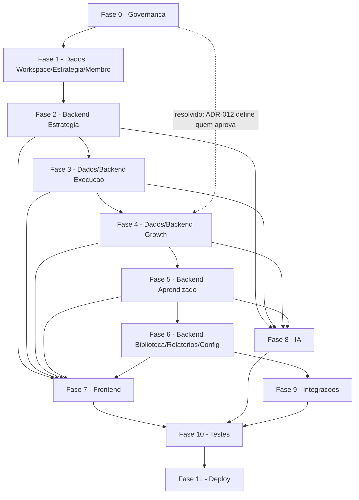

# VEKTOR — Implementation Plan v1

**Status:** Congelado
**Data:** 2026-07-26

Papel de origem: Tech Lead. Este documento não é uma RFC, não decide nada de produto e não altera nenhum documento congelado — apenas sequencia, em fases técnicas, o que RFC-001 a RFC-008, `DECISIONS.md` e `architecture/*.md` já aprovaram. Toda lacuna registrada nessas fontes é tratada aqui como **critério de bloqueio de fase**, nunca como algo resolvido silenciosamente por este plano.

---

## Fase 0 — Fechamento de pré-requisitos de governança

**Objetivo:** resolver, através do processo já definido (Review → ADR ou emenda de RFC), as lacunas que impedem qualquer modelagem de dados séria. **Três das quatro pendências originais já foram fechadas** via ADR-011 a ADR-015 (`DECISIONS.md`): Membro/Identity (Bloqueador 1, ADR-011), autoridade de aprovação de Experimento (Bloqueador 3, ADR-012), e a estrutura mínima de papéis/permissões que RFC-008 deixava como "apenas a palavra 'permissões', sem estrutura" (ADR-012). **Permanece aberto:** estado de Campanha/Tática (Bloqueador 2).

**Dependências:** nenhuma — é o ponto de partida do roadmap.

**Módulos envolvidos:** transversal (Identity/Access), Execução, Growth, Configurações.

**Entregáveis:** decisões formalmente registradas — ✅ ADR-011 (Membro), ADR-012 (RBAC/aprovação de Experimento) aceitos; 🚧 Bloqueador 2 (estado de Campanha/Tática) e Bloqueador 4 (RFC-001 Status/Checklist padronizados) permanecem como entregável pendente.

**Critérios para iniciar:** auditoria arquitetural concluída.

**Critérios para concluir:** ✅ cumprido para Membro, autoridade de aprovação de Experimento e estrutura de papéis/permissões. Permanece pendente apenas para Bloqueador 2 (estado de Campanha/Tática) e Bloqueador 4.

**Riscos:** o risco de retrabalho de schema por decisão tardia já se realizou parcialmente e foi neutralizado para Membro (ADR-011) — o schema de `strategies`/`actions`/etc. já foi desenhado prevendo exatamente essa estrutura. O risco remanescente é específico ao estado de Campanha/Tática (Bloqueador 2): qualquer coluna de status desenhada para essas duas entidades antes de uma decisão de Review continua sendo uma aposta, não uma leitura de especificação.

---

## Fase 1 — Fundação de dados: Workspace, Estratégia, Membro

**Objetivo:** schema e camada de dados para Workspace, Estratégia (com as 11 etapas do Marketing Planning Framework, RFC-001) e a fatia mínima de Configurações que o Blueprint exige desde o primeiro momento: convite de Membro (RFC-008, Critério de aceite nº4 — "disponível desde a criação do Workspace, mesmo sem uma Estratégia ativa").

**Dependências:** Fase 0 concluída para Membro — ✅ satisfeito (ADR-011).

**Módulos envolvidos:** Estratégia, Configurações (fatia "Equipe" apenas).

**Entregáveis:** schema Drizzle de Workspace, Estratégia (estado ativa/encerrada, ADR-003/004), conteúdo estruturado das 11 etapas, Membro; migrations iniciais.

**Critérios para iniciar:** Fase 0 concluída para Membro. ✅ Satisfeito.

**Critérios para concluir:** criação de Workspace + convite de Membro + formulação completa de uma Estratégia funcionam de ponta a ponta contra o schema.

**Riscos:** ✅ **Resolvido.** RFC-001 registrava uma ambiguidade não confirmada — em que ponto do fluxo a Estratégia passa a contar como "ativa" (início da formulação vs. aprovação da síntese). ADR-015 (`DECISIONS.md`) confirmou a primeira leitura (ativa desde o início da formulação) — o campo de estado (`strategy_status`, binário `ativa|encerrada`) não precisa de redesenho.

---

## Fase 2 — Backend de Estratégia

**Objetivo:** lógica das 11 etapas (ordem de dependência, RFC-001), aprovação humana obrigatória por etapa, geração da proposta de handoff (Campanha/Tática/Ação).

**Dependências:** Fase 1.

**Módulos envolvidos:** Estratégia.

**Entregáveis:** Server Actions/Route Handlers por etapa; lógica ADR-003/004/008; geração de proposta de handoff (ainda não persistida como Execução real — isso é Fase 3).

**Critérios para iniciar:** Fase 1 concluída.

**Critérios para concluir:** Critérios de aceite 1, 2, 3, 5, 6 da RFC-001 verificáveis por teste automatizado (o nº4, geração da proposta, fecha só quando a Fase 3 existir para recebê-la).

**Riscos:** dependência circular leve com RFC-002 — o handoff "gera uma proposta" que só se torna real quando Execução existe. Mitigação: implementar a proposta como estado transitório nesta fase, sem depender de Campanha já persistida.

---

## Fase 3 — Dados e Backend de Execução

**Objetivo:** schema e lógica de Campanha, Tática, Ação — hierarquia, estados (RFC-004), produção de Evidência.

**Dependências:** Fase 2; Fase 0 (estado de Campanha/Tática resolvido — sem isso, RFC-004 e RFC-002 concordam explicitamente que "o schema de status não pode ser desenhado").

**Módulos envolvidos:** Execução.

**Entregáveis:** schema de Campanha/Tática/Ação com máquina de estados de Ação (Proposta→Aprovada→EmExecucao→Concluída/Publicada, RFC-004); regras ADR-008/004; geração de Evidência ao concluir Ação.

**Critérios para iniciar:** decisão de Fase 0 sobre Campanha/Tática; handoff da Fase 2 funcional.

**Critérios para concluir:** Critérios de aceite RFC-002 nº1–5, 7, 8 verificáveis (nº6, participação de IA, fica pendente até Review decidir se conclusão de Ação pode ser automatizada).

**Riscos:** RFC-002 registra que o destino de uma Ação/Tática/Campanha *em andamento* quando a Estratégia encerra é lacuna não resolvida — sem decisão, a lógica de ADR-004 (Estratégia encerrada nunca recebe nova Execução) fica ambígua para o que já estava aberto.

---

## Fase 4 — Dados e Backend de Growth

**Objetivo:** schema e lógica de Hipótese e Experimento (estados via RFC-004), dupla amarração Hipótese+Objetivo, execução do Experimento dentro de Tática/Ação.

**Dependências:** Fase 3; Fase 0 com o Bloqueador 3 resolvido — ✅ satisfeito por ADR-012 (Membro com `role = 'admin'` aprova a transição Proposto→Aprovado).

**Módulos envolvidos:** Growth.

**Entregáveis:** schema de Hipótese/Experimento; lógica de dupla amarração (Blueprint Cap. 6.4); lógica de aprovação conforme ADR-012.

**Critérios para iniciar:** autoridade de aprovação de Experimento definida — ✅ satisfeito por ADR-012. Este já foi o ponto de bloqueio mais rígido do roadmap; deixou de ser um risco de decisão em aberto.

**Critérios para concluir:** Critérios de aceite RFC-003 nº1–5, 7, 8 verificáveis.

**Riscos:** o risco de a fase ficar parada esperando uma decisão de produto sobre "quem aprova" foi eliminado (ADR-012). O risco remanescente desta fase é operacional (implementação da checagem de `role` no Service, não mais ausência de decisão).

---

## Fase 5 — Backend de Aprendizado

**Objetivo:** registro de Aprendizado a partir de Evidência interpretada; mecanismo de "Evoluir Estratégia" (encerrar a atual via ADR-004, iniciar a próxima via fluxo da Fase 2, informada pelo Aprendizado acumulado).

**Dependências:** Fase 4.

**Módulos envolvidos:** Aprendizado, Estratégia (reabertura do ciclo).

**Entregáveis:** schema de Aprendizado; lógica de transição de Estratégia; integração com o fluxo de formulação da Fase 2 para a nova Estratégia.

**Critérios para iniciar:** Fase 4 concluída (fonte da Evidência interpretada).

**Critérios para concluir:** Critérios de aceite RFC-005 nº1, 2, 3, 5, 6, 7 verificáveis (nº4 depende de UI de aprovação humana — Fase 7).

**Riscos:** RFC-005 registra uma lacuna terminológica não resolvida — se "Resultado" (linguagem do ciclo de Growth) é sinônimo de Evidência ou um conceito distinto. Se o schema tratar os dois como idênticos sem essa confirmação, uma RFC futura pode exigir separá-los.

---

## Fase 6 — Backend de Biblioteca, Relatórios e Configurações (restante)

**Objetivo:** camadas de leitura/agregação (Biblioteca, Relatórios) e o restante de Configurações (permissões, integrações — "Equipe" já saiu na Fase 1).

**Dependências:** Fases 1–5; RBAC mínimo da Fase 0.

**Módulos envolvidos:** Biblioteca, Relatórios, Configurações.

**Entregáveis:** endpoints de leitura agregada por Workspace (Biblioteca); visão da Estratégia ativa e visão histórica (Relatórios, ADR-005); estrutura de permissões e integrações (genérica, sem tipos específicos — nenhuma fonte nomeia um sistema externo).

**Critérios para iniciar:** Execução e Aprendizado (Fases 3 e 5) produzindo dado real.

**Critérios para concluir:** Critérios de aceite das RFC-006/007/008 verificáveis, exceto os explicitamente registrados como pendentes de Review (mecanismo de busca da Biblioteca; se Relatórios lê Execução/Biblioteca diretamente; estrutura granular de RBAC).

**Riscos:** RFC-007 registra que não há fonte definindo se Relatórios lê Execução ou Biblioteca diretamente — implementar um acoplamento aqui sem essa decisão é o tipo de escolha que uma RFC futura pode ter que desfazer.

---

## Fase 7 — Frontend (todas as superfícies)

**Objetivo:** interfaces dos sete módulos, organizadas pelos dois Contextos de navegação (Global/Estratégico, ADR-007) e pela Sidebar oficial (`architecture/navigation.md`).

**Dependências:** backend de cada módulo correspondente — pode ser paralelizada por módulo assim que o backend dele estiver pronto, sem esperar a Fase 6 inteira fechar.

**Módulos envolvidos:** todos.

**Entregáveis:** telas por módulo; Seletor de Workspace e de Estratégia Ativa; Breadcrumb; Dashboard composto (ADR-001).

**Critérios para iniciar:** todas as oito RFCs registram a mesma lacuna, com a mesma frase, sem exceção: "nenhuma tela, componente ou wireframe está definido nas fontes." Isso significa que, estritamente, esta fase não tem base documental suficiente para iniciar hoje — exige uma rodada de UX/wireframe fora do escopo de qualquer RFC, explicitamente sinalizada por todas elas como pré-requisito.

**Critérios para concluir:** cada tela mapeada a um critério de aceite verificável da RFC correspondente.

**Riscos:** este é o maior risco de todo o roadmap. Nenhuma fonte autoriza uma decisão de layout, componente ou fluxo de tela — iniciar frontend sem uma etapa de design é o caminho mais direto para retrabalho.

---

## Fase 8 — IA (capacidade transversal)

**Objetivo:** Context Builder e sugestões de IA por módulo, seguindo exatamente a tabela "Como a IA participa de cada módulo" de `architecture/ai.md` — nem mais, nem menos.

**Dependências:** backend + frontend do módulo correspondente (Estratégia, Execução, Growth, Aprendizado — os únicos com participação de IA definida).

**Módulos envolvidos:** Estratégia, Execução, Growth, Aprendizado. Explicitamente fora: Relatórios, Biblioteca, Configurações — `architecture/ai.md` é textual: "sem participação de IA definida no Blueprint v1 — não inventar comportamento aqui até uma RFC específica tratar do tema."

**Entregáveis:** Context Builder (Workspace ativo, Estratégia ativa e Objetivos, posição no domínio, Evidência/Aprendizado acumulados); integração via Vercel AI SDK (Anthropic/OpenAI, CLAUDE.md); sugestões módulo a módulo conforme a tabela de `ai.md`.

**Critérios para iniciar:** módulo correspondente com backend e frontend funcionais — o Context Builder não opera sobre estado vazio.

**Critérios para concluir:** nenhuma sugestão implementada fora da tabela oficial; nenhuma automação de aprovação estratégica (regra permanente do Canon).

**Riscos:** múltiplas lacunas de "onde a IA apenas auxilia" (Execução, Growth) e se ações de baixo risco (concluir uma Ação, registrar um Aprendizado) podem ser automatizadas — construir além do documentado quebra "a IA nunca é a protagonista" e exigiria uma RFC de emenda.

---

## Fase 9 — Integrações externas

**Objetivo:** mecanismo genérico de integrações dentro de Configurações.

**Dependências:** Fase 6.

**Módulos envolvidos:** Configurações.

**Entregáveis:** estrutura de armazenamento de configuração de integração — sem conectores específicos, porque RFC-008 é explícita: "o Blueprint usa apenas a palavra 'integrações', sem exemplos" e trata qualquer tipo específico como fora do escopo.

**Critérios para iniciar:** Fase 6 concluída.

**Critérios para concluir:** mecanismo genérico existe e funciona; nenhum conector nomeado é construído sem uma RFC própria que o documente primeiro.

**Riscos:** esta é a fase com menor base documental de todo o plano — o maior risco aqui é escopo crescer além do que qualquer fonte autoriza, não risco técnico de implementação.

---

## Fase 10 — Testes

**Objetivo:** cobertura de teste mapeada diretamente aos Critérios de aceite de cada RFC (já escritos, desde a origem, como especificações verificáveis) e às regras de integridade do domínio (ADRs).

**Dependências:** contínua desde a Fase 1 (testes unitários acompanham cada fase); esta fase cobre especificamente end-to-end cross-módulo.

**Módulos envolvidos:** todos.

**Entregáveis:** suite E2E do ciclo completo (Estratégia → Execução → Growth → Aprendizado → Evoluir Estratégia → nova Estratégia); testes de isolamento por Workspace (multi-tenant); testes que tratam cada ADR como invariante (ex.: nenhuma Ação nasce numa Estratégia encerrada, ADR-004).

**Critérios para iniciar:** Fases 1–9 já com teste unitário próprio por critério de aceite individual.

**Critérios para concluir:** 100% dos critérios de aceite não marcados como pendentes de Review cobertos por teste automatizado.

**Riscos:** critérios que dependem de lacunas ainda abertas (aprovação de Experimento, automação de conclusão de Ação) não podem virar teste real até a lacuna fechar — risco de relatório de cobertura dar falsa sensação de completude.

---

## Fase 11 — Deploy

**Objetivo:** produção na stack definida (Vercel, CLAUDE.md), com isolamento multi-tenant (Workspace) desde o primeiro ambiente.

**Dependências:** Fase 10.

**Módulos envolvidos:** todos (infraestrutura).

**Entregáveis:** pipeline CI/CD; ambientes staging/produção; verificação de isolamento de dado por Workspace em produção.

**Critérios para iniciar:** Fase 10 concluída para o conjunto mínimo que compõe o primeiro release.

**Critérios para concluir:** ciclo completo Estratégia→Aprendizado operacional em produção para ao menos um Workspace real.

**Riscos:** nenhum risco específico registrado nas fontes-produto — é o único ponto do roadmap cujo risco é puramente operacional, não documental.

---

## Ordem recomendada de implementação dos módulos

1. **Estratégia** (RFC-001) — núcleo do ciclo; nada nasce sem ela (ADR-008).
2. **Configurações — fatia "Equipe"** (RFC-008, Critério nº4) — precisa existir junto com a criação do Workspace, não depois.
3. **Execução** (RFC-002) — consome o handoff da Estratégia.
4. **Growth** (RFC-003 + RFC-004) — consome Evidência da Execução; Bloqueador 3 já fechado (ADR-012) — sem bloqueio adicional de decisão para a aprovação de Experimento.
5. **Aprendizado** (RFC-005) — fecha o ciclo e reabre a Estratégia.
6. **Biblioteca** (RFC-006) — só tem valor real "na segunda volta", depois de existir conteúdo acumulado.
7. **Relatórios** (RFC-007) — a visão histórica só faz sentido quando existe mais de uma Estratégia para comparar.
8. **Configurações — restante** (integrações) — pode vir por último; nenhuma outra RFC depende tecnicamente dela para existir. Estrutura de permissões já definida (ADR-012); resta apenas o mecanismo de integrações, que RFC-008 não fecha por tipo específico.

---

## Diagrama de dependências entre fases

---

## Riscos técnicos

1. **Schema de Campanha/Tática instável** — sem a Fase 0 resolver o estado dessas duas entidades, qualquer coluna de status desenhada é uma aposta, não uma leitura de especificação.
2. **Lógica de encerramento de Estratégia incompleta** — ADR-004 define que uma Estratégia encerrada não recebe nova Execução, mas nenhuma fonte diz o que acontece a Ações/Táticas/Campanhas já em andamento no momento do encerramento (RFC-002).
3. **Acoplamento não documentado entre Relatórios e Execução/Biblioteca** — RFC-007 registra que a fonte de leitura de Relatórios para esses dois módulos não está definida; implementar um caminho de leitura específico agora é uma aposta de arquitetura.
4. **Zero wireframes/telas em qualquer RFC** — toda a Fase 7 carece de base documental própria; o risco não é de uma tela específica, é estrutural ao roadmap inteiro.

**Risco resolvido nesta rodada:** "Ausência total de RBAC estruturado" — RFC-008 usava apenas a palavra "permissões", sem estrutura; qualquer verificação de acesso implementada antes de uma decisão correria risco de retrabalho. **Resolvido por ADR-012** (`DECISIONS.md`): dois papéis (`admin`/`membro`), mapeamento completo de operação→autoridade. Removido da lista de riscos ativos.

## Riscos arquiteturais

1. **Growth Framework atravessa três módulos (Execução, Growth, Aprendizado) sem um "dono" único de código** — ADR-006 já distingue módulo de Framework conceitualmente, mas isso significa que a implementação técnica do Framework não mapeia 1:1 para um único módulo de código; times/PRs que ignorarem essa distinção correm o risco de duplicar lógica de Experimento/Evidência em mais de um lugar.
2. **Decisões de Review viradas ADR por atalho** — resolver uma lacuna "plena" via ADR de conveniência, em vez de pelo processo de Review que a própria RFC-004 exige, pode fixar uma decisão de produto não validada como se fosse uma leitura neutra da especificação.
3. **DECISIONS.md usado para registrar perguntas em aberto, não decisões** — se esse hábito se espalhar, o log de ADRs perde a função de "não reabrir a mesma discussão a cada RFC".
4. **Biblioteca com escopo de conteúdo ambíguo (Cap. 3.5 vs. Cap. 4)** — se a Fase 6 implementar Biblioteca assumindo um dos dois escopos sem essa tensão ser resolvida, a superfície pode precisar ser refeita quando a lacuna fechar.

---

## Checklist de prontidão para iniciar desenvolvimento

- [x] Bloqueador 1 (Membro/Identity) resolvido com decisão formalmente registrada. — **ADR-011** (`DECISIONS.md`).
- [ ] Bloqueador 2 (estado de Campanha/Tática) resolvido via Review — não via ADR de conveniência. — permanece aberto.
- [x] Bloqueador 3 (autoridade de aprovação de Experimento) resolvido — bloqueio duro da Fase 4. — **ADR-012** (`DECISIONS.md`).
- [ ] Bloqueador 4 (Status/Checklist da RFC-001) padronizado. — permanece aberto.
- [x] Estrutura mínima de papéis/permissões definida (pré-requisito da Fase 6 e de qualquer RBAC). — **ADR-012** (`DECISIONS.md`).
- [x] Ambiguidade da RFC-001 sobre o momento em que a Estratégia se torna "ativa" confirmada. — **ADR-015** (`DECISIONS.md`).
- [ ] Rodada de UX/wireframe iniciada — pré-requisito documental da Fase 7, ausente em todas as oito RFCs. — permanece aberto.
- [ ] Decisão sobre se Relatórios lê Execução/Biblioteca diretamente, tomada antes da Fase 6. — permanece aberto.
