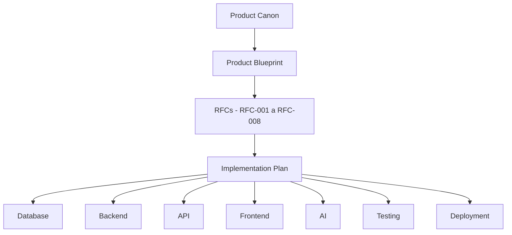

# VEKTOR — Documentação de Engenharia

> Papel de origem: Principal Software Engineer. Esta camada de documentação **não substitui as RFCs**, **não redefine produto** e **não resolve lacunas de produto**. Ela traduz a especificação já congelada — Product Canon, Product Blueprint, `DECISIONS.md`, `architecture/*.md`, RFC-001 a RFC-008 e o [Implementation Plan](../implementation-plan.md) — em arquitetura técnica para quem vai implementar.

Toda decisão técnica registrada nesta pasta aponta explicitamente para o documento de produto que a originou. Onde a especificação registra uma lacuna, o documento técnico correspondente apenas a referencia como pré-requisito de implementação — nunca a resolve por conta própria.

## Cadeia de governança

```
Product Canon
    ↓
Product Blueprint
    ↓
RFCs (RFC-001 a RFC-008, RFC-004 transversal)
    ↓
Implementation Plan
    ↓
Documentação de Engenharia (esta pasta)
    ↓
Código
```

## Fluxo documental completo



## Índice

### Database
- [`database/schema.md`](./database/schema.md) — mapeamento das nove entidades oficiais (mais Membro, pendente) para tabelas.
- [`database/migrations.md`](./database/migrations.md) — processo de evolução do schema ao longo do tempo.
- [`database/rls.md`](./database/rls.md) — isolamento por Workspace em nível de banco (Row Level Security).

### Backend
- [`backend/architecture.md`](./backend/architecture.md) — camadas e limites de módulo, mapeados 1:1 ao Blueprint.
- [`backend/services.md`](./backend/services.md) — casos de uso por módulo, um a um com os Critérios de aceite das RFCs.
- [`backend/repositories.md`](./backend/repositories.md) — acesso a dado por entidade.
- [`backend/validation.md`](./backend/validation.md) — onde os invariantes de `DECISIONS.md` são verificados.

### API
- [`api/rest.md`](./api/rest.md) — superfície HTTP, quando REST se aplica frente a Server Actions.
- [`api/contracts.md`](./api/contracts.md) — formato de entrada/saída por operação (Zod).
- [`api/errors.md`](./api/errors.md) — taxonomia de erro, sempre referenciando o ADR/RFC de origem.

### Frontend
- [`frontend/architecture.md`](./frontend/architecture.md) — estrutura de código mapeada aos dois Contextos de navegação.
- [`frontend/routing.md`](./frontend/routing.md) — URLs por módulo e Contexto.
- [`frontend/state.md`](./frontend/state.md) — estado de servidor vs. estado local.
- [`frontend/components.md`](./frontend/components.md) — componentes compartilhados; sinaliza a lacuna de UX ainda aberta.

### AI
- [`ai/context-builder.md`](./ai/context-builder.md) — implementação do Context Builder de `architecture/ai.md`.
- [`ai/providers.md`](./ai/providers.md) — integração técnica com Anthropic/OpenAI via Vercel AI SDK.
- [`ai/prompts.md`](./ai/prompts.md) — templates por capacidade documentada em `ai.md`.

### Deployment
- [`deployment/environments.md`](./deployment/environments.md) — dev/staging/produção.
- [`deployment/ci-cd.md`](./deployment/ci-cd.md) — pipeline e gates de qualidade.
- [`deployment/monitoring.md`](./deployment/monitoring.md) — observabilidade técnica (distinta de Relatórios, que é produto).

### Testing
- [`testing/strategy.md`](./testing/strategy.md) — pirâmide de teste, ancorada nos Critérios de aceite das RFCs.
- [`testing/unit.md`](./testing/unit.md) — services/validation/repositories isolados.
- [`testing/integration.md`](./testing/integration.md) — API + banco real, por módulo.
- [`testing/e2e.md`](./testing/e2e.md) — ciclo completo Estratégia→Aprendizado.

---

## Auditoria da estrutura documental

Autorrevisão feita antes de considerar esta estrutura concluída, seguindo o mesmo padrão de "Revisão crítica" já usado em todas as RFCs.

### 1. Existe duplicação documental?

Não foi encontrada duplicação de conteúdo técnico. Existe repetição *de citação* — o mesmo ADR aparece referenciado em mais de um documento (ex.: ADR-008 é citado tanto em `backend/services.md` quanto em `backend/validation.md`). Isso é esperado e não é duplicação: `services.md` documenta quem *chama* a verificação; `validation.md` documenta onde o invariante é *definido e checado*. Cada documento cita a fonte de produto que justifica sua fatia específica da implementação — não duplica a implementação em si.

### 2. Existe sobreposição entre documentos?

Dois pares de documentos tinham risco real de sobreposição e foram delimitados deliberadamente durante a criação:

- **`api/rest.md` × `api/contracts.md`** — `rest.md` documenta a superfície de rotas (quando REST existe); `contracts.md` documenta o formato de dado de qualquer operação exposta, seja ela uma rota REST ou uma Server Action. Sem essa distinção, os dois documentos tenderiam a listar as mesmas operações duas vezes.
- **`ai/context-builder.md` × `ai/prompts.md`** — `context-builder.md` documenta *o que* é coletado antes de qualquer sugestão; `prompts.md` documenta *como* isso vira um template de prompt por módulo. A fronteira é a mesma que `architecture/ai.md` já estabelece entre Context Builder e sugestão em si.

Nenhuma sobreposição não resolvida permanece.

### 3. Existe algum documento desnecessário?

Nenhum documento foi identificado como estritamente desnecessário. Um ponto de atenção, não de remoção: `api/rest.md` documenta uma superfície que, na prática, tende a ser pequena no início — CLAUDE.md prioriza Server Actions, e a única fonte de produto que exige REST de fato é a Fase 9 do Implementation Plan (integrações externas). O documento continua justificado porque essa superfície cresce ao longo do roadmap, mas seu peso relativo no início da implementação deve ser lido como proporcional a isso, não como "a" camada de API.

### 4. Existe alguma responsabilidade mal posicionada?

Um risco real foi identificado e já mitigado dentro do próprio documento: `deployment/monitoring.md` poderia, por proximidade temática, absorver métricas de produto (ex.: taxa de Hipótese Validada vs. Refutada) que pertencem ao módulo Relatórios (RFC-007). O documento já contém uma cláusula explícita de fronteira para evitar isso ("este documento não deve virar um 'Relatórios paralelo'"), mas é o ponto da estrutura que mais depende de disciplina de quem for escrever o conteúdo real, não só do desenho da pasta.

### 5. A estrutura é escalável para a VEKTOR v2?

Sim, com uma ressalva. A Fase 2 do Roadmap (Blueprint, Cap. 7 — "Marketing Intelligence": IA mais proativa, benchmarking entre ciclos, sempre agregado e nunca cruzando Workspace) afeta primariamente a pasta `ai/` — que já está isolada de `backend/` e `frontend/` e, portanto, absorve evolução sem exigir reorganização. A ressalva: quando o benchmarking entre ciclos completos chegar, `testing/` provavelmente vai precisar de um documento adicional (ex.: `testing/performance.md` ou similar) para cobrir carga/comparação entre ciclos — isso não é uma falha da estrutura atual, é uma extensão aditiva que a v1 não precisa e que a estrutura já comporta sem quebrar nada existente.
