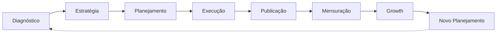
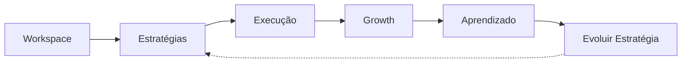
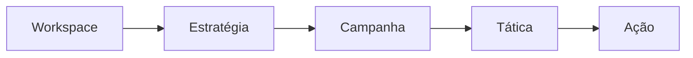
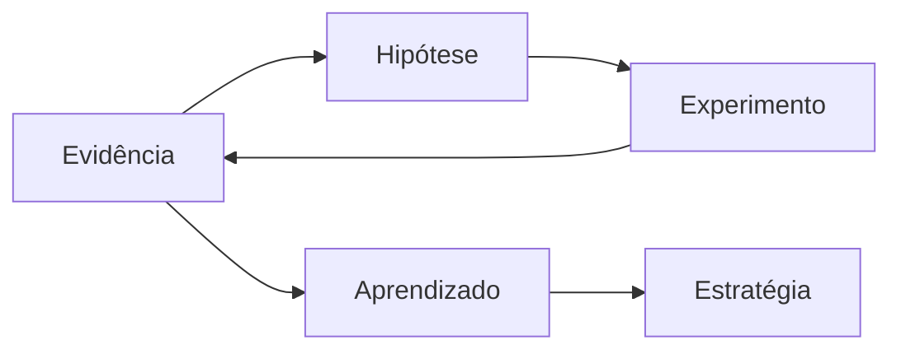
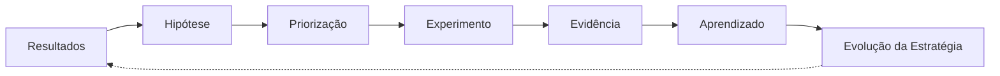
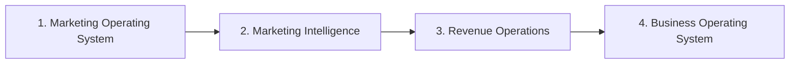
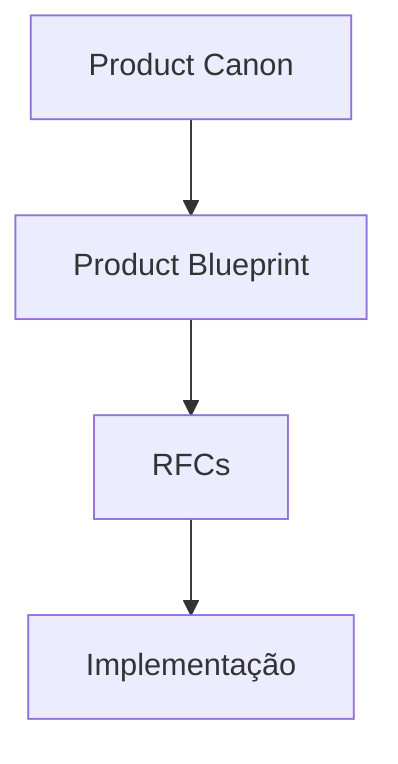

# VEKTOR — Product Blueprint

**Versão:** v1.0
**Data:** 2026-07-26
**Status:** Congelado (frozen)
**Referência:** [Product Canon](./product-canon.md) — autoridade máxima para decisões de produto. Nenhum conteúdo deste Blueprint contraria o Canon; onde há sobreposição, o Canon prevalece.

> **Documento congelado.** A partir da v1.0, este Blueprint só muda mediante uma decisão arquitetural registrada em [`DECISIONS.md`](./DECISIONS.md). Toda evolução funcional da VEKTOR acontece por meio de RFCs (ver [`rfc/README.md`](./rfc/README.md)) — ver seção Governança ao final deste documento.

> Nenhum código foi escrito a partir deste documento até a sua aprovação. Este é o Blueprint de produto completo — 7 capítulos, revisados individualmente e depois em conjunto para consistência entre eles.

## Sumário

1. [Product Vision](#1-product-vision)
2. [Product Strategy](#2-product-strategy)
3. [Product Architecture](#3-product-architecture)
4. [UX Blueprint](#4-ux-blueprint)
5. [Marketing Planning Framework](#5-marketing-planning-framework)
6. [Growth Framework](#6-growth-framework)
7. [Roadmap](#7-roadmap)
8. [Governança](#governança)

---

## 1. Product Vision

VEKTOR não é uma ferramenta de tarefas, um CRM ou um planejador de conteúdo. É um **Marketing Operating System** — uma plataforma organizada em torno de um único ciclo contínuo, não de uma lista de funcionalidades soltas.

> **Do Canon ao operacional**
> O VEKTOR Product Canon define o ciclo em nível de princípio: *toda estratégia deve evoluir → execução gera dados → dados geram aprendizado → aprendizado gera evolução*. O ciclo de 8 etapas abaixo é a **operacionalização** desse princípio — não um conceito paralelo. Cada etapa existe para tornar um dos quatro princípios executável no produto.

Esse ciclo é a espinha dorsal do produto. Toda decisão de arquitetura, módulo e tela nos capítulos seguintes existe para servir a uma etapa dele — nenhuma tela existe fora do ciclo. **Growth**, aqui, é o estágio de mensuração/experimentação que fecha o ciclo — não faz parte do nome do produto (ver Canon). O **Growth Framework** completo, que conecta esse estágio a Aprendizado e à Evolução da Estratégia, é detalhado no Capítulo 6 — não confundir o estágio com o processo inteiro.

### Ciclo operacional × linguagem pública

O Canon define 5 termos que o usuário vê. O ciclo de 8 etapas é interno/operacional. Este mapeamento é a referência para nomear telas e menus nos próximos capítulos — nenhuma das 8 etapas vira um módulo com esse nome na interface:

| Linguagem pública (Canon) | Etapas do ciclo que engloba |
|---|---|
| **Estratégia** | Diagnóstico + Estratégia + Planejamento (inclui metodologicamente SWOT, ICP, Personas, Posicionamento, Objetivos) |
| **Execução** | Execução + Publicação |
| **Growth** | Mensuração + Growth (o estágio de experimentação e recomendação — o Growth Framework completo está no Capítulo 6) |
| **Aprendizado** | A síntese que o Growth produz a partir da Mensuração — o insumo para o próximo passo |
| **Evoluir Estratégia** | Novo Planejamento |

### Missão

Ajudar empresas a transformar objetivos de negócio em crescimento mensurável, unificando estratégia, execução e growth de marketing em um único sistema — eliminando a fragmentação entre documento de planejamento, ferramenta de tarefas e dashboard de métricas que hoje não conversam entre si.

### Visão

Ser o Marketing Operating System que toda empresa orientada a dados usa para transformar diagnóstico em decisão e decisão em crescimento contínuo — com IA participando ativamente de cada etapa do ciclo como copiloto, não como um chat à parte nem como uma protagonista que decide sozinha.

### Proposta de valor

1. **VEKTOR começa pela estratégia, não pela operação.** A maioria das ferramentas (Trello, Notion, Asana) começa na tarefa; o VEKTOR começa no diagnóstico e só gera a operação depois que a estratégia existe.
2. **O ciclo se fecha.** Growth não é uma foto de métricas no fim do processo — ele alimenta o próximo planejamento. Nenhuma outra categoria de ferramenta fecha esse loop de forma nativa.
3. **IA é copiloto, nunca protagonista.** Ela analisa, sugere, explica e automatiza tarefas de baixo risco em cada módulo (diagnóstico, planejamento, growth) — mas toda decisão estratégica permanece sob aprovação humana. Nenhuma tela decide ou executa sozinha em nome do usuário.
4. **O Dashboard é um centro de decisão, não um painel.** Ele responde "o que merece minha atenção hoje", com recomendação de ação — não uma parede de números.

### Diferenciais

> ❌ "CTR = 1,8%"
> ✅ "A campanha Laser CO₂ está com CTR abaixo da média. Recomenda-se testar um criativo com foco em antes e depois."

Esse exemplo é o teste de aceite de todo o módulo de Growth: se uma tela mostra um número sem recomendar uma ação, ela não está pronta.

### Público

Visão preliminar — o ICP completo e as personas detalhadas entram no Capítulo 2. Em linhas gerais, o VEKTOR serve dois perfis dentro da mesma empresa:

| Perfil | O que precisa do VEKTOR |
|---|---|
| Founder / CMO | Visibilidade estratégica: saber se o marketing está alinhado ao objetivo de negócio e o que priorizar agora. |
| Marketer operacional | Clareza sobre o que executar a cada momento do ciclo, sem perder a conexão com a estratégia que originou a tarefa. |

São empresas com alguma maturidade de marketing (não é uma ferramenta para quem nunca fez planejamento nenhum), mas que hoje operam de forma fragmentada — plano em um documento, execução em outra ferramenta, métricas em uma terceira.

### Problemas que o VEKTOR resolve

1. **Fragmentação de ferramentas.** Planejamento em documento estático, execução em Trello/Asana, métricas em outro dashboard — o "porquê" se perde entre a estratégia e o dado.
2. **Métricas sem significado.** Dashboards mostram números, mas não dizem o que fazer a respeito deles.
3. **Planejamento vira artefato morto.** O plano de marketing é feito uma vez, vira PDF, e nunca é realimentado pelos resultados reais da execução.
4. **Execução sem metodologia.** Equipes pulam direto para o calendário de conteúdo sem diagnóstico, SWOT ou ICP estruturados por trás — o calendário existe, mas ninguém sabe se aponta na direção certa.
5. **IA como acessório.** Assistentes de IA genéricos, sem contexto real do negócio, do workspace ou da etapa do ciclo em que o usuário está.

### O que o VEKTOR não é

Registrado aqui porque ancora decisões de escopo em todos os capítulos seguintes: o VEKTOR não é um gerenciador de tarefas genérico (Trello/Asana), não é um workspace de documentos (Notion), não é um CRM, e não é "só" um planejador de calendário de conteúdo. Cada um desses é, no máximo, uma peça operacional dentro de uma etapa do ciclo — nunca o produto inteiro.

---

## 2. Product Strategy

Se o Capítulo 1 define o que o VEKTOR é, este capítulo define para quem ele existe agora — e, com a mesma importância, para quem ele não existe ainda.

### ICP — Ideal Customer Profile

1. Empresa com função de marketing já estabelecida — não é a primeira contratação de marketing da empresa. Já existe alguma prática de planejamento, mesmo que informal.
2. Time de marketing de 2 a 15 pessoas. Grande o suficiente para sentir a dor de coordenar estratégia e execução entre pessoas diferentes; pequeno o suficiente para não ter um sistema proprietário interno já consolidado.
3. Stack fragmentado hoje: usa pelo menos 3 ferramentas desconectadas para planejar, executar e medir marketing (ex.: documento para estratégia, board de tarefas para execução, planilha ou tool de calendário para conteúdo, GA4/Ads Manager para métricas).
4. Negócio orientado a growth mensurável — SaaS, e-commerce, serviços B2B. Não restrito a um setor, mas prioriza empresas onde o ciclo de marketing é claramente iterativo e o resultado é medível.
5. Comprador: Head of Marketing / CMO / Growth Lead. Usuário diário: a equipe de marketing inteira.

### Personas

> **Persona primária — decisora: Marina, Head of Marketing.**
> Responsável pela estratégia e por prestar contas de resultado ao C-level. Hoje passa mais tempo tentando entender o que a equipe está fazendo do que pensando em estratégia — os relatórios de métrica que recebe dizem o que aconteceu, não o que fazer a seguir.
>
> **Precisa do VEKTOR para:** ver o ciclo inteiro (estratégia → execução → resultado) em um lugar só, confirmar que a execução está alinhada ao plano, e receber recomendação de IA em vez de número solto.
>
> **Pergunta de todo dia:** "Estamos executando a estratégia certa, ou só estamos ocupados?"

> **Persona primária — executor: Rafael, Marketing Operacional.**
> Roda campanhas, calendário de conteúdo e reporta métricas. Recebe direcionamento estratégico de forma vaga ou desatualizada, e perde tempo alternando entre ferramentas para entender o que fazer, publicar e medir.
>
> **Precisa do VEKTOR para:** saber exatamente o que executar agora e por que aquilo importa, sem sair da ferramenta para reconstruir o contexto estratégico.
>
> **Pergunta de todo dia:** "O que eu preciso fazer hoje, e isso está conectado a algum objetivo real?"

### Anti-persona — quem não é o ICP agora

Registrar isso evita inventar telas para um público que não é o foco atual:

1. Empresa sem função de marketing formal (founder-led marketing, pré-produto). Precisa de template pronto, não de uma metodologia de diagnóstico — maturidade insuficiente para o ciclo do VEKTOR.
2. Agência que gerencia múltiplos clientes externos. O modelo de dados de hoje é workspace = uma empresa; multi-cliente-por-agência é uma mudança de tenancy, não uma tela nova. Fora de escopo por enquanto.
3. Enterprise com martech stack consolidado (Salesforce Marketing Cloud, Adobe Experience). Custo de migração alto demais para ser o público de entrada.

### Mercado

A categoria de "marketing operations" está em fadiga de ferramentas: times de marketing acumulam dezenas de ferramentas desconectadas ao longo do tempo, cada uma resolvendo uma fatia do ciclo. Duas forças tornam este o momento certo:

1. IA generativa virou padrão em produção de conteúdo, mas quase nenhuma ferramenta aplica IA na camada estratégica (diagnóstico, SWOT, priorização) — o espaço que o VEKTOR ocupa está vazio, não saturado.
2. Empresas estão sob pressão para provar ROI de marketing com times menores — isso favorece uma ferramenta que conecta estratégia a resultado de forma explícita, em vez de mais uma ferramenta de produção.

### Concorrência

O VEKTOR não compete recurso-por-recurso com nenhuma categoria abaixo — compete no espaço entre elas, hoje preenchido por trabalho manual de coordenação (reunião, planilha, copiar e colar dado entre ferramentas):

| Categoria | Onde é forte | Onde é cega |
|---|---|---|
| Ferramentas de tarefa (Trello, Asana, Monday, ClickUp) | Execução, coordenação de equipe | Não sabe por que a tarefa existe |
| Calendário de conteúdo (CoSchedule, Loomly, Sprout Social) | Publicação, agendamento | Assume que o plano já existe; não ajuda a formulá-lo |
| Suítes all-in-one (HubSpot Marketing Hub, ActiveCampaign) | Automação, CRM | Planejamento estratégico é funcionalidade secundária, não o núcleo |
| Analytics / BI (GA4, Mixpanel, dashboards de BI) | Mostrar o dado | Não recomenda decisão — exige humano interpretar e agir em outro lugar |
| Consultoria / templates de estratégia (Notion, planilhas de SWOT) | Metodologia correta | Artefato estático, desconectado da execução real |

### Roadmap de posicionamento

> Este é o roadmap de *mercado* — qual segmento conquistar em qual ordem. O roadmap de *produto* (Marketing OS → Marketing Intelligence → Revenue Operations → Business OS) é o Capítulo 7.

| Fase | Foco |
|---|---|
| **1 — Entrada** | SaaS B2B e e-commerce de porte médio, time de marketing de 2–15 pessoas, com dor aguda e visível de fragmentação (3+ ferramentas desconectadas hoje). Ciclo de vendas mais curto porque a dor já é sentida, não precisa ser criada. |
| **2 — Expansão horizontal** | Outros verticais orientados a growth (fintech, serviços B2B) com o mesmo perfil de maturidade de marketing do ICP da Fase 1. |
| **3 — Expansão vertical (não priorizada)** | Agências multi-cliente. Exige repensar o modelo de tenancy atual (workspace = uma empresa) — tratado como decisão futura, não como próximo passo. |
| **4 — Expansão de identidade (futuro)** | Só depois do Marketing Operating System estar consolidado como categoria própria: possível evolução para o "Business Operating System" mais amplo já reservado no CLAUDE.md — outros domínios de negócio além de marketing, sobre a mesma arquitetura de Workspace. |

---

## 3. Product Architecture

Este capítulo não fala de tecnologia. Fala de como o trabalho do usuário é organizado do início ao fim — a arquitetura é do produto, não da infraestrutura que o roda.

### 3.1 Princípios arquiteturais

1. **Estratégia antes da execução.** Nenhuma Ação existe sem uma Estratégia da qual ela deriva — a arquitetura não permite "começar pela tarefa".
2. **Todo trabalho gera evidências.** Executar uma Ação ou rodar um Experimento sempre produz um registro — nunca é um esforço que desaparece sem deixar rastro.
3. **Toda evidência gera aprendizado.** Evidência bruta é interpretada — pela IA e pelo humano — até virar uma conclusão acionável, não fica arquivada como dado morto.
4. **Todo aprendizado evolui a estratégia.** Aprendizado não é destino final — é insumo de entrada para a próxima Estratégia, fechando o ciclo do Canon.
5. **A IA atua como copiloto.** Em cada um dos quatro princípios acima, a IA pode observar, sugerir e automatizar — mas nunca substitui a decisão humana sobre o que é estratégico.

### 3.2 Modelo mental

É assim que o usuário enxerga a plataforma — não como uma lista de telas, mas como um ciclo que ele percorre continuamente dentro do seu Workspace:

Esse ciclo não tem fim — "Evoluir Estratégia" não é uma tela de conclusão, é a ação que reabre o ciclo com mais contexto do que da vez anterior. É o mesmo ciclo de 5 termos definido no Canon; o mapeamento com as 8 etapas operacionais do Capítulo 1 continua valendo (Estratégias aqui = Diagnóstico + Estratégia + Planejamento; Execução = Execução + Publicação; Growth = Mensuração + Growth).

Note o plural: **Estratégias**. Um Workspace acumula mais de uma Estratégia ao longo do tempo — cada volta do ciclo pode gerar uma nova, e as anteriores permanecem como histórico, não são substituídas.

### 3.3 Domínio

As entidades de negócio existem em uma cadeia — cada uma sustenta uma parte específica do ciclo de evolução. **Convenção usada em todo o Blueprint:** nome de entidade aparece sempre no singular (Hipótese, Experimento, Evidência, Aprendizado), mesmo quando o ciclo acumula muitas instâncias delas.

A cadeia de criação é linear:

Ação e Experimento produzem Evidência. A partir daí, Evidência e Hipótese entram em loop até virarem Aprendizado, que realimenta a Estratégia:

Aprendizado aponta de volta para Estratégia — não como uma seta a mais no diagrama, mas porque é literalmente o insumo que origina a próxima Estratégia do Workspace. O detalhamento completo desse loop (incluindo Resultados e Priorização) é o Capítulo 6 — Growth Framework.

| Entidade | Existe dentro de | Por que existe |
|---|---|---|
| **Workspace** | — | O limite de tenant: uma empresa, seus dados, sua equipe. |
| **Estratégia** | Workspace | Registra a intenção — o que a empresa decidiu perseguir e por quê. É o que torna toda Ação futura justificável. |
| **Campanha** | Estratégia | Traduz a intenção em uma aposta concreta — a iniciativa que operacionaliza um pedaço da Estratégia. |
| **Tática** | Campanha | Define a abordagem dentro da aposta — o "como" de uma Campanha. |
| **Ação** | Tática | A unidade executável — o que de fato é feito, agendado ou publicado. |
| **Evidência** | Ação ou Experimento | O registro bruto do que aconteceu — a materialização de "todo trabalho gera evidências". |
| **Hipótese** | Evidência | Nasce de uma Evidência observada — nunca de opinião. Justifica um Experimento; não é, ela própria, onde o Experimento roda. |
| **Experimento** | Tática ou Ação | Um teste estruturado, sempre justificado por uma Hipótese — existe para gerar nova Evidência com intenção, não por acaso. Roda dentro de uma Tática/Ação; a Hipótese é o motivo, não o lugar. |
| **Aprendizado** | Evidência (interpretada) | A conclusão acionável — o que a Evidência significa e o que fazer a respeito. Alimenta a próxima Estratégia. |

### 3.4 Camadas do produto

Quatro camadas, ordenadas da mais fácil de mudar para a mais estável:

> **Interface** — O que o usuário vê e toca: telas, componentes, visualizações. A camada mais descartável: pode mudar sem alterar o significado do que representa.
>
> **Fluxo** — A sequência de passos que leva uma intenção a um resultado dentro do ciclo (ex.: "criar uma Campanha a partir de uma Estratégia"). O fluxo é o roteiro; a interface é o cenário onde ele acontece.
>
> **Domínio** — As entidades e relações da seção 3.3 — o que é verdadeiro independentemente de como é mostrado ou navegado.
>
> **Inteligência (IA)** — A camada que observa o Domínio e sugere ação dentro do Fluxo — sem nunca ser dona do Domínio nem decidir por ele. Lê Evidência e Aprendizado; quem grava a decisão é sempre o humano.

### 3.5 Arquitetura da informação

Sete módulos visíveis na navegação. Cada um existe para um momento específico do ciclo — nenhum é genérico:

| Módulo | Momento do ciclo | Por que existe |
|---|---|---|
| **Estratégia** | Diagnóstico → Planejamento | Onde a intenção é formulada e registrada. |
| **Execução** | Execução → Publicação | Onde Campanhas viram Táticas e Ações concretas. |
| **Growth** | Mensuração → Growth | Onde Evidência é analisada e decisão é recomendada — nunca só o número. |
| **Aprendizado** | Síntese | Onde a conclusão acionável vive, e de onde se dispara "Evoluir Estratégia". |
| **Relatórios** | Comunicação | Recorte formal e compartilhável, em duas visões — da Estratégia ativa e histórica do Workspace (ver 3.6) — para quem não navega o sistema ao vivo (ex.: o C-level de Marina). |
| **Biblioteca** | Memória | Acúmulo de Campanhas, Ações e Aprendizado de todos os ciclos — histórico reutilizável, para não repetir evidência já coletada. |
| **Configurações** | Fora do ciclo | A forma do próprio Workspace — equipe, permissões, integrações. Não pertence a nenhuma etapa; sustenta todas. |

> **Módulo Growth × Growth Framework**
> O módulo Growth desta tabela é a superfície onde o usuário vê Evidência, Hipótese e recomendação. O Growth Framework (Capítulo 6) é o processo mais amplo que atravessa esse módulo: começa em Execução, passa pelo módulo Growth, e só termina quando um Aprendizado eventualmente dispara "Evoluir Estratégia" dentro do módulo Aprendizado. O módulo é um lugar; o Framework é o processo que passa por três módulos.

Dashboard e "Evoluir Estratégia" não estão nessa tabela — a razão está na seção 3.6, junto com os dois níveis de contexto que sustentam toda a navegação.

### 3.6 Navegação e contexto

A navegação da VEKTOR opera em dois níveis de contexto, que nunca se confundem:

> **Contexto Global — Workspace**
> Representa a empresa. Concentra o histórico completo — todas as Estratégias, passadas e a presente. **Nunca muda** quando o usuário navega entre Estratégias.

> **Contexto Estratégico — Estratégia Ativa**
> Toda Execução, Growth e Aprendizado acontecem sempre dentro de uma Estratégia específica. A Estratégia é a unidade viva de trabalho da VEKTOR — é onde o usuário passa o dia. Relatórios é a exceção parcial: tem uma visão presa a este contexto e outra que pertence ao Contexto Global.

*O Workspace preserva a memória da empresa. A Estratégia concentra o trabalho ativo.*

> **Relatórios nos dois níveis**
> **Visão da Estratégia ativa** (Contexto Estratégico): o recorte de Growth + Aprendizado da Estratégia em curso. **Visão histórica do Workspace** (Contexto Global): comparação entre Estratégias — o que mudou de uma para outra, usada para reportar evolução ao C-level (Capítulo 4, "A segunda volta").

| Elemento | Nível | Permanente porque |
|---|---|---|
| **Seletor de Workspace** | Global | Qual empresa/tenant está ativo — sempre visível porque a plataforma é multi-tenant desde a base. |
| **Seletor de Estratégia Ativa** | Estratégico | Qual Estratégia, dentre as várias do Workspace, está sendo trabalhada agora — determina o que Execução, Growth e Aprendizado mostram, e qual é o recorte "ativo" dentro de Relatórios. |
| **Sidebar** | Ambos | Lista os sete módulos — é o mapa fixo do ciclo, sempre visível independente de em qual contexto o usuário está. |
| **Breadcrumb** | Estratégico | Mostra a posição na cadeia de domínio (Estratégia › Campanha › Tática) dentro da Estratégia Ativa — o usuário nunca perde de vista de qual Estratégia aquela Ação depende. |

> **Duas ausências deliberadas**
> **Dashboard** é uma visão composta do Contexto Global — aparece ao entrar no Workspace, sintetizando Estratégia + Execução + Growth + Aprendizado (de todas as Estratégias, não só a ativa) para responder "o que merece minha atenção hoje". Não tem domínio próprio, por isso não é um módulo.
>
> **"Evoluir Estratégia"** não é um módulo de navegação — é uma ação originada dentro de Aprendizado, que fecha a Estratégia ativa e abre a próxima. Não é um lugar para onde se navega; é uma transição de contexto.

> **O que acontece quando uma Estratégia evolui**
> A Estratégia anterior é encerrada: permanece consultável e comparável no Contexto Global (Biblioteca, Relatórios), mas **nunca volta a receber Execução**. Toda Execução nova, a partir desse momento, acontece só na Estratégia ativa — nunca duas Estratégias recebem trabalho ao mesmo tempo.

### 3.7 Princípios de evolução

Toda proposta de nova funcionalidade passa por este teste antes de ser aceita:

1. Melhora uma Estratégia?
2. Melhora a Execução?
3. Melhora o Aprendizado?
4. Melhora a Evolução?
5. **Esta decisão reduz a complexidade para o usuário?**

Se a resposta é não para as cinco, a funcionalidade provavelmente não pertence ao VEKTOR — independente de quão pedida ou interessante ela pareça. A quinta pergunta vem diretamente do Product Canon ("Toda decisão de UX deve reduzir complexidade") — está ao lado das demais de propósito: simplicidade é um princípio arquitetural do produto, não apenas uma diretriz de UX. Toda RFC futura deve responder positivamente a ela antes de ser considerada aprovada.

---

## 4. UX Blueprint

Este capítulo não é um catálogo de telas. É a história de uma volta completa pelo ciclo — da chegada de uma empresa nova ao VEKTOR até o momento em que ela evolui sua primeira Estratégia e o ciclo reabre, já diferente de como começou.

### Chegada

Uma empresa chega ao VEKTOR e cria seu Workspace. Ele nasce vazio — mas nunca cai num painel em branco esperando que alguém decida o que fazer. Como "estratégia antes da execução" é um princípio arquitetural, não uma preferência de onboarding, a primeira coisa que o produto pede não é "convide sua equipe" nem "conecte suas ferramentas de anúncio". É: comece sua primeira Estratégia.

> **Estado inicial:** Workspace sem Estratégia ativa. A única ação com peso real disponível é iniciar a formulação — tudo o mais (convidar equipe em Configurações, explorar Biblioteca) é secundário e pode esperar.

### Formular a primeira Estratégia

O usuário entra em Estratégia e é conduzido pela fase de formulação — diagnóstico, SWOT, mercado, concorrentes, ICP, personas, objetivos, posicionamento — como uma experiência contínua, não como uma lista de módulos independentes que ele precisa descobrir sozinho em qual ordem visitar. Para o usuário, isso tudo é uma coisa: **Estratégia**.

A IA participa em cada etapa como copiloto: sugere um SWOT a partir do que sabe do negócio, propõe um posicionamento, esboça objetivos. O usuário nunca vê um formulário em branco te encarando — vê uma sugestão para reagir, editar ou descartar. A palavra final é sempre humana; isso é o Canon em ação, não uma nota de rodapé.

A jornada termina quando a Estratégia tem forma: objetivos claros, posicionamento definido, um plano. Esse é o momento em que "planejar" e "estar pronto para agir" deixam de ser a mesma frase.

### Do papel para a operação

É aqui que a promessa central do produto acontece: a plataforma gera a operação a partir da Estratégia — Campanhas, Táticas e Ações nascem como uma proposta, não como trabalho manual de transcrever o plano em tarefas. O usuário não parte de uma tela vazia em Execução; parte de um rascunho que já reflete a Estratégia que acabou de formular.

*Esse rascunho é uma sugestão, não um fato consumado — o usuário revisa, ajusta e aprova antes de qualquer Ação se tornar real. A automação acelera o trabalho de traduzir intenção em plano; não decide sozinha o que a empresa vai fazer.*

### Rotina de execução

No dia a dia, quem entra é o operacional — a pessoa responsável por Execução, não por reformular estratégia. Ela abre o Workspace, a Estratégia Ativa do Contexto Estratégico já está definida, e o que ela vê em Execução são Ações priorizadas, agendadas, algumas sugeridas pela IA (um calendário de publicação, por exemplo), esperando confirmação ou ajuste. Ela marca o que foi feito, publica o que estava pronto, e o ciclo continua girando sem que ela precise voltar em Estratégia para lembrar por que aquela Ação existe — o Breadcrumb sempre mostra a Campanha e a Tática de onde ela veio.

### Growth entra em cena

Toda Ação executada e todo Experimento rodado deixam Evidência. Growth não espera o fim de um período para mostrar isso como uma tabela de números — ele observa a Evidência continuamente e traz à tona o que precisa de decisão agora. Quando alguém entra no Workspace, o Dashboard — a visão composta do Contexto Global — já aponta isso: não "aqui estão suas métricas", mas "isso aqui merece sua atenção hoje".

> ❌ "CTR = 1,8%"
> ✅ "A campanha está com CTR abaixo da média. Recomenda-se testar um criativo com foco em antes e depois."

Essa é a experiência de Growth por definição — se uma tela dentro desse módulo mostra um número sem sugerir uma ação, ela ainda não está pronta, seja qual for o capítulo do Blueprint em que for desenhada.

### Aprendizado

Growth recomenda; Aprendizado é onde a recomendação — aceita, testada, ou rejeitada — vira conclusão registrada. É um momento mais lento e reflexivo do que o ritmo de Growth: não é "o que fazer agora", é "o que isso nos ensinou". Cada entrada de Aprendizado carrega a Evidência que a originou e o raciocínio por trás dela, e passa a viver também em Biblioteca — memória que a próxima Estratégia, e as futuras Estratégias de outros ciclos, vão poder consultar.

### Evoluir Estratégia — fechar e reabrir o ciclo

De dentro de Aprendizado, a IA sugere o momento: os sinais acumulados apontam que a Estratégia atual já dá o que tinha para dar. "Evoluir Estratégia" não é um botão que apaga o que existia e recomeça do zero — é uma transição que leva o Aprendizado acumulado como ponto de partida da próxima Estratégia. A nova formulação já começa informada por evidência real, não por um diagnóstico em branco como da primeira vez.

*Essa diferença — primeira Estratégia partindo do zero, todas as seguintes partindo do Aprendizado anterior — é a experiência do princípio "todo aprendizado evolui a estratégia" deixando de ser uma frase de princípio e virando algo que o usuário sente ao usar o produto.*

> **O que acontece com a Estratégia anterior**
> Ela se encerra — não é arquivada e esquecida, mas também não continua recebendo trabalho. Fica consultável e comparável no Contexto Global, porém nenhuma Ação, Campanha ou Experimento novo pode nascer dentro dela depois que a próxima Estratégia se torna ativa.

### A segunda volta — o que muda

Quando o ciclo reabre, o Workspace já não é mais o mesmo lugar vazio da Chegada. O seletor de Estratégia Ativa agora tem mais de uma opção — a atual, e as anteriores como histórico consultável e comparável, nunca mais executável. Biblioteca tem conteúdo real para reutilizar. Relatórios, na sua visão histórica do Workspace, tem ciclos inteiros para comparar, não uma folha em branco — é o momento em que a persona decisora leva ao C-level não uma opinião, mas uma narrativa de evolução: o que foi decidido, o que foi aprendido, o que mudou. E o Dashboard, no Contexto Global, passa a sintetizar não uma Estratégia, mas a trajetória de todas elas.

É esse acúmulo — não uma tela nova a cada versão — que faz o VEKTOR parecer, a cada volta, mais um parceiro que conhece a empresa do que uma ferramenta que se usa.

> **Regra de entrada, não só princípio**
> O usuário nunca inicia seu trabalho criando uma Campanha ou uma tarefa solta. Não existe um botão de "+ Nova Campanha" ou "+ Nova Tarefa" fora do contexto de uma Estratégia. Toda operação nasce de uma Estratégia — se não há de qual Estratégia a Campanha deriva, a Campanha não pode ser criada.

### O estado ideal da VEKTOR

As seções anteriores descrevem uma volta do ciclo. Mas o VEKTOR não é feito para uma volta — é feito para acumular voltas. Depois de vários ciclos completos, a plataforma deixa de ser apenas uma ferramenta de execução e passa a representar a memória estratégica da empresa: o registro vivo de tudo que ela decidiu, testou, mediu e aprendeu sobre o próprio negócio.

Nesse estado, o VEKTOR preserva:

1. **Estratégias** — todas as intenções que a empresa já perseguiu, não só a atual.
2. **Hipóteses** — o que se acreditava ser verdade em cada momento, antes de ser testado.
3. **Campanhas** — as apostas concretas feitas para perseguir cada Estratégia.
4. **Experimentos** — os testes estruturados que confirmaram ou derrubaram uma hipótese.
5. **Evidências** — o registro bruto do que de fato aconteceu.
6. **Aprendizados** — o que a evidência significou, e o que fazer a respeito.
7. **Evolução** — a linha do tempo de como a Estratégia da empresa mudou, e por quê.

Nenhuma outra categoria de ferramenta preserva essa cadeia inteira como um único fio contínuo — a maioria preserva só a Campanha ou só a Evidência, e perde exatamente a parte que explica o "porquê".

> **Síntese**
> O VEKTOR não é o lugar onde o marketing registra o que fez. É o lugar onde o marketing lembra por que decidiu, o que aprendeu, e o que vai fazer diferente na próxima volta do ciclo.

---

## 5. Marketing Planning Framework

Esta é a metodologia completa que vive dentro do módulo Estratégia. É o coração do sistema — todo o resto do produto (Execução, Growth, Aprendizado) existe para operacionalizar o que nasce aqui. Cada etapa depende do resultado da anterior — não é uma lista de formulários soltos, é uma cadeia. Pular uma etapa significa formular a próxima com uma base mais fraca.

### Fase de formulação — dentro de Estratégia

| Etapa | Depende de | Pergunta que responde |
|---|---|---|
| 1. Diagnóstico | — | Onde a empresa está agora, por dentro e por fora? |
| 2. Mercado | Diagnóstico | Em que ambiente a empresa compete, e para onde ele está indo? |
| 3. Concorrentes | Mercado | Quem disputa a mesma atenção e o mesmo cliente? |
| 4. SWOT | Diagnóstico + Mercado + Concorrentes | Onde estão as forças, fraquezas, oportunidades e ameaças reais? |
| 5. ICP | SWOT | Para qual tipo de cliente a empresa deveria estar vendendo? |
| 6. Personas | ICP | Quem é essa pessoa, na prática — o que ela sente, teme, decide? |
| 7. Jornada do Cliente | Personas | Como essa pessoa caminha do desconhecimento até a decisão? |
| 8. Funis | Jornada do Cliente | Que estrutura vai conduzir essa jornada de forma repetível? |
| 9. Objetivos | SWOT + ICP | O que a empresa quer alcançar, e em quanto tempo? |
| 10. Posicionamento | Concorrentes + ICP + Objetivos | Como a empresa quer ser percebida por esse cliente, frente a essa concorrência? |
| 11. Estratégia (síntese) | Todas as anteriores | Onde apostar, com que prioridade, com que recurso? É o documento que fecha a formulação. |

A IA atua como copiloto em cada uma dessas etapas — sugerindo um SWOT a partir do Diagnóstico, um recorte de ICP a partir do SWOT, um Posicionamento a partir do que já foi definido. Ela nunca pula uma etapa em nome do usuário; acelera o preenchimento de cada uma, sempre com aprovação humana antes de avançar para a próxima.

> **O handoff**
> Quando a Estratégia (síntese) é aprovada, a formulação termina e a geração da operação começa — o momento descrito no Capítulo 4 como "Do papel para a operação". Nada abaixo desta linha é preenchido manualmente do zero; nasce como proposta a partir do que foi formulado acima.

### Fase de geração — handoff para Execução

| Etapa | Gerada a partir de | O que produz |
|---|---|---|
| 12. Editorias | Posicionamento + Funis | Os temas/categorias de conteúdo que sustentam a Jornada do Cliente. |
| 13. Campanhas | Objetivos + Estratégia (síntese) | As apostas concretas — a primeira entidade do domínio de Execução (Capítulo 3). |
| 14. Calendário Editorial | Editorias + Campanhas | A agenda de publicação das Ações de conteúdo. |
| 15. Plano de Ação | Campanhas → Táticas | As Ações executáveis do dia a dia — o que a rotina de execução do Capítulo 4 de fato opera. |

Estas quatro etapas não pertencem ao módulo Estratégia — vivem em Execução. Estão aqui porque a metodologia só faz sentido completa: mostrar a formulação sem mostrar para onde ela vai deixaria a promessa "a plataforma gera a operação automaticamente" sem explicação de como.

É por isso que este framework é o coração do sistema: ele não é uma funcionalidade entre outras — é a lógica que decide o que existe em Execução, o que Growth vai medir, e o que Aprendizado eventualmente vai devolver para a próxima Estratégia.

---

## 6. Growth Framework

### 6.1 O que Growth significa na VEKTOR

Growth não é um módulo de testes, e não é uma coleção de hacks isolados. É o mecanismo que transforma resultado em decisão estratégica nova — o processo sistemático pelo qual a Estratégia de uma empresa evolui continuamente.

Onde "growth hacking" tradicionalmente significa tentar muitas ideias rápido e ver o que gruda, o Growth Framework da VEKTOR é o oposto: cada teste existe para responder a uma pergunta específica que a Estratégia colocou, e cada resultado — positivo ou negativo — é obrigado a virar aprendizado registrado antes do ciclo seguir adiante.

> **Módulo Growth × Growth Framework**
> Não são a mesma coisa. O módulo Growth (Capítulo 3) é a tela onde o usuário vê Evidência e recomendação. O Growth Framework, descrito neste capítulo, é o processo inteiro — começa em Execução, passa pelo módulo Growth, e só termina quando um Aprendizado eventualmente dispara "Evoluir Estratégia" dentro do módulo Aprendizado. O Framework atravessa três módulos; não mora em nenhum sozinho.

### 6.2 O ciclo de Growth

Este ciclo não tem saída. "Evolução da Estratégia" não encerra o processo — a Estratégia evoluída volta a gerar Execução, a Execução volta a gerar Resultados, e o ciclo de Growth recomeça com mais contexto do que da vez anterior. É a mecânica detalhada de como a etapa "Growth → Aprendizado" do ciclo maior do Canon (Capítulo 3) de fato funciona por dentro.

### 6.3 Hipótese

> Toda hipótese nasce de uma evidência — nunca de opinião. Uma hipótese válida tem a forma "acreditamos que [mudança] vai gerar [resultado], porque [evidência já observada] sugere isso". Uma ideia sem evidência por trás não é uma hipótese de Growth — é um palpite, e palpite não entra no ciclo.

### 6.4 Experimento

> Um Experimento existe para validar uma hipótese específica — não para "testar uma ideia" de forma solta. Todo Experimento declara qual Hipótese está testando e a qual Objetivo da Estratégia ativa ele serve. Sem essa dupla amarração, o Experimento não é aprovado para rodar.

### 6.5 Evidência

> Nenhuma decisão de Growth — continuar, pivotar ou abandonar uma linha — se sustenta em intuição ou na opinião de quem está mais confiante na sala. Toda decisão precisa apontar para uma Evidência registrada que a sustente. Evidência é a moeda do ciclo inteiro: sem ela, não há Hipótese válida na próxima volta nem Aprendizado real nesta.

### 6.6 Aprendizado

> Todo Aprendizado permanece na memória estratégica da empresa (Biblioteca, Capítulo 3) — inclusive, e principalmente, quando o Experimento fracassa. Um Experimento que não confirma a Hipótese não é um ciclo desperdiçado: o registro de "isso não funcionou, e por quê" é tão valioso quanto o de um acerto, porque evita que a mesma aposta fraca seja repetida em uma Estratégia futura.

### 6.7 IA como copiloto

**Pode:** identificar padrões em Evidência acumulada · sugerir Hipótese a partir desses padrões · ajudar a priorizar entre Hipóteses concorrentes à luz dos Objetivos da Estratégia · encontrar oportunidades entre o Objetivo da Estratégia e o Resultado atual · resumir Aprendizado acumulado.

**Nunca:** aprova uma mudança estratégica automaticamente.

Growth é o ponto do sistema mais tentador para automatizar de ponta a ponta — é também o ponto mais perigoso para fazer isso. A IA acelera cada etapa do ciclo, mas a transição final, Evolução da Estratégia, exige validação humana sempre, sem exceção definida por confiança do modelo ou volume de dado.

### 6.8 Princípios

1. Nenhuma hipótese sem evidência.
2. Nenhum experimento sem objetivo.
3. Nenhum aprendizado sem registro.
4. Nenhuma evolução sem validação humana.
5. Nenhum ciclo se encerra — toda Evolução gera novos Resultados.

É por isso que o Growth Framework não é "mais um módulo" ao lado de Execução e Aprendizado — é o elo que os conecta: pega o que a Execução produziu, disciplina o que vale a pena aprender com isso, e entrega à Estratégia exatamente o combustível que o princípio "todo aprendizado evolui a estratégia" (Capítulo 3) promete.

---

## 7. Roadmap

Fases, não datas. Cada fase representa uma direção de evolução da capacidade do produto — a ordem importa porque cada uma se apoia na anterior, não porque há um calendário prometido.

| Fase | Foco |
|---|---|
| **1 — Marketing Operating System** | Consolidar Estratégia, Execução, Growth e Aprendizado como um ciclo único e coeso — o que os Capítulos 3 a 6 deste Blueprint já especificam por completo. Esta fase não adiciona domínio novo; garante que o ciclo inteiro funciona antes de qualquer expansão. |
| **2 — Marketing Intelligence** | A IA copiloto do Capítulo 6 se torna mais proativa: reconhecimento de padrões entre ciclos, recomendações estratégicas antecipadas, benchmarking e inteligência acumulada — sempre agregada e nunca cruzando o limite de um Workspace para outro. É a mesma IA-copiloto, com mais Aprendizado acumulado para observar; a regra de nunca aprovar mudança estratégica sozinha continua valendo. |
| **3 — Revenue Operations** | Expansão para integrar marketing, vendas e receita — os Resultados que alimentam o ciclo de Growth passam a incluir dado de vendas e receita, e os Objetivos de uma Estratégia podem ser expressos em termos de receita, não só de métrica de marketing. O ciclo e o domínio não mudam de forma; a superfície de dado que os alimenta cresce. |
| **4 — Business Operating System** | Possível evolução futura da VEKTOR para outras áreas da empresa além de marketing, sobre a mesma arquitetura de Workspace e o mesmo ciclo Estratégia → Execução → Growth → Aprendizado. Esta é a reserva de nome já registrada no CLAUDE.md e no roadmap de posicionamento do Capítulo 2 — as duas visões (mercado e produto) convergem para a mesma fase final. |

### Princípios de Evolução

Este roadmap descreve uma **direção estratégica**, não uma promessa de funcionalidades nem um compromisso de prazo. Fases podem se reordenar, se fundir ou se estender conforme o que as Estratégias reais dos primeiros Workspaces ensinarem — o próprio produto pratica, sobre si mesmo, o princípio de que aprendizado evolui estratégia.

Toda evolução futura — nesta lista ou fora dela — deve responder ao mesmo teste do Capítulo 3.7 (melhora uma Estratégia, a Execução, o Aprendizado, a Evolução — e reduz a complexidade para o usuário?) e permanecer dentro do que o Product Canon permite. Nenhuma fase futura autoriza uma exceção ao Canon; se uma direção de produto exigisse contrariá-lo, a direção estaria errada, não o Canon.

---

## Governança

Este documento representa a especificação funcional oficial da VEKTOR.

Toda RFC futura deverá ser compatível com:

- Product Canon
- Product Blueprint

Em caso de conflito, a hierarquia de autoridade é:

### Status: v1.0 congelado (frozen)

A partir desta versão:

- O **Product Canon** muda apenas em casos excepcionais.
- O **Product Blueprint** muda apenas mediante uma decisão arquitetural registrada em [`DECISIONS.md`](./DECISIONS.md).
- Toda **evolução funcional** da VEKTOR passa a acontecer por meio de RFCs (ver [`rfc/README.md`](./rfc/README.md)).

Nenhuma RFC altera este documento diretamente — ela referencia o capítulo relevante e, se precisar de uma exceção real, propõe primeiro um ADR em `DECISIONS.md`.
