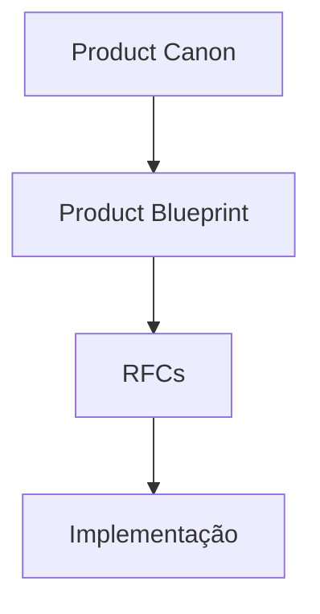

# VEKTOR — Padrão de RFC

Toda mudança de produto não trivial na VEKTOR — novo comportamento, novo dado, nova participação de IA, nova tela — é proposta como uma RFC (Request for Comments) antes de virar implementação.

## Hierarquia de autoridade



Uma RFC nunca pode contrariar o [Product Canon](../product-canon.md) ou o [Product Blueprint](../product-blueprint.md). Em caso de conflito, o Canon prevalece sobre o Blueprint, e o Blueprint prevalece sobre a RFC. Consulte também [`DECISIONS.md`](../DECISIONS.md) — uma RFC não pode reabrir uma decisão já registrada lá sem propor explicitamente substituí-la.

O Product Blueprint está **congelado na v1.0**: RFCs não o editam diretamente. Se uma RFC exigir uma exceção real ao Blueprint, o primeiro passo é propor um ADR em `DECISIONS.md` — só depois disso a RFC pode prosseguir.

## Template

```markdown
# Objetivo

O que esta RFC propõe alcançar, em uma ou duas frases.

# Problema

Qual necessidade real — do usuário ou do produto — esta RFC resolve. Referencie o Blueprint (ex.: um Problema do Cap. 1, uma etapa do Cap. 5 ou 6) sempre que aplicável.

# Escopo

O que esta RFC cobre, especificamente.

# Fora do escopo

O que esta RFC explicitamente não resolve — para não gerar expectativa nem ambiguidade de revisão.

# Experiência do usuário (UX)

Como o usuário vive essa mudança, do ponto de vista de fluxo e experiência (não é necessário desenhar tela — ver Blueprint Cap. 4 para o padrão narrativo esperado).

# Modelo de domínio impactado

Quais entidades de `architecture/domain.md` são criadas, alteradas ou relacionadas de forma nova. Se nenhuma entidade nova for necessária, declare isso explicitamente.

# Participação da IA

Se a IA participa desta mudança, descreva como, usando as categorias de `architecture/ai.md` (o que ela pode/nunca deve fazer, em qual módulo). Se não há participação de IA, declare isso explicitamente.

# Fluxos

Passo a passo de como a mudança se comporta — pode usar Mermaid (`flowchart` ou `sequenceDiagram`) quando ajudar a clarear.

# Critérios de aceite

Lista verificável do que precisa ser verdade para esta RFC ser considerada implementada corretamente — comportamento funcional específico do módulo desta RFC, não os itens de governança do Checklist abaixo. As duas seções têm propósitos diferentes e não devem se sobrepor: Critérios de aceite validam o que a RFC faz; Checklist valida se a RFC pode ser aprovada.

# Impactos

- **Banco:** dado novo, alterado ou nenhum impacto.
- **Backend:** lógica nova, alterada ou nenhum impacto.
- **Frontend:** tela/componente novo, alterado ou nenhum impacto.
- **IA:** ver seção "Participação da IA" acima; resumir aqui se há mudança de comportamento de IA.
- **Navegação:** novo estado de navegação, mudança de contexto (Global/Estratégico), ou nenhum impacto.
- **Product Canon:** confirmação de que nada nesta RFC contraria o Canon.
- **Product Blueprint:** capítulo(s) do Blueprint que esta RFC referencia ou detalha.

# Dependências

Outras RFCs, decisões (ADRs) ou partes do domínio que precisam existir antes desta.

# Checklist

- [ ] Não contraria o Product Canon.
- [ ] Não contraria o Product Blueprint.
- [ ] Não contraria nenhuma decisão registrada em `DECISIONS.md`.
- [ ] Toda operação proposta nasce dentro de uma Estratégia (ADR-008), se aplicável.
- [ ] Participação de IA (se houver) respeita os limites de `architecture/ai.md`.
- [ ] Seção "Fora do escopo" preenchida — não deixar implícita.
- [ ] Critérios de aceite são verificáveis, não vagos.
- [ ] **Esta decisão reduz a complexidade para o usuário?** (Product Canon; Product Blueprint, Cap. 3.7) — resposta precisa ser sim.
```

## Como uma RFC deve ser escrita e aprovada

1. **Escrever a partir do template acima**, preenchendo todas as seções — uma seção marcada "não aplicável" é aceitável; uma seção em branco não é.
2. **Verificar contra a governança** antes de submeter: reler o Product Canon, os capítulos relevantes do Product Blueprint, e `DECISIONS.md` — nenhuma RFC deve reabrir uma decisão já tomada sem propor explicitamente substituí-la (registrando um novo ADR).
3. **Revisão**: a RFC é lida contra o Checklist acima. Qualquer item não marcado precisa ser resolvido ou justificado explicitamente antes de seguir.
4. **Aprovação**: uma RFC só está pronta para implementação depois de aprovada — não antes. Aprovação implícita ("parece razoável") não é suficiente; a RFC precisa de um aceite explícito.
5. **Decisões estruturais permanentes** que emergem durante a RFC (uma distinção nova, uma regra nova de domínio) devem ser registradas como um novo ADR em [`DECISIONS.md`](../DECISIONS.md) — não apenas mencionadas dentro da RFC, que é um documento de mudança pontual, não de registro permanente.
6. **Implementação só começa após aprovação** — nenhuma RFC autoriza código antes de estar no estado aprovado.
