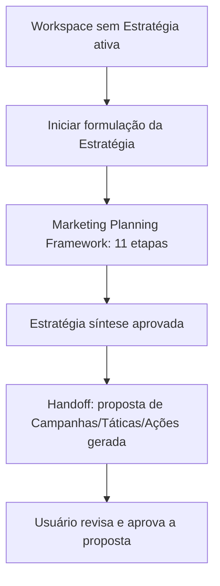

# RFC-001 — Estratégia

**Status:** Proposta
**Data:** 2026-07-26

# Objetivo

Definir completamente o módulo Estratégia — o núcleo da VEKTOR (Product Canon; Product Blueprint, Cap. 1) — cobrindo sua responsabilidade, limites, entidades envolvidas, o fluxo completo de criação de uma Estratégia (incluindo o Marketing Planning Framework), sua relação com Workspace e com Execução, e a participação da IA.

# Problema

A formulação de uma Estratégia (Blueprint Cap. 5), o domínio que a sustenta (Blueprint Cap. 3.3) e a experiência de uso do módulo (Blueprint Cap. 4) estão descritos em três capítulos separados do Blueprint. Sem consolidação, cada implementação poderia partir de apenas um desses capítulos e divergir das outras duas. Esta RFC existe para reunir essas três fontes em uma única especificação de implementação, sem adicionar nada além do que já está aprovado.

O módulo Estratégia também é a resposta direta a dois problemas registrados no Blueprint (Cap. 1): "Planejamento vira artefato morto" e "Execução sem metodologia".

# Escopo

O módulo Estratégia é responsável **apenas** pela formulação e pela síntese da intenção estratégica de um Workspace — ele não executa, não mede e não aprende; essas responsabilidades pertencem, respectivamente, a Execução, Growth e Aprendizado (Blueprint, Cap. 3.4 "Camadas do produto"; Cap. 3.5).

Esta RFC cobre:

- O módulo Estratégia como definido no Blueprint Cap. 3.5 ("Onde a intenção é formulada e registrada").
- A metodologia completa de formulação — as 11 etapas da fase de formulação (Blueprint Cap. 5).
- O momento de handoff em que a Estratégia aprovada gera a proposta inicial de Execução (Blueprint Cap. 5, "Fase de geração"; Cap. 4, "Do papel para a operação") — o gatilho e o que ele produz, não o comportamento interno de Execução depois disso.
- A relação da Estratégia com o Workspace (ADR-003, ADR-004) e com o Contexto Estratégico (ADR-007).
- A participação da IA como copiloto em cada etapa da formulação (Blueprint Cap. 5; `architecture/ai.md`).
- O ciclo de vida da Estratégia: sem Estratégia ativa → ativa → encerrada → nova ativa (`architecture/navigation.md`, diagrama de estados).

# Fora do escopo

- A especificação completa das quatro etapas de geração que já pertencem ao domínio de Execução — Editorias, Campanhas, Calendário Editorial, Plano de Ação (Blueprint Cap. 5, "Fase de geração"). Listadas aqui por completude da metodologia, mas sua especificação de implementação é objeto de RFC própria do módulo Execução.
- O módulo Growth e o Growth Framework (Blueprint Cap. 6) — citados apenas onde referenciam a Estratégia (ex.: Objetivo da Estratégia ativa como critério de um Experimento).
- O módulo Aprendizado e o mecanismo interno da ação "Evoluir Estratégia" — citados apenas como o gatilho que encerra a Estratégia ativa e inicia a próxima. Especificação completa é objeto de RFC própria.
- Módulos Relatórios, Biblioteca, Configurações.
- Decisões de interface visual (layout, componente, copy) — o Blueprint Cap. 4 estabelece que a formulação é "uma experiência contínua", não uma lista de telas, e esta RFC não desenha essa experiência em detalhe (ver lacuna em "Experiência do usuário").
- Schema de banco de dados detalhado (colunas, tipos, migrations) — ver lacuna em "Impactos → Banco".

# Experiência do usuário (UX)

Conforme Blueprint Cap. 4 ("Formular a primeira Estratégia"): o usuário entra no módulo Estratégia e é conduzido pela fase de formulação — Diagnóstico, Mercado, Concorrentes, SWOT, ICP, Personas, Jornada do Cliente, Funis, Objetivos, Posicionamento — como uma experiência contínua, não como uma lista de sub-telas independentes que ele precisa descobrir sozinho em qual ordem visitar. Para o usuário, isso tudo é uma coisa só: Estratégia (Product Canon, "Linguagem").

A cada etapa, a IA participa como copiloto, sugerindo conteúdo a partir do que já foi definido (Blueprint Cap. 5). O usuário nunca vê um formulário em branco — vê uma sugestão para reagir, editar ou descartar; a palavra final é sempre humana.

A jornada de formulação termina quando a Estratégia (síntese) está definida: objetivos claros, posicionamento definido, um plano (Blueprint Cap. 4). Nesse momento, a operação (Campanhas, Táticas, Ações) é gerada como proposta revisável — não como fato consumado (Blueprint Cap. 4, "Do papel para a operação").

**Lacuna registrada:** o Blueprint descreve esta experiência em nível narrativo, não como wireframe ou fluxo de tela. Nenhum documento-fonte define quantas telas, em que ordem visual exata, ou quais componentes compõem essa experiência contínua — isso precisa ser decidido em uma RFC de UX específica ou em iteração de design antes da implementação de frontend.

# Modelo de domínio impactado

Entidades envolvidas (`architecture/domain.md`):

| Entidade | Papel nesta RFC |
|---|---|
| **Workspace** | Contém a Estratégia. Contexto Global — nunca muda quando uma Estratégia é criada, encerrada ou trocada. |
| **Estratégia** | Entidade central desta RFC. Existe dentro de um Workspace. Registra a intenção da empresa. |
| **Campanha** | Não é criada por esta RFC em detalhe — nasce como proposta a partir da Estratégia no momento do handoff (ver "Fora do escopo"). |

**Relação com Workspace:**
- Um Workspace acumula múltiplas Estratégias ao longo do tempo (Blueprint, Cap. 3.2 — "Note o plural: Estratégias").
- A qualquer momento, exatamente uma Estratégia por Workspace está ativa (ADR-003).
- Uma Estratégia encerrada permanece no Workspace, consultável e comparável no Contexto Global, mas nunca mais recebe Execução (ADR-004).
- O Workspace em si não é alterado pela criação, formulação ou encerramento de uma Estratégia — ele passa a conter mais uma entrada em seu histórico (`architecture/navigation.md`).

**Relação com Execução:**
- Nenhuma Campanha, Tática, Ação ou Experimento existe fora do contexto de uma Estratégia (ADR-008; Blueprint, Cap. 3.1, "Estratégia antes da execução").
- Quando a Estratégia (síntese) é aprovada, a plataforma gera uma proposta inicial de Campanhas, Táticas e Ações — revisável e ajustável antes de se tornar real (Blueprint, Cap. 4 e Cap. 5, "O handoff").
- Uma Estratégia encerrada nunca mais recebe essa geração — toda Execução nova ocorre somente na Estratégia ativa (ADR-004).

# Participação da IA

Conforme `architecture/ai.md` e Blueprint Cap. 5.

**Pode:**
- Sugerir SWOT a partir do Diagnóstico.
- Sugerir um recorte de ICP a partir do SWOT.
- Sugerir Posicionamento a partir do que já foi definido (Concorrentes + ICP + Objetivos).
- Esboçar Objetivos.
- Acelerar o preenchimento de qualquer uma das 11 etapas de formulação, sempre com aprovação humana antes de avançar para a próxima.

**Nunca:**
- Aprovar ou avançar uma etapa da formulação sem confirmação humana (Blueprint, Cap. 5 — "Ela nunca pula uma etapa em nome do usuário").
- Criar ou aprovar a Estratégia (síntese) final sozinha — é sempre decisão estratégica, protegida pela regra "a IA nunca é a protagonista" (Product Canon).
- Tornar reais Campanhas/Táticas/Ações geradas no handoff sem revisão humana — a geração é sempre proposta (Blueprint, Cap. 4).

**Context Builder** (`architecture/ai.md`) aplicado a este módulo: o Workspace ativo, a Estratégia em formulação (e o estado parcial de suas 11 etapas), e Evidência/Aprendizado de Estratégias anteriores do mesmo Workspace relevantes ao novo Diagnóstico.

# Fluxos

## Fluxo completo de criação de uma Estratégia

Este fluxo cobre tanto a primeira Estratégia de um Workspace (Blueprint Cap. 4, "Chegada" → "Formular a primeira Estratégia") quanto uma nova Estratégia originada de "Evoluir Estratégia" — a diferença é que, no segundo caso, a etapa Diagnóstico já parte do Aprendizado acumulado em vez de um estado em branco (Blueprint Cap. 4). O mecanismo de "Evoluir Estratégia" em si é detalhado em RFC própria (ver "Fora do escopo").

**Confirmado por ADR-015 (`DECISIONS.md`):** a Estratégia passa a contar como "ativa" do Workspace (ADR-003) desde o início da formulação (passo B), não apenas após a aprovação da proposta de Execução (passo F) — não existe um terceiro estado de rascunho não-vinculante. "Ativa" não implica handoff automático liberado: a geração de proposta de Campanha/Tática/Ação (passo E) continua condicionada à aprovação da síntese (etapa 11); criação manual de Campanha durante a formulação, antes da síntese, já é permitida por RFC-002 critério 4 desde que a Estratégia esteja `ativa`. Esta era a leitura assumida por esta RFC, registrada como pendente de confirmação — a confirmação ocorreu via ADR-015.

## Marketing Planning Framework

Fase de formulação (dentro do módulo Estratégia) — cada etapa depende do resultado da anterior (Blueprint, Cap. 5):

| Etapa | Depende de | Pergunta que responde |
|---|---|---|
| 1. Diagnóstico | — | Onde a empresa está agora, por dentro e por fora? |
| 2. Mercado | Diagnóstico | Em que ambiente a empresa compete, e para onde ele está indo? |
| 3. Concorrentes | Mercado | Quem disputa a mesma atenção e o mesmo cliente? |
| 4. SWOT | Diagnóstico + Mercado + Concorrentes | Onde estão as forças, fraquezas, oportunidades e ameaças reais? |
| 5. ICP | SWOT | Para qual tipo de cliente a empresa deveria estar vendendo? |
| 6. Personas | ICP | Quem é essa pessoa, na prática? |
| 7. Jornada do Cliente | Personas | Como essa pessoa caminha do desconhecimento até a decisão? |
| 8. Funis | Jornada do Cliente | Que estrutura vai conduzir essa jornada de forma repetível? |
| 9. Objetivos | SWOT + ICP | O que a empresa quer alcançar, e em quanto tempo? |
| 10. Posicionamento | Concorrentes + ICP + Objetivos | Como a empresa quer ser percebida por esse cliente, frente a essa concorrência? |
| 11. Estratégia (síntese) | Todas as anteriores | Onde apostar, com que prioridade, com que recurso? |

Handoff — listado por completude da metodologia; especificação de implementação é fora do escopo desta RFC:

| Etapa | Gerada a partir de |
|---|---|
| 12. Editorias | Posicionamento + Funis |
| 13. Campanhas | Objetivos + Estratégia (síntese) |
| 14. Calendário Editorial | Editorias + Campanhas |
| 15. Plano de Ação | Campanhas → Táticas |

Pular uma etapa da fase de formulação significa formular a próxima com uma base mais fraca (Blueprint, Cap. 5) — a ordem é dependência, não sugestão.

# Critérios de aceite

1. Um Workspace sem Estratégia ativa não permite criar Campanha, Tática, Ação ou Experimento (ADR-008).
2. As 11 etapas da fase de formulação só avançam na ordem de dependência definida (Blueprint, Cap. 5) — uma etapa não pode ser concluída antes de suas dependências estarem preenchidas.
3. A IA pode sugerir conteúdo em qualquer etapa, mas nenhuma etapa avança para a próxima sem confirmação humana explícita — exige Membro com `role = 'admin'` (ADR-012, `DECISIONS.md`).
4. Ao aprovar a Estratégia (síntese), uma proposta de Campanhas/Táticas/Ações é gerada e apresentada para revisão — não é persistida como real até aprovação humana. A aprovação da síntese exige Membro com `role = 'admin'` (ADR-012).
5. Um Workspace nunca tem mais de uma Estratégia ativa simultaneamente (ADR-003).
6. Uma Estratégia encerrada não aceita nova Campanha, Tática, Ação ou Experimento, mas permanece consultável e comparável (ADR-004).
7. **Esta decisão reduz a complexidade para o usuário?** Sim — consolida em um único módulo contínuo uma metodologia de 11 etapas que, sem a Estratégia, exigiria a empresa sincronizar esse raciocínio manualmente entre ferramentas separadas (Product Canon; Blueprint, Cap. 3.7).

# Impactos

- **Banco:** persistência de uma Estratégia por Workspace (com estado ativa/encerrada), do conteúdo estruturado das 11 etapas de formulação, e do histórico de Estratégias encerradas. **Lacuna:** nenhum documento-fonte define schema, tabelas ou colunas — apenas o modelo de domínio conceitual (`architecture/domain.md`). O motor de persistência (PostgreSQL via Drizzle ORM) já está definido em CLAUDE.md (Technology Stack); o desenho do schema é trabalho de implementação, não desta RFC.
- **Backend:** lógica que impede criação de Execução sem Estratégia ativa (ADR-008), lógica de transição de estado da Estratégia, e lógica de geração da proposta de handoff. CLAUDE.md (Code Quality) indica preferência por Server Actions quando simplificam a arquitetura; a forma exata de implementação é trabalho de implementação, não desta RFC.
- **Frontend:** interface para a experiência contínua de formulação (Blueprint, Cap. 4), usando a stack definida em CLAUDE.md (Next.js, React, Tailwind CSS, shadcn/ui). **Lacuna:** nenhum wireframe ou componente está especificado — ver "Experiência do usuário" acima.
- **IA:** integração de sugestão nas 11 etapas de formulação, respeitando os limites de `architecture/ai.md`. O provider e mecanismo técnico de IA são cobertos pela stack definida em CLAUDE.md (Technology Stack), não por esta RFC.
- **Navegação:** o módulo Estratégia vive no Contexto Estratégico (ADR-007). Antes da primeira Estratégia existir, o Workspace está no estado "sem Estratégia ativa" (`architecture/navigation.md`) — a Sidebar e o Seletor de Estratégia Ativa precisam refletir esse estado inicial explicitamente.
- **Product Canon:** esta RFC opera dentro dos princípios "toda estratégia deve evoluir" e "toda funcionalidade deve responder a uma necessidade estratégica". Nenhum conteúdo desta RFC contraria o Canon.
- **Product Blueprint:** esta RFC detalha e consolida os Capítulos 3, 4 e 5 para fins de implementação — não os substitui nem os contradiz. Nenhuma seção do Blueprint precisa ser alterada.

# Dependências

- Fundação técnica do monorepo (CLAUDE.md, Technology Stack) já implementada.
- O handoff para Execução (etapas 12–15) depende de uma RFC própria que especifique o módulo Execução — sem ela, a implementação desta RFC pode entregar a formulação e a geração da proposta, mas não a operação completa de Execução.
- A ação "Evoluir Estratégia" (transição Encerrada → nova Ativa) depende de uma RFC própria para o módulo Aprendizado.

# Checklist

- [ ] Não contraria o Product Canon.
- [ ] Não contraria o Product Blueprint.
- [ ] Não contraria nenhuma decisão registrada em `DECISIONS.md`.
- [ ] Toda operação proposta nasce dentro de uma Estratégia (ADR-008), se aplicável — N/A para a Estratégia em si (ela nasce dentro de um Workspace, não de outra Estratégia); aplicável e respeitado para a geração de Campanhas/Táticas/Ações no handoff.
- [ ] Participação de IA (se houver) respeita os limites de `architecture/ai.md`.
- [ ] Seção "Fora do escopo" preenchida.
- [ ] Critérios de aceite são verificáveis, não vagos.
- [ ] Esta decisão reduz a complexidade para o usuário? (Product Canon; Product Blueprint, Cap. 3.7) — sim, ver Critério de aceite nº7.

---

## Revisão crítica desta RFC

Feita antes de considerar o documento concluído, como pedido.

**Ambiguidade encontrada, registrada e posteriormente fechada:** em que ponto do fluxo uma Estratégia em formulação passa a contar como "a Estratégia ativa" para fins de ADR-003. Os documentos-fonte não respondiam isso de forma explícita. A leitura assumida (ativa desde o início da formulação) foi confirmada formalmente por ADR-015 (`DECISIONS.md`) — não é mais uma leitura pendente.

**Duplicação avaliada e considerada necessária, não acidental:** a tabela do Marketing Planning Framework (11 + 4 etapas) reaparece aqui como já está em `product-blueprint.md` Cap. 5. Mantive porque é o objeto central desta RFC — omiti-la obrigaria o leitor a alternar entre dois documentos para entender o próprio assunto da RFC. Não copiei a prosa narrativa do Cap. 5 ao redor da tabela, só a tabela e uma frase de síntese.

**Inconsistência verificada e não encontrada:** conferi que "Campanha" aparece com o mesmo relacionamento ("existe dentro de Estratégia") em `domain.md`, no Blueprint Cap. 3.3 e nesta RFC — sem divergência de nomenclatura ou de hierarquia.

**Lacunas registradas explicitamente, sem solução inventada:** schema de banco, wireframes de UX, e o mecanismo técnico de IA — os três são apontados como decisões de implementação em aberto, não preenchidos com uma proposta não documentada.

**Checklist revertido para `[ ]`:** o Checklist representa o critério de aprovação da RFC, não a conclusão da sua redação — são coisas diferentes. A autorrevisão acima já foi feita e permanece registrada nesta seção; os itens do Checklist só devem ser marcados após aprovação humana formal, seguindo o fluxo Draft → Review → Approved → Ready for Implementation.
