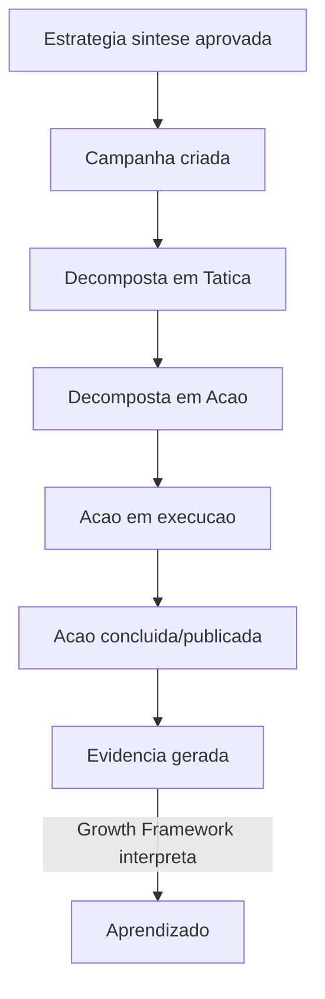
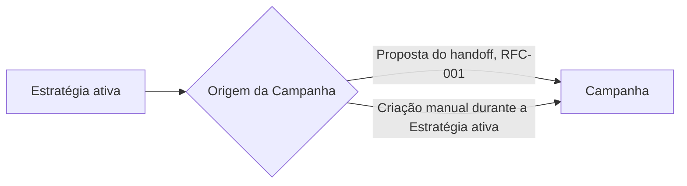
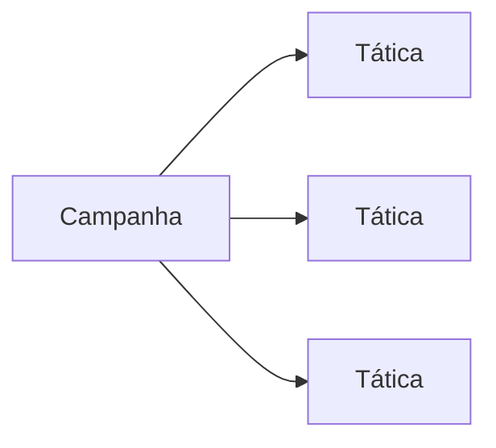
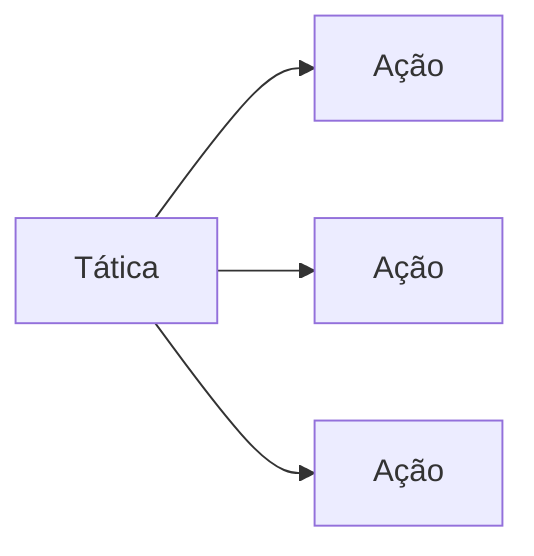
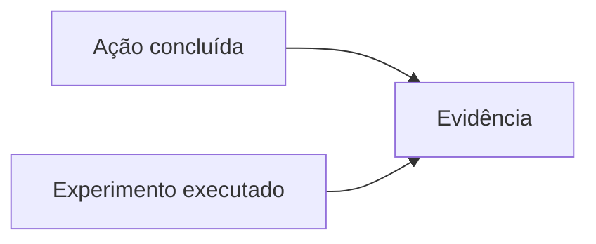
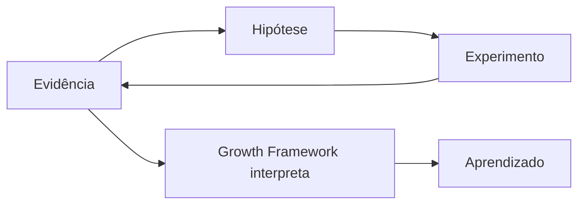

# RFC-002 — Execução

**Status:** Draft
**Data:** 2026-07-26

Continuação natural da [RFC-001 — Estratégia](./RFC-001-estrategia.md): a RFC-001 termina no momento em que a Estratégia (síntese) é aprovada e uma proposta de Campanhas/Táticas/Ações é gerada. Esta RFC começa exatamente ali.

# Objetivo

Definir completamente o módulo Execução da VEKTOR: sua responsabilidade, limites, entidades envolvidas, relação com Estratégia, com Growth e com Aprendizado, participação da IA, e o fluxo operacional completo — desde a criação de uma Campanha até a geração de Evidência.

# Problema

O Blueprint descreve a operação em três lugares diferentes — o handoff que a gera (Cap. 5), a rotina de quem a executa no dia a dia (Cap. 4, "Rotina de execução"), e a entrada de dados que ela produz para Growth (Cap. 4, "Growth entra em cena"; Cap. 6). A RFC-001 especifica o lado da Estratégia até o ponto de handoff, mas explicitamente deixa "a especificação completa das quatro etapas de geração que já pertencem ao domínio de Execução" para uma RFC própria (RFC-001, "Fora do escopo" e "Dependências"). Esta é essa RFC — sem ela, a proposta gerada pela Estratégia não tem para onde ir.

# Escopo

O módulo Execução é responsável **apenas** por transformar a intenção aprovada de uma Estratégia em trabalho concreto, executável e rastreável — ele não formula estratégia, não mede resultado e não interpreta aprendizado; essas responsabilidades pertencem a Estratégia, Growth e Aprendizado respectivamente (Blueprint, Cap. 3.4 "Camadas do produto"; Cap. 3.5).

Esta RFC cobre:

- As entidades Campanha, Tática e Ação — responsabilidade e hierarquia (`architecture/domain.md`).
- A criação de Campanhas: tanto a proposta inicial gerada no handoff da RFC-001 quanto a criação de novas Campanhas enquanto a Estratégia permanece ativa.
- A decomposição de Campanha em Tática e de Tática em Ação.
- O fluxo operacional do dia a dia (Blueprint, Cap. 4, "Rotina de execução").
- A produção de Evidência a partir de Ação ou Experimento (Blueprint, Cap. 3.1; `architecture/domain.md`).
- A relação de Execução com Growth (módulo e Framework — ADR-006) e com Aprendizado.
- A participação da IA em Execução, nos limites de `architecture/ai.md`.
- O que acontece com a Execução quando a Estratégia que a contém é encerrada (ADR-004).

# Fora do escopo

- A formulação da Estratégia e o Marketing Planning Framework — já especificados na RFC-001.
- O mecanismo interno do Growth Framework (Resultados → Hipótese → Priorização → Experimento → Evidência → Aprendizado) — Blueprint Cap. 6; objeto de RFC própria. Esta RFC documenta apenas o ponto de contato: Execução produz Evidência e pode receber um Experimento para rodar.
- O módulo Aprendizado e a ação "Evoluir Estratégia" em detalhe — objeto de RFC própria.
- Editorias e Calendário Editorial como conceitos de conteúdo (Blueprint, Cap. 5, etapas 12 e 14) — mencionados apenas onde intersectam Campanha/Tática/Ação; sua especificação completa (se necessária como entidades próprias) não está coberta aqui porque o Blueprint não as inclui na lista de nove entidades oficiais (`architecture/domain.md`) — ver lacuna registrada abaixo.
- Módulos Relatórios, Biblioteca, Configurações.
- Decisões de interface visual (layout, componente, copy) e schema de banco detalhado — ver lacunas em "Impactos".

# Experiência do usuário (UX)

Conforme Blueprint Cap. 4, "Rotina de execução": quem entra no módulo Execução no dia a dia é o operacional — a pessoa responsável por Execução, não por reformular estratégia (Blueprint, Cap. 2, persona Rafael). Ao abrir o Workspace, a Estratégia Ativa do Contexto Estratégico já está definida. Em Execução, ela vê Ações priorizadas e agendadas, algumas sugeridas pela IA (ex.: um calendário de publicação), esperando confirmação ou ajuste. Ela marca o que foi feito e publica o que estava pronto. O Breadcrumb sempre mostra a Campanha e a Tática de onde aquela Ação depende — ela nunca precisa voltar a Estratégia para lembrar por que a Ação existe.

Imediatamente após a aprovação da Estratégia (RFC-001, "Do papel para a operação"), o usuário vê a proposta inicial de Campanhas/Táticas/Ações gerada — não uma tela vazia — e a revisa, ajusta e aprova antes de qualquer Ação se tornar real.

**Lacuna registrada:** assim como na RFC-001, o Blueprint descreve esta experiência em nível narrativo. Nenhum documento-fonte define telas, componentes ou o desenho visual da decomposição Campanha → Tática → Ação — isso é trabalho de uma RFC de UX específica ou de iteração de design.

# Modelo de domínio impactado

Entidades envolvidas (`architecture/domain.md`):

| Entidade | Existe dentro de | Papel nesta RFC |
|---|---|---|
| **Estratégia** | Workspace | Não é criada nem alterada aqui (RFC-001) — é a pré-condição obrigatória (ADR-008) para toda entidade abaixo. |
| **Campanha** | Estratégia | Entidade central desta RFC. Traduz a intenção da Estratégia em uma aposta concreta. |
| **Tática** | Campanha | Define a abordagem dentro da aposta — o "como" de uma Campanha. |
| **Ação** | Tática | A unidade executável — o que de fato é feito, agendado ou publicado. |
| **Experimento** | Tática ou Ação | Não é criado por esta RFC (pertence ao Growth Framework) — mas roda dentro do domínio de Execução, e por isso sua existência aqui precisa ser reconhecida. |
| **Evidência** | Ação ou Experimento | Produzida por esta RFC como saída de toda Ação e todo Experimento — é o limite de saída do módulo Execução. |

Aprendizado e Hipótese não têm relação direta com Execução — apenas indireta, através de Evidência e do Growth Framework (ver "Relação com Growth" e "Relação com Aprendizado" abaixo).

**Relação com Estratégia:**
- Nenhuma Campanha, Tática, Ação ou Experimento existe fora do contexto de uma Estratégia (ADR-008).
- Uma Campanha pode nascer de duas formas: (1) como parte da proposta inicial gerada no handoff quando a Estratégia (síntese) é aprovada (RFC-001, "Fluxo completo de criação de uma Estratégia"); ou (2) criada manualmente enquanto a Estratégia permanece ativa. O Blueprint não distingue essas duas origens em termos de regra — ambas exigem apenas uma Estratégia ativa (ADR-008).
- Quando a Estratégia é encerrada (ADR-004), nenhuma nova Campanha, Tática, Ação ou Experimento pode nascer dentro dela. **Lacuna registrada:** os documentos-fonte não especificam o que acontece com uma Ação, Tática ou Campanha que já estava em andamento (não concluída) no momento em que a Estratégia é encerrada — se ela é interrompida, continua até o fim, ou fica em um estado indefinido. Esta RFC não inventa uma resposta.

**Relação com Growth:**
Growth Module ≠ Growth Framework (ADR-006). A relação de Execução com cada um é diferente:
- Com o **módulo Growth**: nenhuma relação direta — o módulo Growth é a superfície onde Evidência é analisada, não uma entidade que Execução chama ou depende.
- Com o **Growth Framework** (Blueprint, Cap. 6): bidirecional.
  - **Saída:** toda Ação executada e todo Experimento rodado produzem Evidência, que alimenta o ciclo de Growth (Blueprint, Cap. 4, "Growth entra em cena"; Cap. 6.2).
  - **Entrada:** um Experimento, justificado por uma Hipótese formada a partir de Evidência anterior, roda dentro de uma Tática ou Ação (`architecture/domain.md`) — ou seja, o Growth Framework pode originar trabalho que passa a existir dentro do domínio de Execução.

**Relação com Aprendizado:**
Não há relação direta. Execução não escreve nem lê Aprendizado. A única via é indireta: Ação/Experimento → Evidência → (Growth Framework interpreta) → Aprendizado (Blueprint, Cap. 3.3; Cap. 6). Esta RFC não define nenhum comportamento de Execução em relação a Aprendizado além de ser, transitivamente, a origem do dado que o alimenta.

# Participação da IA

Conforme `architecture/ai.md`, a única participação de IA documentada para o módulo Execução é:

**Onde a IA participa (ativamente, gerando sugestão):**
- Sugestão de priorização e agendamento de Ações — ex.: um calendário de publicação (Blueprint, Cap. 4, "Rotina de execução"; `architecture/ai.md`, tabela "Como a IA participa de cada módulo").

**Onde a IA apenas auxilia:**
- **Lacuna registrada:** os documentos-fonte não definem uma categoria intermediária de "auxílio" para o módulo Execução, distinta da sugestão de priorização/agendamento acima. Não há, por exemplo, menção documentada a resumo de pendências, alertas de prazo, ou qualquer outra forma de assistência mais leve. Esta RFC não inventa esse comportamento — se ele for desejado, precisa ser especificado em uma RFC própria ou como emenda a esta.

**Onde a IA nunca toma decisões:**
- Decidir ou executar sozinha em nome do usuário (Product Canon; Blueprint, Cap. 1).
- Tornar uma Ação, Tática ou Campanha "real" sem revisão humana quando ainda é parte da proposta inicial de handoff (RFC-001).
- Aprovar qualquer mudança estratégica — fora do escopo de Execução, mas a fronteira geral se aplica (Blueprint, Cap. 6.7).
- **Lacuna registrada:** o Blueprint não esclarece se marcar uma Ação como concluída ou publicá-la (Blueprint, Cap. 4 — ações hoje descritas como feitas por um humano: "ela marca o que foi feito, publica o que estava pronto") é uma tarefa de baixo risco automatizável pela IA (permitido genericamente pelo Product Canon) ou uma ação que sempre exige confirmação humana explícita. Esta RFC não decide isso — registra a ambiguidade para resolução em Review.

# Fluxos

## Fluxo operacional completo

*(Rótulos sem acentuação neste diagrama específico por limitação de compatibilidade; ver diagramas individuais abaixo para a nomenclatura oficial completa.)*

## Criação de Campanha

## Decomposição em Táticas

## Decomposição em Ações

## Execução

**Lacuna registrada:** os nomes e o número exato de estados intermediários ("priorizada", "agendada", "aguardando confirmação", "em execução") são uma síntese da narrativa do Blueprint Cap. 4, não uma máquina de estados oficial. Nenhum documento-fonte enumera os estados formais de uma Ação. Ver "Estados" abaixo.

## Conclusão

**Lacuna registrada:** o Blueprint usa "marca o que foi feito" e "publica o que estava pronto" como duas frases distintas (Cap. 4) — não fica claro se são o mesmo estado terminal para todo tipo de Ação ou dois estados diferentes (ex.: Ações de conteúdo "publicam"; outras Ações apenas "concluem"). Não há também definição de como uma Campanha ou Tática é considerada concluída — se é automático quando todas as Ações filhas concluem, ou se exige uma ação explícita. Esta RFC não resolve isso.

## Geração de Evidência

## Envio para Aprendizado

Execução não envia nada "para" Aprendizado diretamente — produz Evidência; é o Growth Framework (Blueprint, Cap. 6, fora do escopo desta RFC) quem interpreta essa Evidência e produz Aprendizado.

## Estados

Não existe, em nenhum documento-fonte, uma lista oficial e enumerada de estados para Campanha, Tática ou Ação. O que existe é linguagem narrativa da qual esta RFC sintetiza uma progressão aproximada, sem tratá-la como especificação formal:

| Entidade | Estados sintetizados (não oficiais) | Fonte |
|---|---|---|
| Campanha | Sem estado documentado além de conter Táticas | — (lacuna) |
| Tática | Sem estado documentado além de conter Ações | — (lacuna) |
| Ação | Proposta → Priorizada/Agendada → Em execução → Concluída/Publicada | Blueprint, Cap. 4, síntese narrativa |

**Esta é a lacuna mais significativa desta RFC.** Uma máquina de estados formal (nomes exatos, transições permitidas, se Campanha/Tática têm estado próprio ou apenas agregam o estado das Ações filhas) precisa ser definida antes da implementação — em Review desta RFC, ou como uma RFC de emenda.

## Dependências entre entidades

A única regra de dependência documentada é hierárquica e herdada de `architecture/domain.md`: Ação depende de Tática existir; Tática depende de Campanha existir; Campanha depende de Estratégia ativa existir (ADR-008). Não há, nos documentos-fonte, dependência documentada *entre* Campanhas, *entre* Táticas de Campanhas diferentes, ou *entre* Ações de Táticas diferentes (ex.: uma Ação que só pode começar depois que outra termina). **Lacuna registrada.**

## Handoffs

1. **Estratégia → Execução** (RFC-001): a Estratégia síntese aprovada gera a proposta inicial de Campanhas/Táticas/Ações, revisável antes de real.
2. **Growth Framework → Execução**: um Experimento, justificado por uma Hipótese, passa a existir dentro de uma Tática ou Ação (`architecture/domain.md`).
3. **Execução → Growth Framework**: toda Ação concluída e todo Experimento executado produzem Evidência.

# Critérios de aceite

1. Nenhuma Campanha, Tática, Ação ou Experimento é criado fora do contexto de uma Estratégia ativa (ADR-008).
2. Uma Ação não existe sem uma Tática; uma Tática não existe sem uma Campanha; uma Campanha não existe sem uma Estratégia (hierarquia de `architecture/domain.md`).
3. A proposta inicial de Campanhas/Táticas/Ações gerada no handoff da Estratégia (RFC-001) é apresentada para revisão — nenhuma Ação se torna real sem aprovação humana.
4. Uma Campanha pode ser criada tanto pela proposta de handoff quanto manualmente, desde que a Estratégia esteja ativa — as duas origens seguem a mesma regra (ADR-008).
5. Toda Ação concluída e todo Experimento executado produzem Evidência. Este é o caminho automático; ADR-016 ratifica um segundo mecanismo, explícito e independente, de registro de Evidência (`registrarEvidencia`) — aditivo, sem alterar o `status` da Ação.
6. A IA pode sugerir priorização e agendamento de Ações, mas nunca aprova ou decide sozinha em nome do usuário. **Pendente de Review:** se marcar uma Ação como concluída/publicada pode ser delegado à IA como tarefa de baixo risco é uma lacuna registrada nesta RFC — este critério só é totalmente verificável depois que essa lacuna for resolvida.
7. Quando a Estratégia que contém uma Campanha, Tática ou Ação é encerrada, nenhuma nova Campanha, Tática, Ação ou Experimento pode ser criada dentro dela (ADR-004).
8. O Breadcrumb de qualquer Ação mostra corretamente a Campanha e a Tática das quais ela deriva (`architecture/navigation.md`).
9. **Esta decisão reduz a complexidade para o usuário?** Sim — a decomposição estruturada (Campanha → Tática → Ação), sempre rastreável até a Estratégia de origem, elimina a necessidade de o usuário manter manualmente essa rastreabilidade entre ferramentas separadas (Product Canon; Blueprint, Cap. 3.7).

# Impactos

- **Banco:** persistência de Campanha, Tática e Ação, sua hierarquia, e o vínculo de cada uma com a Estratégia ativa que as contém. **Lacuna:** nenhum schema, tabela ou coluna está definido — nem os estados formais (ver "Estados" acima), que são pré-requisito para desenhar qualquer coluna de status. O motor (PostgreSQL via Drizzle ORM) já está definido em CLAUDE.md (Technology Stack); o schema é trabalho de implementação, condicionado à resolução da lacuna de Estados.
- **Backend:** lógica de decomposição (Campanha → Tática → Ação), lógica que impede criação de qualquer uma delas fora de uma Estratégia ativa (ADR-008), e lógica de produção de Evidência ao concluir uma Ação ou Experimento. CLAUDE.md (Code Quality) indica preferência por Server Actions quando simplificam a arquitetura; a implementação exata não é objeto desta RFC.
- **Frontend:** interface para a rotina de execução (Blueprint, Cap. 4) usando a stack de CLAUDE.md (Next.js, React, Tailwind CSS, shadcn/ui). **Lacuna:** nenhum wireframe está especificado.
- **IA:** integração de sugestão de priorização/agendamento de Ações, respeitando os limites de `architecture/ai.md`. Ver lacunas registradas em "Participação da IA".
- **Navegação:** o módulo Execução vive no Contexto Estratégico (ADR-007; `architecture/navigation.md`). O Breadcrumb precisa refletir a cadeia Estratégia › Campanha › Tática (`architecture/navigation.md`).
- **Product Canon:** esta RFC opera dentro dos princípios "execução gera dados" e "toda funcionalidade deve responder a uma necessidade estratégica". Nenhum conteúdo contraria o Canon.
- **Product Blueprint:** esta RFC detalha e consolida os Capítulos 3, 4, 5 (ponto de handoff) e 6 (ponto de contato com Evidência) para fins de implementação — não os substitui nem os contradiz.

# Dependências

- RFC-001 — Estratégia: fornece a Estratégia ativa e a proposta inicial de handoff que esta RFC consome.
- RFC-003 — Growth: especifica como um Experimento é originado e entregue a uma Tática/Ação, e como a Evidência é consumida do outro lado. Aceita e implementada (2026-07-28) — dependência satisfeita.
- RFC-005 — Aprendizado: fecha o ciclo iniciado pela Evidência gerada aqui. Aceita (2026-07-28); implementação do módulo em si é missão futura própria.
- Resolução da lacuna de "Estados" — RFC-004 (Aceita, 2026-07-28) — era pré-requisito para qualquer trabalho de banco de dados; satisfeita.

# Checklist

- [ ] Não contraria o Product Canon.
- [ ] Não contraria o Product Blueprint.
- [ ] Não contraria nenhuma decisão registrada em `DECISIONS.md`.
- [ ] Toda operação proposta nasce dentro de uma Estratégia (ADR-008), se aplicável.
- [ ] Participação de IA (se houver) respeita os limites de `architecture/ai.md`.
- [ ] Seção "Fora do escopo" preenchida — não deixar implícita.
- [ ] Critérios de aceite são verificáveis, não vagos.
- [ ] **Esta decisão reduz a complexidade para o usuário?** (Product Canon; Product Blueprint, Cap. 3.7) — resposta precisa ser sim.

---

## Revisão crítica desta RFC

Autorrevisão feita antes de considerar o documento concluído, como pedido. A RFC permanece em **Draft**.

**Conflito com a RFC-001: nenhum encontrado.** A fronteira declarada por ambas coincide — RFC-001 termina na proposta de handoff aprovável; RFC-002 começa exatamente aí. A regra ADR-008 (toda operação nasce de uma Estratégia) e ADR-004 (Estratégia encerrada nunca recebe Execução) são citadas de forma idêntica nas duas RFCs.

**Conflito com o Product Blueprint: nenhum encontrado.** Toda afirmação desta RFC aponta para um capítulo específico; onde o Blueprint é silencioso, registrei lacuna em vez de afirmar algo em nome dele.

**Inconsistência interna verificada:** o diagrama "Fluxo operacional completo" está sem acentuação (limitação deliberada de compatibilidade de renderização, sinalizada no próprio texto), enquanto todos os demais diagramas desta RFC usam acentuação normalmente, como no Blueprint e na RFC-001. Isso é uma inconsistência visual pequena, não conceitual — registrando para você decidir se deve ser padronizado.

**Duplicação corrigida:** "Critérios de aceite" voltou a ser uma lista própria, verificável e específica do comportamento funcional do módulo Execução (9 itens), distinta do "Checklist" de governança — que permanece exclusivamente os 8 itens de `rfc/README.md`. Este é agora o padrão oficial para todas as RFCs: Critérios de aceite validam o comportamento funcional da RFC; Checklist valida governança antes da aprovação. Nenhuma duplicação de conteúdo permanece entre as duas seções.

**Maior lacuna identificada:** a ausência de uma máquina de estados oficial para Ação (e a ausência total de estado para Campanha/Tática). Sem isso, tanto o schema de banco quanto a lógica de backend ficam bloqueados. Não inventei uma — apenas sintetizei o que a narrativa do Blueprint implica e marquei explicitamente como não oficial.

**Outras lacunas registradas, sem solução inventada:**
- O que acontece com Execução em andamento quando a Estratégia é encerrada.
- Se marcar uma Ação como concluída/publicada pode ser automatizado pela IA ou sempre exige confirmação humana.
- Se existe dependência de ordem entre Ações/Táticas/Campanhas irmãs.
- Se Editorias e Calendário Editorial (Blueprint, Cap. 5) precisam de representação própria no domínio de Execução além de Campanha/Tática/Ação — o Blueprint as menciona na metodologia mas não as lista como entidades oficiais em `architecture/domain.md`.

Nenhuma lacuna acima foi resolvida com uma decisão inventada — todas seguem abertas para Review.
