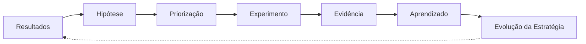
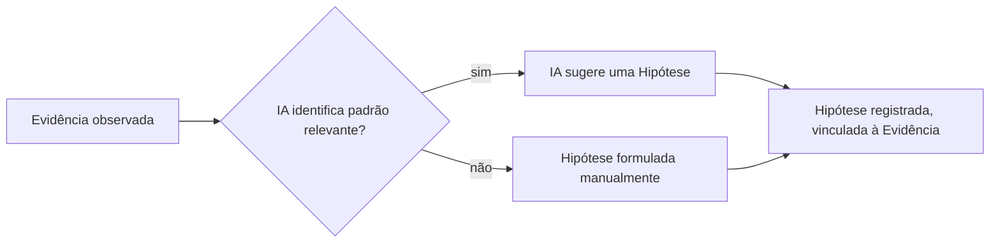
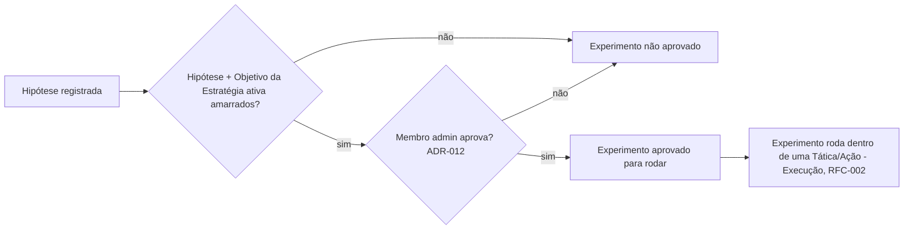

# RFC-003 — Growth

**Status:** Aceita (2026-07-28 — ver "Consolidação" e "Revisão de consistência" abaixo; implementação autorizada)
**Data:** 2026-07-26

Continuação natural da [RFC-001 — Estratégia](./RFC-001-estrategia.md) e da [RFC-002 — Execução](./RFC-002-execucao.md). A RFC-002 termina com Execução produzindo Evidência e registra, em "Dependências", que uma RFC própria do Growth Framework é necessária para especificar "como um Experimento é de fato originado e entregue a uma Tática/Ação, e como a Evidência é consumida do outro lado". Esta RFC é essa RFC.

**Nota de aprovação e implementação (2026-07-28):** RFC-003, RFC-004 e RFC-005 foram formalmente aprovadas (Status: Aceita). O bloqueio de governança descrito adiante neste documento ("RFC-004 permanece em Draft", "nenhum Service de Growth deve ser escrito antes dessa aprovação", etc.) está **resolvido** — essas passagens referem-se ao estado do documento antes desta aprovação e são mantidas como registro histórico da análise, não como estado atual. `GrowthService` (Hipótese + Experimento), Repositories, Composition Root, Server Actions e UI já foram implementados sobre esta RFC — a verificação dupla da amarração de Experimento e a transição acoplada de Hipótese (na aprovação e na conclusão) são parte da própria especificação desta RFC, não uma decisão arquitetural separada; ver o relatório de Architecture Freeze do módulo Growth. Aprendizado (RFC-005) permanece não implementado — é missão própria futura.

**Nota de consolidação (2026-07-27):** a máquina de estados de Hipótese e Experimento, registrada abaixo como lacuna na versão original desta RFC, é hoje especificada por [RFC-004 — Lifecycle & State Machine](./RFC-004-lifecycle-state-machine.md) — criada exatamente em resposta à recomendação que esta RFC fez em sua própria Revisão crítica. RFC-004 é a fonte única desses estados; esta RFC não os redefine, apenas referencia. Da mesma forma, [RFC-005 — Aprendizado](./RFC-005-aprendizado.md) já existe e assume formalmente a superfície do módulo Aprendizado e o mecanismo de "Evoluir Estratégia", que esta RFC deferia como dependência em aberto. **(Histórico — ver Nota de aprovação acima.)** Ambas as RFCs permaneciam, até 2026-07-28, em Draft.

# Objetivo

Definir completamente o módulo Growth da VEKTOR: o ciclo de melhoria contínua que conduz o que a Execução produziu até uma interpretação acionável — a partir daí, o registro como Aprendizado e a Evolução da Estratégia são responsabilidade do módulo Aprendizado (RFC-005). Growth não é experimentação isolada — é o mecanismo que transforma Execução em conhecimento interpretado, entregando-o a Aprendizado (Product Canon; Blueprint, Cap. 6.1).

# Problema

Sem esta RFC, a Evidência que a RFC-002 produz não tem destino documentado em nível de implementação, e a promessa central do Product Canon — "execução gera dados. dados geram aprendizado. aprendizado gera evolução" — permanece descrita apenas em nível de princípio (Canon) e de narrativa (Blueprint, Cap. 6), sem uma especificação única que consolide responsabilidade, entidades e fluxo para quem for construir o módulo.

# Escopo

Growth é responsável por conduzir Evidência até uma conclusão interpretada, através de um ciclo disciplinado — Hipótese → Priorização → Experimento — e por entregar essa interpretação ao módulo Aprendizado, que a registra e, quando os sinais acumulados justificam, sugere e conduz a evolução da Estratégia (RFC-005). Growth não formula estratégia, não executa e não decide a evolução sozinho; essas responsabilidades pertencem a Estratégia (RFC-001), Execução (RFC-002) e ao humano, respectivamente (Blueprint, Cap. 3.4 "Camadas do produto"; Cap. 6.7).

Esta RFC cobre:

- O ciclo de Growth completo (Blueprint, Cap. 6.2): Resultados → Hipótese → Priorização → Experimento → Evidência → interpretação.
- O papel das entidades Hipótese, Experimento e Evidência dentro deste ciclo — sem redefinir onde elas estruturalmente existem (`architecture/domain.md`, já fixado por RFC-002 para Experimento/Evidência).
- A distinção módulo Growth × Growth Framework (ADR-006).
- A participação da IA em Growth (formação e priorização de Hipótese, aprovação de Experimento) — não a participação da IA em Aprendizado (RFC-005).
- O ponto exato em que a responsabilidade passa de Growth para Aprendizado — não o mecanismo interno de registro ou de "Evoluir Estratégia" em si (RFC-005).

# Fora do escopo

- A execução física de um Experimento e a geração original de Evidência a partir de uma Ação — já especificadas na RFC-002; esta RFC consome esses resultados, não os redefine.
- A formulação da Estratégia e o Marketing Planning Framework — RFC-001.
- A especificação completa do módulo Aprendizado como superfície própria (como uma entrada é editada, arquivada, ou indexada em Biblioteca) e o mecanismo interno completo da ação "Evoluir Estratégia" (como a nova Estratégia é de fato criada a partir do Aprendizado acumulado) — mencionados apenas como o destino/gatilho que este ciclo alimenta. Especificados por [RFC-005 — Aprendizado](./RFC-005-aprendizado.md) (Draft), que fecha a dependência que RFC-001 e RFC-002 haviam registrado.
- O módulo Relatórios, incluindo sua visão dupla sobre Growth/Aprendizado (ADR-005) — mencionado apenas como consumidor indireto do que este ciclo produz.
- A Fase 2 do Roadmap ("Marketing Intelligence" — IA mais proativa, benchmarking entre ciclos, Blueprint Cap. 7) — é evolução futura declarada, não parte do Growth Framework nesta RFC.
- Máquina de estados de Hipótese e Experimento — especificada por [RFC-004 — Lifecycle & State Machine](./RFC-004-lifecycle-state-machine.md) (Draft); não redefinida aqui. Decisões de interface visual e schema de banco detalhado permanecem fora do escopo desta RFC.

# Experiência do usuário (UX)

Conforme Blueprint, Cap. 4 ("Growth entra em cena"): toda Ação executada e todo Experimento rodado deixam Evidência. Growth não espera o fim de um período para mostrar isso como uma tabela de números — observa a Evidência continuamente e traz à tona o que precisa de decisão agora. Ao entrar no Workspace, o Dashboard (Contexto Global) já aponta isso: não "aqui estão suas métricas", mas "isso aqui merece sua atenção hoje" — o teste de aceite é sempre recomendação, nunca número isolado (❌ "CTR = 1,8%" / ✅ "recomenda-se testar um criativo com foco em antes e depois").

A experiência de Aprendizado — o momento mais lento e reflexivo em que uma recomendação de Growth vira conclusão registrada, e o sinal de "Evoluir Estratégia" — é descrita por [RFC-005](./RFC-005-aprendizado.md) ("Experiência do usuário"), não repetida aqui.

**Lacuna registrada:** como nas RFCs anteriores, esta experiência é descrita em nível narrativo. Nenhuma tela, componente ou wireframe está definido nos documentos-fonte.

# Modelo de domínio impactado

Nenhuma entidade nova é criada por esta RFC. As quatro entidades abaixo já existem em `architecture/domain.md`; esta RFC documenta seu papel dentro do ciclo de Growth, sem alterar onde estruturalmente existem:

| Entidade | Existe dentro de (`architecture/domain.md`) | Papel no Growth Framework |
|---|---|---|
| **Evidência** | Ação ou Experimento | Entrada do ciclo — o registro observável que origina uma Hipótese. |
| **Hipótese** | Evidência | Formada a partir de Evidência observada, nunca de opinião (Blueprint, Cap. 6.3) — é o que um Experimento existe para validar. |
| **Experimento** | Tática ou Ação (RFC-002) | Roda dentro do domínio de Execução, mas é originado e justificado pelo Growth Framework: a Hipótese que o motiva e o Objetivo da Estratégia que ele serve pertencem a este ciclo (Blueprint, Cap. 6.4). |
| **Aprendizado** | Evidência (interpretada) | Recebe a interpretação que o ciclo de Growth produz e a registra como conclusão acionável — comportamento, ciclo de vida e participação de IA especificados integralmente por [RFC-005](./RFC-005-aprendizado.md), não por esta RFC. |

**Relação com Estratégia (RFC-001):** a Estratégia ativa fornece o Objetivo contra o qual todo Experimento é justificado (Blueprint, Cap. 6.4). A Estratégia é também a receptora final do Aprendizado quando ele evolui — mecanismo especificado por RFC-005, fora do escopo desta RFC.

**Relação com Execução (RFC-002):** o módulo Growth não tem relação direta com Execução — ele lê Evidência que a Execução já produziu. O Growth Framework, por outro lado, tem relação bidirecional com Execução, já registrada simetricamente em ambas as RFCs: recebe Evidência de Ação/Experimento; entrega um Experimento (justificado por Hipótese) para rodar dentro de uma Tática/Ação.

**Relação com Evidência:** é o dado de entrada do ciclo inteiro — "a moeda do ciclo" (Blueprint, Cap. 6.5). Nenhuma Hipótese ou decisão de Growth existe sem uma Evidência registrada que a sustente. Desde ADR-016 (`DECISIONS.md`), Evidência tem dois mecanismos legítimos de criação em Execução — automático (ao concluir uma Ação) e independente (`registrarEvidencia`) — mas essa distinção é interna à Execução; para o Growth Framework ambos produzem o mesmo dado de entrada, sem diferença de tratamento.

**Relação com Aprendizado:** é o destino do ciclo — Growth entrega a interpretação; o registro, a permanência na memória estratégica (Biblioteca) mesmo em caso de fracasso, e o tratamento de fracasso como conhecimento válido (Blueprint, Cap. 6.6) são especificados e implementados por RFC-005, não por esta RFC.

**Relação com Hipótese:** ver tabela acima — Hipótese é o elo formal entre uma Evidência observada e a justificativa de um Experimento (`architecture/domain.md`).

**Relação com Experimento:** ver tabela acima. Esta RFC não redefine onde um Experimento existe (RFC-002: Tática ou Ação) — apenas documenta que ele nasce de uma Hipótese e serve a um Objetivo da Estratégia ativa.

**Relação com Evolução da Estratégia:** o Growth Framework entrega a Aprendizado o sinal de entrada que pode justificar a sugestão de "Evoluir Estratégia" — uma ação disparada dentro do módulo Aprendizado (ADR-002), não um destino de navegação. A transição em si, quem a aprova e o que ela produz são especificados por RFC-005; esta RFC documenta apenas que o sinal existe e de onde vem.

# Participação da IA

Conforme `architecture/ai.md` e Blueprint, Cap. 6.7. Esta seção cobre exclusivamente a participação da IA no que é responsabilidade do módulo Growth — formação e priorização de Hipótese, e aprovação de Experimento. A participação da IA em Aprendizado (resumir conhecimento acumulado, sugerir o momento de "Evoluir Estratégia") é especificada por [RFC-005 — Aprendizado](./RFC-005-aprendizado.md) e não é repetida aqui.

**Onde a IA participa (ativamente, gerando sugestão):**
- Identificar padrões em Evidência acumulada.
- Sugerir Hipótese a partir desses padrões.
- Ajudar a priorizar entre Hipóteses concorrentes, à luz dos Objetivos da Estratégia ativa.
- Encontrar oportunidades entre o Objetivo da Estratégia e o Resultado atual.

**Onde apenas auxilia:**
- **Lacuna registrada:** assim como na RFC-002, os documentos-fonte não estabelecem uma camada intermediária de "auxílio" distinta da sugestão ativa acima. Não há, por exemplo, uma forma documentada de a IA apenas organizar ou destacar Evidência sem chegar a sugerir uma Hipótese. Esta RFC não inventa essa camada.

**Onde a IA nunca toma decisões:**
- Decidir sozinha o resultado de um Experimento. **Ambiguidade registrada:** o Blueprint (Cap. 3.1) diz que "Evidência bruta é interpretada — pela IA e pelo humano — até virar uma conclusão acionável", mas não especifica onde, dentro dessa interpretação conjunta, a fronteira decisória exata está. Esta RFC não resolve essa ambiguidade — RFC-005 registra a mesma lacuna do lado do registro de Aprendizado.
- Aprovar uma mudança estratégica automaticamente, ou disparar "Evoluir Estratégia" sem validação humana (Blueprint, Cap. 6.7 e 6.8, princípio nº4) — decisão e mecanismo pertencem a Aprendizado; ver RFC-005.

**Quais decisões continuam sendo humanas (nesta RFC):**
- **Resolvido por ADR-012 (`DECISIONS.md`):** iniciar um Experimento (transição Proposto→Aprovado, condicionada à dupla amarração Hipótese + Objetivo, Cap. 6.4) sempre exige aprovação humana explícita — nunca é automação de baixo risco — e essa aprovação exige Membro com `role = 'admin'`. O Blueprint usava "aprovado para rodar" (Cap. 6.4) sem dizer quem aprova; esta é a resposta formal, e fecha também o Bloqueador 3 de `ARCHITECTURE_RESOLUTION.md`.

A aprovação de "Evolução da Estratégia" também exige Membro `role = 'admin'`, mas essa decisão pertence ao módulo Aprendizado (ver RFC-005, "Participação da IA" — mesmo ADR-012, transição diferente) — não repetida aqui para evitar duas fontes da mesma regra.

# Fluxos

## Ciclo completo de Growth

Este ciclo não tem saída — "Evolução da Estratégia" reabre o ciclo com novos Resultados (Blueprint, Cap. 6.2 e 6.8, princípio nº5).

**Nota terminológica:** "Resultado" não é uma entidade oficial de `architecture/domain.md` — RFC-005 registra essa lacuna explicitamente (não fica claro se é sinônimo de Evidência, um agregado de Evidências, ou um conceito distinto ainda não modelado). Esta RFC usa o termo apenas na posição narrativa que o próprio Blueprint usa (Cap. 6.2, primeira etapa do ciclo), sem resolver a ambiguidade — a lacuna é a mesma, registrada uma única vez em RFC-005 para não ter duas fontes da mesma pergunta em aberto.

## Quais etapas pertencem a qual módulo

| Etapa | Pertence a |
|---|---|
| Execução (produz o Resultado bruto) | Módulo Execução (RFC-002) — fora do escopo desta RFC. |
| Resultados | Ponto de entrada do Growth Framework — dado vindo de Execução. |
| Hipótese | Growth Framework. |
| Priorização | Growth Framework (decisão humana assistida por IA — ver "Participação da IA"). |
| Experimento | Originado e justificado pelo Growth Framework; roda dentro do domínio de Execução (Tática/Ação, RFC-002). |
| Evidência (pós-experimento) | Produzida pela Execução (RFC-002); consumida pelo Growth Framework. |
| Aprendizado | Módulo Aprendizado (RFC-005) — registra a interpretação que Growth entrega; especificação completa fora do escopo desta RFC. |
| Evoluir Estratégia | Ação disparada dentro do módulo Aprendizado (ADR-002, RFC-005) — fora do escopo desta RFC; o Growth Framework apenas entrega o sinal. |

## Criação de Hipótese

*O ramo de formulação manual é uma inferência consistente com "a IA é copiloto" (Product Canon) — o Blueprint não descreve explicitamente um fluxo de criação de Hipótese sem participação de IA, mas também não o exclui. Registrado como inferência, não como fato documentado.*

## Execução de Experimento

**Resolvido por ADR-012 (`DECISIONS.md`):** a dupla amarração (Hipótese + Objetivo) é condição necessária, mas não suficiente — a aprovação também exige um Membro do Workspace com `role = 'admin'`. Isso fecha o Bloqueador 3 de `ARCHITECTURE_RESOLUTION.md`.

Este diagrama documenta apenas a regra de negócio (a dupla amarração e quem aprova) — os nomes formais dos estados que ela transiciona (`Proposto`, `Aprovado`, `Em execução`, `Concluído`) são definidos exclusivamente por RFC-004, não redefinidos aqui.

## Fronteira com Aprendizado

O Growth Framework é responsável pelo ciclo até a Evidência do Experimento entrar em interpretação (IA e humano, Blueprint Cap. 3.1). No momento em que essa interpretação é registrada como uma entrada permanente, a responsabilidade passa a ser do módulo Aprendizado — que a mantém consultável e, quando os sinais acumulados justificam, sugere e conduz "Evoluir Estratégia". O diagrama completo dessa transformação, o handoff para "Evoluir Estratégia" e a fronteira exata Growth/Aprendizado são especificados em [RFC-005 — Aprendizado](./RFC-005-aprendizado.md) ("Fluxo completo do Aprendizado"; "Reutilização de Aprendizados na criação de uma nova Estratégia") — não redesenhados aqui para não ter duas fontes da mesma regra.

# Critérios de aceite

1. Toda Hipótese registrada aponta para a Evidência que a originou — nenhuma Hipótese existe sem essa referência (Blueprint, Cap. 6.3).
2. Nenhum Experimento roda sem declarar qual Hipótese está testando e a qual Objetivo da Estratégia ativa ele serve (Blueprint, Cap. 6.4).
3. Toda Evidência nova, vinda de Ação ou Experimento, fica disponível para o ciclo de Growth observar continuamente — sem depender do fim de um período para ser considerada.
4. Toda decisão de Growth (continuar, pivotar, abandonar uma linha) aponta para uma Evidência registrada que a sustenta (Blueprint, Cap. 6.5).
5. Um Experimento que não confirma sua Hipótese ainda é interpretado e entregue a Aprendizado — fracasso não é descartado por Growth antes de chegar lá (Blueprint, Cap. 6.6; registro em si, RFC-005).
6. Nenhuma recomendação de Growth é apresentada como um número isolado sem uma ação sugerida associada (Blueprint, Cap. 1, teste de aceite de Growth).
7. Nenhuma transição desta RFC (formação de Hipótese, priorização, aprovação de Experimento) autoriza a IA a decidir sozinha — ver RFC-005, critério 4, para a mesma garantia aplicada à Evolução da Estratégia.
8. O ciclo de Growth não tem estado terminal — uma Evolução da Estratégia (RFC-005) sempre reabre o ciclo com novos Resultados (Blueprint, Cap. 6.8, princípio nº5).
9. **Esta decisão reduz a complexidade para o usuário?** Sim — substitui a necessidade de o usuário interpretar métricas cruas manualmente por uma recomendação já formada a partir de evidência real, fechando o ciclo entre execução e nova decisão estratégica (Product Canon; Blueprint, Cap. 1 e 3.7).

# Impactos

- **Banco:** persistência de Hipótese; Experimento e Evidência já são de responsabilidade da RFC-002; a persistência do registro de Aprendizado é de RFC-005. Estados de Hipótese e Experimento (`hypothesis_status`, `experiment_status`) definidos por RFC-004 — já implementados em `packages/db/src/schema.ts` (ver "Dependências" sobre o bloqueio de governança).
- **Backend:** lógica de amarração Hipótese–Objetivo–Experimento e lógica de interpretação de Evidência até o ponto de entrega a Aprendizado; a lógica de registro e de sugestão do momento de evoluir é de RFC-005. CLAUDE.md (Code Quality) indica preferência por Server Actions quando simplificam a arquitetura; a implementação exata não é objeto desta RFC.
- **Frontend:** interface para a experiência de Growth (Blueprint, Cap. 4) usando a stack de CLAUDE.md (Next.js, React, Tailwind CSS, shadcn/ui); a experiência de Aprendizado é de RFC-005. **Lacuna:** nenhum wireframe está especificado.
- **IA:** integração de identificação de padrões, sugestão de Hipótese e auxílio à priorização, respeitando os limites de `architecture/ai.md`; resumo de Aprendizado e sugestão do momento de evoluir são de RFC-005. Ver ambiguidades registradas em "Participação da IA".
- **Navegação:** os módulos Growth e Aprendizado vivem no Contexto Estratégico (ADR-007; `architecture/navigation.md`). A visão histórica de Relatórios (ADR-005) consome dado deste ciclo, mas sua especificação é fora do escopo.
- **Product Canon:** esta RFC opera dentro dos princípios "execução gera dados", "dados geram aprendizado", "aprendizado gera evolução" e "a IA nunca é a protagonista". Nenhum conteúdo contraria o Canon.
- **Product Blueprint:** esta RFC detalha e consolida o Capítulo 6 inteiro, além de pontos dos Capítulos 1, 3 e 4 — não os substitui nem os contradiz. A Fase 2 do Cap. 7 é citada apenas como fora do escopo.

# Dependências

- RFC-001 — Estratégia: fornece o Objetivo contra o qual todo Experimento é justificado.
- RFC-002 — Execução: fornece a Evidência de entrada e recebe o Experimento originado por este ciclo. Congelada (Architecture Freeze concluído; ADR-016).
- RFC-004 — Lifecycle & State Machine: define os estados de Hipótese e Experimento que esta RFC pressupõe. **Bloqueador de implementação:** RFC-004 permanece em Draft — o schema (`packages/db/src/schema.ts`, `hypothesis_status`/`experiment_status`) já implementa exatamente os estados que ela propõe, o que faz da aprovação formal de RFC-004 uma ratificação de algo já em produção, não uma decisão em aberto. Ainda assim, nenhum Service de Growth deve ser escrito antes dessa aprovação — implementar sobre uma RFC em Draft contraria `rfc/README.md` ("implementação só começa após aprovação").
- RFC-005 — Aprendizado: assume a superfície do módulo Aprendizado e o mecanismo de "Evoluir Estratégia" que esta RFC deferia. Também em Draft — mesma ressalva de bloqueio acima se aplica a qualquer Service que dependa do registro de Aprendizado.

# Checklist

- [ ] Não contraria o Product Canon.
- [ ] Não contraria o Product Blueprint.
- [ ] Não contraria nenhuma decisão registrada em `DECISIONS.md`.
- [ ] Toda operação proposta nasce dentro de uma Estratégia (ADR-008), se aplicável.
- [ ] Participação de IA (se houver) respeita os limites de `architecture/ai.md`.
- [ ] Seção "Fora do escopo" preenchida — não deixar implícita.
- [ ] Critérios de aceite são verificáveis, não vagos.
- [ ] **Esta decisão reduz a complexidade para o usuário?** (Product Canon; Product Blueprint, Cap. 3.7) — resposta precisa ser sim.

---

## Revisão crítica desta RFC

Autorrevisão feita antes de considerar o documento concluído. A RFC permanece em **Draft**.

**Inconsistências com RFC-001 e RFC-002: nenhuma encontrada.** Verifiquei especificamente que esta RFC não redefine onde Experimento ou Evidência existem estruturalmente (`architecture/domain.md`, fixado por RFC-002) — apenas documenta seu papel dentro do ciclo de Growth. A relação bidirecional Execução ↔ Growth Framework está descrita de forma simétrica nas duas RFCs (RFC-002, "Relação com Growth"; RFC-003, "Relação com Execução").

**Conflitos com o Product Blueprint: nenhum encontrado.** Toda afirmação aponta para um capítulo específico do Blueprint ou para um ADR; onde a fonte é silenciosa, registrei lacuna em vez de decidir em nome dela.

**Decisão arquitetural implícita verificada e removida:** a primeira versão do diagrama "Execução de Experimento" quase assumia que a aprovação da dupla amarração (Hipótese + Objetivo) era automaticamente suficiente para o Experimento rodar sem qualquer confirmação humana — o que seria uma decisão arquitetural não documentada. Corrigi isso registrando explicitamente a ambiguidade em "Participação da IA" em vez de resolvê-la no diagrama.

**Duplicação avaliada:** o ciclo de 7 etapas (Cap. 6.2) reaparece aqui como já está no Blueprint. Mantive porque é o objeto central desta RFC — omiti-lo obrigaria alternar entre documentos para entender o próprio assunto. Critérios de aceite e Checklist foram verificados item a item e não têm sobreposição de conteúdo entre si, seguindo o padrão estabelecido na RFC-002.

**Tema grande demais para esta RFC — registrado, não incorporado:** uma **RFC transversal de máquina de estados** parece necessária, cobrindo pelo menos Ação (lacuna já registrada na RFC-002), Hipótese e Experimento (lacunas registradas aqui). Os três compartilham o mesmo problema — nenhum tem estados formais definidos — e resolver isso separadamente em cada RFC arriscaria nomes e transições inconsistentes entre módulos. Recomendo que essa máquina de estados seja tratada como preocupação transversal, não como parte de nenhuma RFC de módulo individual.

> **Resolvido na consolidação de 2026-07-27:** RFC-004 foi escrita exatamente para atender esta recomendação e já cobre Ação, Hipótese e Experimento. Esta RFC foi atualizada para referenciar RFC-004 em vez de tratar o tema como lacuna própria (ver "Fora do escopo", "Fluxos" e "Dependências" acima). RFC-004 permanece em Draft — a lacuna de *especificação* está fechada; a lacuna de *aprovação formal* não está (ver "Dependências").

**Lacuna fechada nesta rodada:** se iniciar um Experimento exige aprovação humana explícita ou pode ser automação de baixo risco — **resolvido por ADR-012**: exige sempre aprovação humana explícita, por um Membro com `role = 'admin'`.

**Outras lacunas registradas, sem solução inventada:**
- Onde exatamente está a fronteira decisória entre IA e humano na interpretação conjunta de Evidência em Aprendizado (Blueprint, Cap. 3.1) — RFC-005 reafirma a mesma lacuna do lado de Aprendizado; permanece sem resposta em nenhuma fonte.
- Se existe uma camada de "auxílio" de IA distinta da sugestão ativa, para Growth como para Execução (mesma lacuna já registrada na RFC-002).

Nenhuma lacuna acima foi resolvida com uma decisão inventada — todas seguem abertas para Review.

---

## Consolidação de 2026-07-27

Revisão feita a pedido explícito, para transformar esta RFC na especificação arquitetural completa do módulo Growth antes do início da implementação — sem reabrir decisões de domínio já fixadas e sem duplicar RFC-004.

**Redundância eliminada:** o diagrama "Execução de Experimento" (seção "Fluxos") descrevia, em linguagem natural, transições que hoje têm nome formal em RFC-004 (`Proposto`/`Aprovado`/`Em execução`/`Concluído`). O diagrama foi mantido — documenta uma regra de negócio própria desta RFC (dupla amarração + aprovação `admin`), não apenas estado — mas passou a declarar explicitamente que os nomes de estado pertencem a RFC-004.

**Referências ausentes corrigidas:** esta RFC nunca citava RFC-004 pelo nome, apesar de RFC-004 ter sido criada em resposta direta à sua própria recomendação ("Tema grande demais para esta RFC", acima). Também nunca citava RFC-005, que já existe e fecha a dependência de "RFC própria do módulo Aprendizado" registrada em "Fora do escopo" e "Dependências". Ambas as referências foram adicionadas.

**Lacuna nova identificada nesta consolidação (não existia na versão original desta RFC):** o schema já implementado (`packages/db/src/schema.ts` — `hypothesis_status`, `experiment_status`, tabelas `hypotheses`/`experiments`/`evidences`/`learnings`, todas com FKs compostas consistentes com o domínio aqui descrito) já assume como definitivos os estados que RFC-004 propõe — mas RFC-004 continua formalmente em **Draft**, nunca aprovada. Isso não é uma inconsistência de dado (schema e RFC-004 concordam integralmente), mas é uma inconsistência de governança: `rfc/README.md` exige aprovação antes de implementação, e a camada de persistência já foi implementada sobre uma RFC não aprovada. Não corrijo isso aqui — apenas registro, porque a correção (aprovar RFC-004) é uma decisão do usuário, não um achado de documentação.

**O que já estava adequado e não foi alterado nesta primeira rodada:** a distinção módulo Growth × Growth Framework (ADR-006); o ciclo completo em Mermaid; a estrutura das quatro entidades. **Nota:** a segunda rodada de consolidação (ver seção abaixo) revisou "Participação da IA", "Critérios de aceite" e "Impactos" para eliminar sobreposição com RFC-005 — a afirmação original desta seção de que esses trechos permaneceriam intocados deixou de valer com o pedido de consolidação mais estrito que se seguiu.

---

## Consolidação de 2026-07-27 (segunda rodada) — RFC-003 como documento orquestrador

Pedido explícito: manter RFC-003 como especificação completa do domínio Growth, mas com RFC-004 como referência única para máquinas de estado e RFC-005 como referência única para participação de IA em Aprendizado e decisões do ciclo de aprendizagem — sem duplicar conteúdo já especificado nesses dois documentos.

**Duplicação de regra de negócio removida (não apenas de nomenclatura, diferente da primeira rodada):**
- "Participação da IA": as duas entradas que pertenciam a Aprendizado — "resumir Aprendizado acumulado" e "sugerir o momento de Evoluir Estratégia" — foram removidas da lista de participação ativa de Growth e substituídas por uma referência a RFC-005, que já as documenta com o mesmo nível de detalhe. O mesmo para "aprovar mudança estratégica automaticamente" e "disparar Evoluir Estratégia sem validação humana" em "Onde a IA nunca toma decisões", e para a aprovação de "Evolução da Estratégia" em "Quais decisões continuam sendo humanas" — RFC-005 já registra a mesma regra (via ADR-012) para essa transição especificamente.
- "Fluxos": os diagramas "Transformação de Evidência em Aprendizado" e "Handoff para Evoluir Estratégia" foram substituídos por uma única seção "Fronteira com Aprendizado", em prosa, que aponta para os diagramas equivalentes (e mais completos) já existentes em RFC-005 ("Fluxo completo do Aprendizado"; "Reutilização de Aprendizados na criação de uma nova Estratégia").
- "Critérios de aceite" nº7: reescrito de uma restatement da regra de aprovação humana de Evolução de Estratégia para uma referência direta ao critério equivalente de RFC-005.
- "Impactos" (Banco, Backend, Frontend, IA): cada bullet que misturava responsabilidade de Growth com responsabilidade de Aprendizado foi dividido, com a parte de Aprendizado atribuída explicitamente a RFC-005.

**Duplicação adicional encontrada na revisão de consistência final:** "Experiência do usuário (UX)" tinha um parágrafo quase idêntico ao de RFC-005 ("Growth recomenda; Aprendizado é onde a recomendação... vira conclusão registrada..."). Substituído por uma frase de fronteira com referência a RFC-005. Também identificada e registrada uma lacuna terminológica sobre o termo "Resultado" (usado por esta RFC em quatro pontos sem qualificação) que RFC-005 já registra como não resolvida — adicionada nota explícita em "Fluxos" apontando para essa fonte única, em vez de deixar esta RFC implicar uma definição que nenhuma fonte confirma.

**Correção de fronteira de domínio (mais do que remoção de duplicata — um ajuste de precisão):** "Objetivo", "Escopo" e "Modelo de domínio impactado" afirmavam que Growth "transforma Evidência em Aprendizado" — impreciso frente ao que RFC-005 já estabelece como fronteira exata: Growth vai até a *interpretação*; o *registro* como entrada de Aprendizado é responsabilidade de RFC-005. Ajustado em todos os pontos onde a afirmação aparecia (Objetivo, Escopo, tabela de entidades, "Relação com Aprendizado", "Relação com Evolução da Estratégia", tabela "Quais etapas pertencem a qual módulo").

## Revisão de consistência (pedido explícito desta rodada)

1. **Informações conflitantes entre RFC-003, RFC-004 e RFC-005:** nenhuma remanescente. A única encontrada — RFC-003 descrevendo Growth como responsável por "produzir" Aprendizado, enquanto RFC-005 define que Aprendizado é quem registra — foi corrigida acima.
2. **Lacunas de navegação entre os documentos:** fechadas. RFC-003 agora referencia RFC-004 (9 pontos) e RFC-005 (6 pontos) explicitamente. RFC-004 e RFC-005 já citavam RFC-003 desde que foram escritas (verificado nos parágrafos de abertura de ambas). Nenhum dos três arquivos ficou sem caminho de navegação para os outros dois.
3. **Responsabilidade de cada RFC:** agora delimitada sem sobreposição — RFC-003 (Growth): Hipótese, Priorização, Experimento, até a interpretação de Evidência. RFC-004 (transversal): nomes de estado e transições de Ação, Hipótese e Experimento. RFC-005 (Aprendizado): registro de conhecimento, Biblioteca, participação de IA em Aprendizado, mecanismo de "Evoluir Estratégia".
4. **Duplicação significativa de regra de negócio:** eliminada nos pontos listados acima. Duplicação remanescente e deliberada, não corrigida por ser explicitamente justificada em RFC-005 (não em RFC-003): o diagrama "Ciclo completo de Growth" (7 etapas, Blueprint Cap. 6.2) permanece em RFC-003 porque é citação do Blueprint, não uma regra que RFC-004 ou RFC-005 possuam — mantido pela mesma razão já registrada na primeira rodada desta Revisão crítica.

**Decisões arquiteturais que ainda impedem o início da implementação (reafirmado desta rodada):** RFC-003, RFC-004 e RFC-005 seguem em Draft — nenhuma aprovação formal ocorreu. O schema já implementado (`hypotheses`, `experiments`, `evidences`, `learnings`) antecipa o que RFC-004 propõe, o que soma urgência a essa aprovação, mas não a substitui. Nenhum Service, Repository além dos já existentes, ou Action de Growth deve ser escrito antes da aprovação explícita destas três RFCs.
