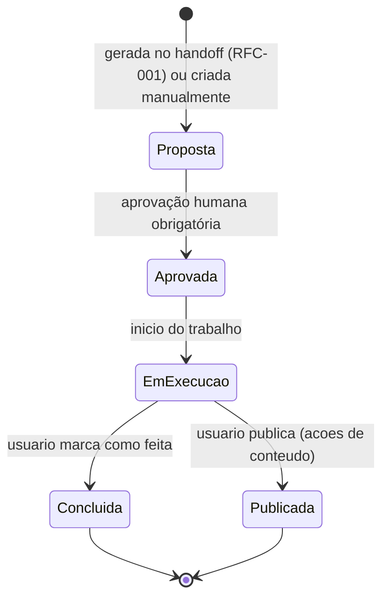
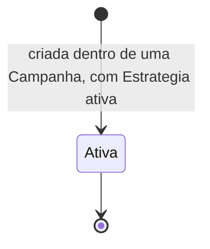
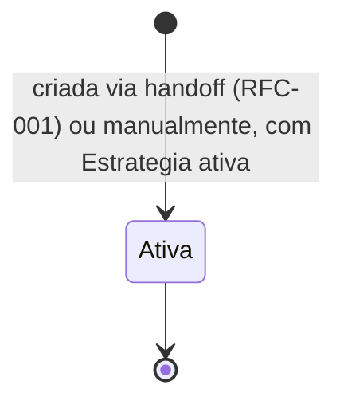
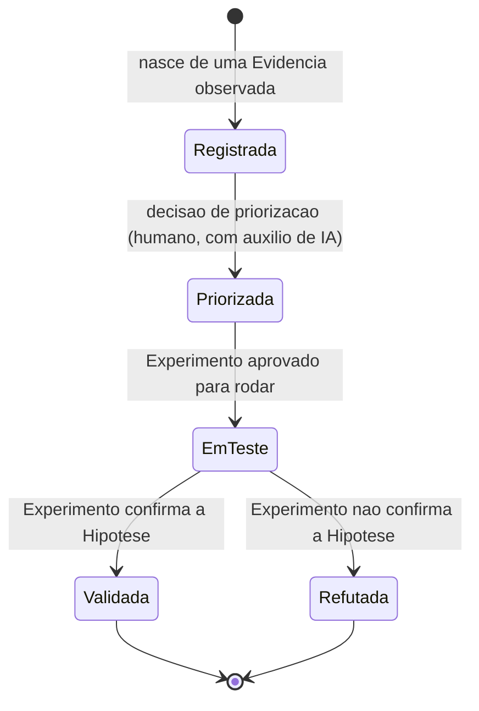
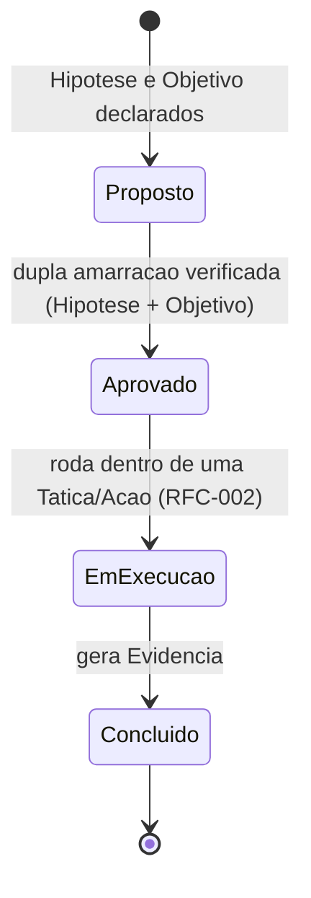

# RFC-004 — Lifecycle & State Machine

**Status:** Implementado (2026-07-29 — ver seção "Implementação" abaixo)
**Data:** 2026-07-26

Esta RFC existe para resolver uma lacuna transversal identificada de forma independente na [RFC-002 — Execução](./RFC-002-execucao.md) (Ação sem máquina de estados) e na [RFC-003 — Growth](./RFC-003-growth.md) (Hipótese e Experimento sem máquina de estados; recomendação explícita de tratar isso como "preocupação transversal, não como parte de nenhuma RFC de módulo individual"). Esta é essa RFC.

**Nota de aprovação (2026-07-28):** esta RFC foi formalmente aprovada. A seção "Revisão crítica" abaixo, incluindo a frase "A RFC permanece em Draft", é o registro histórico da autorrevisão feita antes da aprovação — mantida sem edição por fidelidade ao processo, não porque ainda reflita o status atual.

# Implementação

**Status: Implementado (2026-07-29).** Validado por Relatório de Convergência — verificação linha a linha de cada requisito desta RFC contra o código existente, sem nenhuma lacuna encontrada no que a RFC efetivamente se comprometeu a entregar.

Todos os requisitos desta RFC — estados, transições, eventos e RBAC de Ação, Hipótese e Experimento — foram entregues como consequência direta da implementação de RFC-002 (Execução) e RFC-003 (Growth), não como um trabalho de implementação separado:

- **Ação** (Proposta → Aprovada → Em execução → Concluída/Publicada): `ExecucaoService` (`packages/services/src/execucao/execucao.service.ts`) — `criarAcao`, `aprovarAcao`, `iniciarExecucaoAcao`, `concluirAcao`.
- **Hipótese** (Registrada → Priorizada → Em teste → Validada/Refutada): `GrowthService` (`packages/services/src/growth/growth.service.ts`) — `registrarHipotese`, `priorizarHipotese`; a transição Priorizada → Em teste ocorre dentro de `aprovarExperimento`, e Em teste → Validada/Refutada dentro de `concluirExperimento`, exatamente como esta RFC descreve ("Experimento aprovado para rodar" / "Experimento confirma a Hipótese").
- **Experimento** (Proposto → Aprovado → Em execução → Concluído): `GrowthService` — `proporExperimento`, `aprovarExperimento` (exige `role = 'admin'`, ADR-012), `iniciarExecucaoExperimento`, `concluirExperimento`.
- **Campanha/Tática** (estado único "Ativa"): sem coluna de status em `packages/db/src/schema.ts` — como esta própria RFC define, essas duas entidades não têm máquina de estados própria.

Enums correspondentes: `action_status`, `hypothesis_status`, `experiment_status` (`packages/db/src/schema.ts`).

**Lacunas que esta RFC registra e que permanecem não resolvidas** (nunca fizeram parte do compromisso de entrega — ver "Revisão crítica" abaixo): estado final de Campanha/Tática; destino de uma entidade em andamento quando a Estratégia que a contém é encerrada; cancelamento, para qualquer uma das cinco entidades; automação de IA para concluir uma Ação. Continuam em aberto para Review futura e não bloqueiam este status de Implementado.

# Objetivo

Definir o ciclo de vida (lifecycle) e a máquina de estados (state machine) das entidades operacionais da VEKTOR — Campanha, Tática, Ação, Hipótese e Experimento — de forma centralizada e consistente entre módulos, sem alterar o domínio (`architecture/domain.md`), sem alterar responsabilidades de módulo (RFC-001, RFC-002, RFC-003) e sem introduzir entidades novas.

# Problema

RFC-002 registrou: "os nomes e o número exato de estados intermediários... são uma síntese da narrativa do Blueprint Cap. 4, não uma máquina de estados oficial. Nenhum documento-fonte enumera os estados formais de uma Ação." RFC-003 registrou o mesmo problema para Hipótese e Experimento, e recomendou explicitamente uma RFC transversal em vez de resolver o problema de forma fragmentada em cada módulo. Sem uma máquina de estados consistente, schema de banco e lógica de backend de três módulos diferentes (Estratégia, Execução, Growth) ficam bloqueados ou arriscam divergir entre si.

# Escopo

Esta RFC cobre, exclusivamente:

- Os estados de Campanha, Tática, Ação, Hipótese e Experimento.
- As transições permitidas e proibidas entre esses estados.
- Os eventos que provocam cada transição.
- O papel da IA e o papel obrigatório do usuário em cada transição.
- Estados finais e estados de cancelamento, onde existir base documental para defini-los.

Esta RFC **não** cobre — e é importante ser explícito sobre isso, dado o risco de uma RFC de estado "vazar" para decisões de domínio:

- Novas entidades, novos campos de domínio além de um atributo de estado, ou novas relações "existe dentro de" (`architecture/domain.md` permanece inalterado).
- Novas responsabilidades de módulo (RFC-001, RFC-002, RFC-003 permanecem inalteradas).
- O ciclo de vida de Estratégia — já parcialmente documentado (`architecture/navigation.md`, diagrama de estados: Sem Estratégia Ativa → Ativa → Encerrada) e fora do escopo de revisão aqui.
- O ciclo de vida de Aprendizado — não é uma entidade operacional no mesmo sentido; é um registro que, uma vez criado, permanece na memória estratégica (Blueprint, Cap. 6.6) sem transições documentadas.
- Evidência — Blueprint a descreve como "o registro bruto do que aconteceu" (`architecture/domain.md`), um fato imutável, não uma entidade com estados.

# Fora do escopo

- Schema de banco de dados (nomes de coluna, tipos, enums) — esta RFC define os estados conceituais; a tradução para schema é trabalho de implementação subsequente.
- Interface visual de como o estado é exibido ao usuário (badges, cores, filtros).
- Qualquer mecanismo de cancelamento não documentado nas fontes — ver lacunas por entidade abaixo.
- O ciclo de vida de Estratégia e Aprendizado (ver "Escopo" acima).

# Experiência do usuário (UX)

Esta RFC não introduz experiência nova. Ela nomeia formalmente o que a RFC-002 e a RFC-003 já descreveram em nível narrativo (Blueprint, Cap. 4: "Ações priorizadas, agendadas... esperando confirmação ou ajuste. Ela marca o que foi feito, publica o que estava pronto"). Nenhuma tela ou componente é definido aqui.

# Modelo de domínio impactado

Nenhuma entidade nova. Nenhuma alteração às relações "existe dentro de" já fixadas em `architecture/domain.md`. O único impacto é conceitual: cada uma das cinco entidades abaixo passa a ter um atributo de estado explícito, necessário para que as regras já documentadas (ex.: ADR-004, "Estratégia encerrada nunca recebe nova Execução") sejam operacionalizáveis.

| Entidade | Existe dentro de (inalterado) | Estado é novo atributo desta RFC |
|---|---|---|
| Campanha | Estratégia | Sim — quase sem base documental (ver seção própria). |
| Tática | Campanha | Sim — quase sem base documental (ver seção própria). |
| Ação | Tática | Sim — sintetizado da narrativa (Blueprint, Cap. 4). |
| Hipótese | Evidência | Sim — sintetizado da narrativa (Blueprint, Cap. 6.3–6.6). |
| Experimento | Tática ou Ação | Sim — sintetizado da narrativa (Blueprint, Cap. 6.4–6.6). |

# Participação da IA

A participação de IA em transições de estado não é, em nenhuma fonte, descrita como a IA movendo uma entidade de um estado para outro de forma autônoma. O padrão documentado, em toda fonte consultada, é: a IA **sugere**; o evento que efetivamente muda o estado é, na maior parte dos casos, uma ação humana — exceto onde isso é uma ambiguidade registrada (ver tabela abaixo e as seções por entidade).

| Transição (qualquer entidade) | Papel da IA | Papel do usuário |
|---|---|---|
| Criação a partir de proposta/handoff | Pode gerar a proposta (RFC-001, "Do papel para a operação") | Revisa, ajusta e aprova — obrigatório (Blueprint, Cap. 4) |
| Priorização/agendamento | Pode sugerir (`architecture/ai.md`) | Confirma ou ajusta — Blueprint não diz se a confirmação é sempre obrigatória (**lacuna**, já registrada na RFC-002 e RFC-003) |
| Marcar como concluída/publicada | Não documentado como capacidade de IA | Descrito narrativamente como ação humana (Blueprint, Cap. 4) — mas não há proibição explícita de automação de baixo risco (**lacuna**, já registrada na RFC-002) |
| Aprovar Experimento para rodar | Nunca — não documentado, e agora explicitamente excluído como capacidade de IA | Membro do Workspace com `role = 'admin'` (**resolvido por ADR-012**, `DECISIONS.md` — fecha a lacuna antes registrada aqui e na RFC-003) |
| Registrar resultado (confirma/não confirma Hipótese) | Participa da interpretação (Blueprint, Cap. 3.1: "interpretada — pela IA e pelo humano") | Fronteira exata não definida (**lacuna**, já registrada na RFC-003) |

**Nunca pode ser automatizado, em nenhuma transição, de nenhuma entidade:** aprovar uma mudança estratégica (Product Canon; Blueprint, Cap. 6.7) e disparar "Evoluir Estratégia" (Blueprint, Cap. 4 e 6.8) — mas nenhuma dessas duas coisas é, em si, uma transição de estado de Campanha, Tática, Ação, Hipótese ou Experimento; são mencionadas aqui só para delimitar a fronteira externa que nenhuma automação desta RFC pode cruzar.

# Fluxos

Para cada entidade: estados propostos (com fonte), transições permitidas, transições proibidas, eventos, estado final, estado de cancelamento. "Proposto" significa sintetizado da narrativa das fontes permitidas — nenhum destes é uma enumeração oficial pré-existente; tornam-se oficiais somente se esta RFC for aprovada.

## Ação

- **Estados oficiais (propostos):** Proposta, Aprovada, Em execução, Concluída, Publicada.
- **Transições permitidas:** Proposta → Aprovada (evento: aprovação humana, Blueprint Cap. 4); Aprovada → Em execução; Em execução → Concluída ou Publicada.
- **Transições proibidas:** criação de qualquer Ação (entrada em Proposta) dentro de uma Estratégia encerrada (ADR-004). Retorno de Concluída/Publicada para Em execução — não documentado; tratado aqui como proibido por inferência razoável, não por afirmação explícita das fontes.
- **Eventos:** aprovação humana (Proposta→Aprovada); início de trabalho (evento não nomeado nas fontes — **lacuna**); marcação de conclusão/publicação (ação humana narrada, automação não descartada — **lacuna**, ver "Participação da IA").
- **Papel da IA:** sugere priorização/agendamento enquanto a Ação está em Aprovada ou Em execução — não documentado como uma transição própria, e sim como uma característica da Ação nesses estados.
- **Papel obrigatório do usuário:** aprovar a proposta inicial (Blueprint, Cap. 4) — exige apenas Membro `ativo` no Workspace, qualquer `role` (ADR-012, `DECISIONS.md` — diferente da aprovação de Experimento e de etapa/síntese de Estratégia, que exigem especificamente `role = 'admin'`). Além disso, **lacuna**.
- **Estado final:** Concluída ou Publicada. **Lacuna:** as fontes não esclarecem se são o mesmo estado terminal com nomes diferentes por tipo de Ação, ou dois estados terminais distintos.
- **Estado cancelado:** não documentado em nenhuma fonte. Não inventado aqui.

## Tática

- **Estados oficiais (propostos):** apenas "Ativa" — existência simples. Nenhuma fonte descreve um estado de conclusão, pausa ou revisão para Tática.
- **Transições permitidas/proibidas:** a única regra documentada é de criação — depende de uma Campanha existente e de uma Estratégia ativa (ADR-008). Nenhuma transição de saída é documentada.
- **Eventos:** apenas o evento de criação.
- **Papel da IA / do usuário:** não documentado para Tática especificamente, além do que já se aplica à Campanha/Estratégia que a contêm.
- **Estado final:** **lacuna plena.** Não há informação para definir se ou quando uma Tática é considerada concluída — por exemplo, se isso é automático quando todas as Ações filhas concluem, ou se exige uma ação explícita.
- **Estado cancelado:** não documentado. Não inventado aqui.

## Campanha

- **Estados oficiais (propostos):** apenas "Ativa" — mesma situação da Tática.
- **Transições permitidas/proibidas:** a única regra documentada é de criação, condicionada a uma Estratégia ativa (ADR-008; RFC-002, Critério de aceite nº4, duas origens possíveis: handoff ou manual).
- **Eventos:** apenas o evento de criação.
- **Papel da IA / do usuário:** o handoff pode ser sugerido/gerado por automação (RFC-001), mas a criação manual é sempre por ação do usuário. Nenhuma transição de saída documentada.
- **Estado final:** **lacuna plena** — mesma natureza da lacuna em Tática.
- **Estado cancelado:** não documentado. Não inventado aqui.

## Hipótese

- **Estados oficiais (propostos):** Registrada, Priorizada, Em teste, Validada, Refutada.
- **Transições permitidas:** Registrada → Priorizada (Blueprint, Cap. 6.2 e 6.7 — priorização entre Hipóteses concorrentes); Priorizada → Em teste (quando um Experimento que a testa é "aprovado para rodar", Blueprint Cap. 6.4); Em teste → Validada ou Refutada (conforme o Experimento confirma ou não, Blueprint Cap. 6.6).
- **Transições proibidas:** uma Hipótese sem Evidência de origem não pode ser registrada (Blueprint, Cap. 6.3 — "nunca de opinião"). Não há indicação de uma Hipótese poder pular de Registrada direto para Em teste sem passar por Priorização — tratado aqui como proibido por inferência, não por afirmação explícita.
- **Eventos:** observação de Evidência (origem); decisão de priorização; aprovação do Experimento associado; conclusão do Experimento.
- **Papel da IA:** pode sugerir a própria Hipótese a partir de padrões em Evidência, e pode ajudar a priorizar entre Hipóteses concorrentes (Blueprint, Cap. 6.7). Não documentada como capaz de mover Registrada→Priorizada ou Priorizada→EmTeste sozinha — **lacuna** sobre se a decisão final desses dois passos é sempre humana.
- **Papel obrigatório do usuário:** não claramente definido além do princípio geral "nenhuma evolução sem validação humana" (Cap. 6.8), que se aplica ao fim do ciclo maior, não necessariamente a cada transição de Hipótese. **Lacuna.**
- **Estado final:** Validada ou Refutada — ambos tratados como igualmente válidos e não descartáveis (Blueprint, Cap. 6.6: fracasso também gera conhecimento).
- **Estado cancelado:** não documentado (ex.: uma Hipótese priorizada mas nunca testada, ou abandonada). Não inventado aqui.

## Experimento

- **Estados oficiais (propostos):** Proposto, Aprovado, Em execução, Concluído.
- **Transições permitidas:** Proposto → Aprovado, condicionado à "dupla amarração" (Hipótese + Objetivo da Estratégia ativa, Blueprint Cap. 6.4); Aprovado → Em execução (passa a rodar dentro de uma Tática/Ação, RFC-002); Em execução → Concluído (produz Evidência, Blueprint Cap. 6.5).
- **Transições proibidas:** Proposto → Em execução sem a dupla amarração — "sem essa dupla amarração, o Experimento não é aprovado para rodar" (Blueprint, Cap. 6.4, citação direta).
- **Eventos:** declaração da dupla amarração; aprovação por Membro `role = 'admin'` (**ADR-012**); execução dentro de Execução (RFC-002); conclusão com geração de Evidência.
- **Papel da IA:** pode ter originado a Hipótese que motiva o Experimento e pode ajudar a priorizá-lo (Blueprint, Cap. 6.7) — nunca aprovadora da transição Proposto→Aprovado, que é exclusivamente humana.
- **Papel obrigatório do usuário:** aprovar a transição Proposto→Aprovado, exigindo Membro com `role = 'admin'` — **resolvido por ADR-012** (`DECISIONS.md`), fecha o Bloqueador 3 de `ARCHITECTURE_RESOLUTION.md`.
- **Estado final:** Concluído — sempre produz Evidência, independentemente de confirmar ou não a Hipótese (Blueprint, Cap. 6.6).
- **Estado cancelado:** não documentado (ex.: um Experimento proposto mas nunca aprovado, ou interrompido no meio). Não inventado aqui.

# Critérios de aceite

1. Toda entidade (Campanha, Tática, Ação, Hipótese, Experimento) tem um estado explícito e nomeado a qualquer momento — nenhuma existe em estado indefinido.
2. Nenhuma Ação, Campanha ou Tática entra em seu estado inicial dentro de uma Estratégia encerrada (ADR-004).
3. Nenhum Experimento transita para "Aprovado" sem a dupla amarração Hipótese + Objetivo da Estratégia ativa (Blueprint, Cap. 6.4).
4. Nenhuma Hipótese é registrada sem uma Evidência de origem (Blueprint, Cap. 6.3).
5. Tanto Validada quanto Refutada são tratados como estados finais legítimos de Hipótese — nenhum fluxo de implementação pode tratar Refutada como erro ou estado a ser ocultado (Blueprint, Cap. 6.6).
6. Nenhuma transição desta RFC permite que a IA aprove uma mudança estratégica ou dispare "Evoluir Estratégia" — essas duas ações permanecem inteiramente fora do que qualquer transição aqui documentada autoriza (Product Canon).
7. Onde esta RFC registra uma lacuna ainda aberta (ex.: estado final de Campanha/Tática), nenhuma implementação deve assumir uma resposta não documentada sem antes resolver a lacuna em Review. (A lacuna "quem aprova um Experimento" foi fechada por ADR-012 — deixou de se qualificar como lacuna aberta.)
8. **Esta decisão reduz a complexidade para o usuário?** Sim — dar nomes e transições consistentes às mesmas cinco entidades em todos os módulos evita que cada equipe de implementação invente sua própria nomenclatura, o que geraria mais complexidade, não menos (Product Canon; Blueprint, Cap. 3.7).

# Impactos

- **Banco:** esta RFC é o pré-requisito direto para o desenho de colunas de status em Campanha, Tática, Ação, Hipótese e Experimento (lacunas de schema já registradas em RFC-002 e RFC-003 dependiam justamente disto). Mesmo após esta RFC, Campanha e Tática permanecem com lacuna quase total — nenhum schema de status significativo pode ser desenhado para elas até essas lacunas serem resolvidas em Review.
- **Backend:** lógica de validação de transição (o que impede uma transição proibida de acontecer) para as três entidades com máquina de estados mais completa (Ação, Hipótese, Experimento). CLAUDE.md (Technology Stack) já define o motor de persistência; a implementação exata não é objeto desta RFC.
- **Frontend:** nenhum impacto direto de UI é definido aqui — ver "Fora do escopo".
- **IA:** nenhuma nova capacidade de IA é introduzida; esta RFC apenas organiza, por transição, o que já estava disperso em `architecture/ai.md`, RFC-002 e RFC-003.
- **Navegação:** nenhum impacto — estado de entidade não é, por si, um conceito de navegação (`architecture/navigation.md` permanece inalterado).
- **Product Canon:** esta RFC não contraria o Canon; a fronteira "IA nunca aprova mudança estratégica" é reafirmada como limite externo de toda transição documentada aqui.
- **Product Blueprint:** esta RFC sintetiza estados a partir de linguagem narrativa dos Capítulos 4 e 6 — não introduz uma metodologia ou princípio que o Blueprint não tenha já sugerido; onde o Blueprint é silencioso, a lacuna é registrada, não preenchida.

# Dependências

- RFC-001 — Estratégia: origem da proposta inicial de Campanha/Tática/Ação; define quando uma Estratégia está ativa (confirmado por ADR-015).
- RFC-002 — Execução: definiu a necessidade desta RFC para Ação; consome os estados de Campanha, Tática e Ação aqui propostos.
- RFC-003 — Growth: definiu a necessidade desta RFC para Hipótese e Experimento; consome os estados aqui propostos.
- Toda lacuna que permanece registrada nesta RFC (automação de conclusão de Ação, estado final de Campanha/Tática, cancelamento em qualquer entidade) precisa ser resolvida em Review antes de esta RFC autorizar trabalho de banco de dados. (Aprovação de Experimento já foi resolvida por ADR-012.)

# Checklist

- [ ] Não contraria o Product Canon.
- [ ] Não contraria o Product Blueprint.
- [ ] Não contraria nenhuma decisão registrada em `DECISIONS.md`.
- [ ] Toda operação proposta nasce dentro de uma Estratégia (ADR-008), se aplicável.
- [ ] Participação de IA (se houver) respeita os limites de `architecture/ai.md`.
- [ ] Seção "Fora do escopo" preenchida — não deixar implícita.
- [ ] Critérios de aceite são verificáveis, não vagos.
- [ ] **Esta decisão reduz a complexidade para o usuário?** (Product Canon; Product Blueprint, Cap. 3.7) — resposta precisa ser sim.

---

## Revisão crítica desta RFC

Autorrevisão feita antes de considerar o documento concluído. A RFC permanece em **Draft**.

**Conflitos com RFC-001, RFC-002 e RFC-003: nenhum encontrado.** Verifiquei que esta RFC não redefine nenhuma relação "existe dentro de" de `architecture/domain.md`, não introduz nenhuma entidade nova, e não reatribui responsabilidade de nenhum módulo — os três limites que a própria tarefa impôs. Os estados aqui propostos para Ação, Hipótese e Experimento consolidam exatamente as sínteses que RFC-002 e RFC-003 já haviam começado, sem contradizê-las.

**Decisão arquitetural implícita verificada e evitada:** ao desenhar o diagrama de Ação, a tentação inicial foi unificar "Concluída" e "Publicada" em um único estado terminal para simplificar o diagrama — isso teria sido uma decisão de design não documentada, resolvendo silenciosamente uma lacuna que a RFC-002 já havia registrado como aberta. Mantive os dois como estados terminais distintos e a ambiguidade explicitamente registrada, em vez de decidir por conveniência de diagrama.

**Duplicação avaliada:** as citações de Blueprint Cap. 6.3–6.6 reaparecem aqui como já estão na RFC-003. Mantive porque esta RFC precisa justificar cada estado e transição individualmente — omitir as citações tornaria os estados propostos parecerem inventados. Critérios de aceite e Checklist foram comparados linha a linha e não têm sobreposição de conteúdo, seguindo o padrão estabelecido nas RFC-002 e RFC-003.

**Assimetria encontrada entre entidades — registrada, não resolvida:** Ação, Hipótese e Experimento têm base narrativa suficiente para uma máquina de estados com múltiplos nós. Campanha e Tática não têm quase nenhuma — apenas "existem". Isso não é um erro desta RFC; é o reflexo honesto de que o Blueprint narra a experiência de execução no nível da Ação (Cap. 4, "Rotina de execução"), não no nível de Campanha ou Tática. Uma decisão de produto sobre se Campanha/Tática precisam de estado próprio (e não apenas herdado das Ações filhas) ainda precisa ser tomada — esta RFC não a toma.

**Lacuna fechada nesta rodada:** quem aprova um Experimento para passar de Proposto a Aprovado — **resolvido por ADR-012**: Membro do Workspace com `role = 'admin'`.

**Lacunas remanescentes, sem solução inventada:**
- Estado final de Campanha e Tática (se existe, e se é automático ou explícito).
- Cancelamento — inexistente como conceito em qualquer fonte, para qualquer uma das cinco entidades.
- Se marcar uma Ação como concluída/publicada pode ser automação de IA de baixo risco.
- O que acontece com uma entidade em estado não-terminal quando a Estratégia que a contém é encerrada (ADR-004) — a regra impede *novas* entidades, mas não define o destino das existentes em andamento (lacuna já registrada na RFC-002, ainda sem resposta).

Nenhuma lacuna acima foi resolvida com uma decisão inventada — todas seguem abertas para Review.
