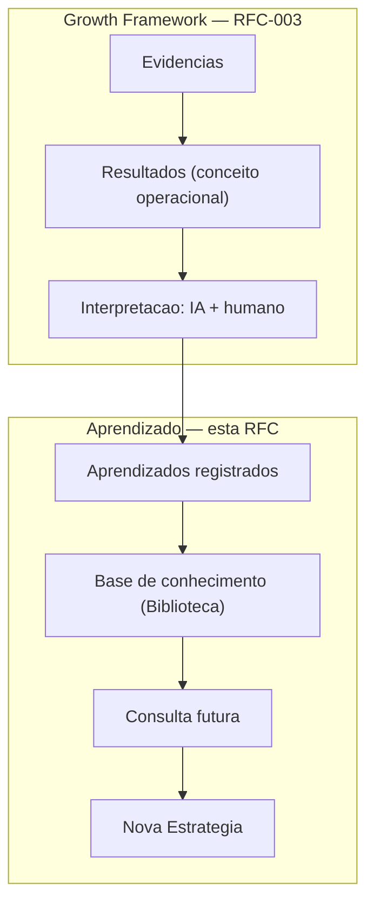
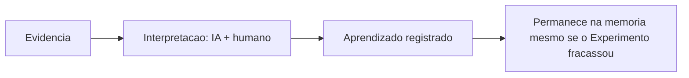
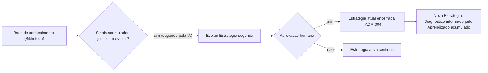
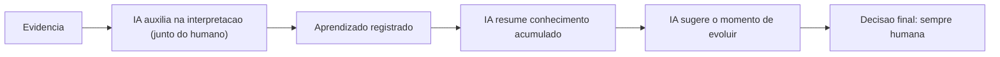

# RFC-005 — Aprendizado

**Status:** Aceita (2026-07-28 — arquitetura aprovada; implementação do módulo Aprendizado em si permanece fora do escopo da implementação de RFC-003/Growth, é missão futura própria)
**Data:** 2026-07-26

Continuação natural da [RFC-003 — Growth](./RFC-003-growth.md). A RFC-003 registrou explicitamente, em "Fora do escopo": *"A especificação completa do módulo Aprendizado como superfície própria (...) e o mecanismo interno completo da ação 'Evoluir Estratégia' (...) é objeto de RFC própria do módulo Aprendizado."* Esta é essa RFC.

**Nota de aprovação (2026-07-28):** esta RFC foi formalmente aprovada (arquitetura). Nenhum código foi escrito para o módulo Aprendizado nesta rodada — a implementação foi exclusivamente de RFC-003 (Growth). A seção "Revisão crítica" abaixo, incluindo "A RFC permanece em Draft", é registro histórico da autorrevisão pré-aprovação.

# Objetivo

Definir completamente o módulo Aprendizado da VEKTOR. Aprendizado é responsável por transformar Evidência e o resultado de Experimentos em conhecimento reutilizável que influencia decisões futuras (Product Canon; Blueprint, Cap. 3.1). Este módulo **não** executa ações, **não** cria Estratégias, **não** executa Experimentos e **não** gera Evidência — ele consolida conhecimento.

# Problema

O princípio "todo aprendizado evolui a estratégia" (Product Canon; Blueprint, Cap. 3.1) está documentado em nível de princípio e de narrativa (Blueprint, Cap. 4), mas nunca foi consolidado em uma especificação única. A RFC-003 documentou o ciclo até o ponto em que uma interpretação de Evidência é formada, e deferiu explicitamente para esta RFC tanto a superfície do módulo Aprendizado quanto o mecanismo de "Evoluir Estratégia" — sem esta RFC, o Aprendizado produzido pelo Growth Framework não tem destino documentado, e o ciclo do Canon fica incompleto em nível de implementação.

# Escopo

Aprendizado é responsável por registrar conhecimento a partir de Evidência interpretada, torná-lo consultável para Estratégias futuras, e disparar o sinal de "Evoluir Estratégia" quando os sinais acumulados justificarem — nunca por executar, formular ou medir; essas responsabilidades pertencem a Execução, Estratégia e Growth, respectivamente (Blueprint, Cap. 3.4 "Camadas do produto").

Esta RFC cobre:

- A interpretação final de Evidência em uma entrada de Aprendizado registrada.
- Onde o Aprendizado vive (Biblioteca, Blueprint Cap. 3.5 e 4) e como pode, em princípio, ser consultado por Estratégias futuras.
- A ação "Evoluir Estratégia" como mecanismo disparado a partir de Aprendizado (ADR-002) — a sequência documentada de sinal, aprovação e efeito sobre a Estratégia atual e a próxima.
- A fronteira exata entre o Growth Framework (RFC-003) e o módulo Aprendizado (esta RFC).
- A participação da IA em interpretação, organização de conhecimento e sugestão do momento de evoluir.

# Fora do escopo

- A execução de Experimentos e a produção de Evidência (RFC-002, RFC-003) — esta RFC consome o resultado, não os redefine.
- A Priorização de Hipóteses e a mecânica interna do ciclo de Growth anterior à interpretação final (RFC-003).
- A formulação da nova Estratégia em si — o Marketing Planning Framework (RFC-001). Esta RFC documenta apenas que a nova Estratégia recebe o Aprendizado acumulado como ponto de partida do Diagnóstico; não documenta como a formulação em si se processa a partir disso.
- Máquina de estados de Aprendizado — a RFC-004 já declarou explicitamente que Aprendizado "não é uma entidade operacional no mesmo sentido (...) sem transições documentadas". Esta RFC não contradiz isso nem introduz estados.
- A especificação completa do módulo Biblioteca como superfície de busca/indexação — mencionado apenas como o lugar onde Aprendizado vive; como ele é de fato organizado e pesquisado é maior que esta RFC (ver Revisão crítica).
- O módulo Relatórios e sua visão dupla (ADR-005) — mencionado apenas como consumidor indireto.
- A Fase 2 do Roadmap ("Marketing Intelligence" — Blueprint, Cap. 7) — evolução futura, não parte desta RFC.
- Schema de banco detalhado e decisões de interface visual — lacunas registradas abaixo.

# Experiência do usuário (UX)

Conforme Blueprint, Cap. 4 ("Aprendizado" e "Evoluir Estratégia — fechar e reabrir o ciclo"): Growth recomenda; Aprendizado é onde a recomendação — aceita, testada ou rejeitada — vira conclusão registrada. É um momento mais lento e reflexivo do que o ritmo de Growth: não é "o que fazer agora", é "o que isso nos ensinou". Cada entrada de Aprendizado carrega a Evidência que a originou e o raciocínio por trás dela, e passa a viver em Biblioteca — memória que a próxima Estratégia, e as futuras Estratégias de outros ciclos, vão poder consultar.

De dentro de Aprendizado, a IA sugere o momento de "Evoluir Estratégia" a partir dos sinais acumulados — mas quem decide é sempre humano. A transição não apaga o que existia: leva o Aprendizado acumulado como ponto de partida da próxima Estratégia, que já começa informada por evidência real, não por um diagnóstico em branco.

**Lacuna registrada:** como nas RFCs anteriores, esta experiência é descrita em nível narrativo. Nenhuma tela, componente ou wireframe de como o usuário navega, lê ou organiza entradas de Aprendizado está definido nas fontes.

# Modelo de domínio impactado

Nenhuma entidade nova é criada por esta RFC.

| Conceito | Status em `architecture/domain.md` | Papel nesta RFC |
|---|---|---|
| **Evidência** | Entidade oficial — existe dentro de Ação ou Experimento | Entrada do módulo — o dado interpretado para formar Aprendizado. |
| **Resultado** | **Não é uma entidade oficial.** Aparece apenas como termo narrativo no ciclo de Growth (Blueprint, Cap. 6.2, primeira etapa; Cap. 6.8, princípio 5). | Tratado aqui como conceito operacional, não como entidade com identidade própria — ver lacuna abaixo. |
| **Aprendizado** | Entidade oficial — existe dentro de Evidência (interpretada) | Entidade central desta RFC. |
| **Hipótese** | Entidade oficial (RFC-003) | Relação indireta — ver abaixo. |
| **Experimento** | Entidade oficial (RFC-002, RFC-003) | Relação indireta — ver abaixo. |
| **Estratégia** | Entidade oficial (RFC-001) | Receptora do Aprendizado acumulado quando evolui. |

**Lacuna terminológica registrada — "Resultado":** o Blueprint usa "Resultados" como a primeira etapa do ciclo de Growth e no princípio "toda Evolução gera novos Resultados" (Cap. 6.8), mas `architecture/domain.md` não o lista entre as nove entidades oficiais. Não fica claro se "Resultado" é sinônimo de Evidência, um agregado de várias Evidências, ou um conceito formalmente distinto ainda não modelado. Esta RFC não inventa essa distinção — trata "Resultado" apenas como o dado observável que entra no ciclo, na mesma posição que Evidência ocupa em `architecture/domain.md`.

**Relação com Growth:** nenhuma relação direta com o módulo Growth (a superfície onde Evidência é analisada, Blueprint Cap. 3.5). A relação real é com o **Growth Framework** (RFC-003, ADR-006): ele entrega a interpretação de Evidência como insumo para o registro de Aprendizado. Onde um termina e o outro começa está detalhado em "Fluxos" abaixo.

**Relação com Estratégia:** Aprendizado não altera a Estratégia ativa diretamente. Quando "Evoluir Estratégia" é aprovada, a Estratégia ativa é encerrada (ADR-004) e uma nova Estratégia é criada, recebendo o Aprendizado acumulado como ponto de partida do seu Diagnóstico (Blueprint, Cap. 4).

**Relação com Execução:** nenhuma relação direta — mesma observação já registrada pela RFC-002 ("Execução não escreve nem lê Aprendizado").

**Relação com Evidência:** é o dado de entrada — Aprendizado é, por definição de domínio, "Evidência interpretada" (`architecture/domain.md`).

**Relação com Hipótese:** indireta. Uma Hipótese Validada ou Refutada (RFC-004) motiva o conteúdo de uma entrada de Aprendizado, mas Aprendizado não armazena nem altera a Hipótese em si — isso permanece domínio do Growth Framework (RFC-003).

**Relação com Experimento:** indireta. O resultado de um Experimento Concluído (RFC-004) é interpretado; Aprendizado registra a conclusão, não o Experimento.

**Relação com Evolução da Estratégia:** é a relação central desta RFC — ver "Fluxos" abaixo para a sequência completa.

# Participação da IA

Conforme `architecture/ai.md` e Blueprint, Cap. 3.1, 4 e 6.7.

**Onde a IA auxilia na interpretação:**
- Evidência bruta é interpretada "pela IA e pelo humano" até virar uma conclusão acionável (Blueprint, Cap. 3.1) — participação documentada, mas conjunta, não exclusiva da IA.

**Onde a IA apenas organiza conhecimento:**
- Resumir Aprendizado acumulado (`architecture/ai.md`; Blueprint, Cap. 6.7).
- **Lacuna registrada:** além de "resumir", nenhuma outra forma de organização (categorização, indexação, priorização de quais Aprendizados são mais relevantes) está documentada.

**Onde a IA nunca toma decisões:**
- Aprovar uma mudança estratégica automaticamente (Blueprint, Cap. 6.7).
- Disparar "Evoluir Estratégia" sem validação humana — ela só sugere o momento (Blueprint, Cap. 4; Cap. 6.8, princípio 4).

**Quais decisões permanecem humanas:**
- A aprovação final de "Evoluir Estratégia" (Blueprint, Cap. 6.8, princípio 4 — explícito e sem exceção). **Resolvido por ADR-012 (`DECISIONS.md`):** exige Membro do Workspace com `role = 'admin'` — mesmo nível de autoridade exigido para aprovar a síntese da Estratégia (RFC-001) e a aprovação de Experimento (RFC-003).

**Lacuna entre IA e usuário, registrada:** o Blueprint (Cap. 3.1) descreve a interpretação de Evidência em Aprendizado como conjunta ("pela IA e pelo humano"), mas não especifica se o registro de uma entrada de Aprendizado exige confirmação humana explícita a cada vez, ou se a IA pode registrar autonomamente quando a interpretação é direta (ex.: um Experimento com resultado inequívoco). Esta é a mesma fronteira que a RFC-003 já havia deixado em aberto ("Participação da IA", RFC-003) — reafirmada aqui porque o registro final acontece dentro do módulo Aprendizado, não do Growth.

# Fluxos

## Fluxo completo do Aprendizado

**Onde termina o Growth e onde começa o Aprendizado:** o Growth Framework (RFC-003) é responsável pelo ciclo até a interpretação de Evidência/Resultado em uma conclusão. No exato momento em que essa conclusão é registrada como uma entrada permanente, ela passa a ser responsabilidade do módulo Aprendizado — que a mantém consultável (Biblioteca) e, quando os sinais acumulados justificam, dispara "Evoluir Estratégia". O card "Módulo Growth × Growth Framework" (Blueprint, Cap. 3.5 e 6.1) já registra que o Framework, como processo, só termina "quando um Aprendizado eventualmente dispara 'Evoluir Estratégia' dentro do módulo Aprendizado" — ou seja, o Framework atravessa o módulo Aprendizado até esse ponto exato; ele não termina antes de entrar nele.

## Transformação de Evidência em Aprendizado

**Nota de consolidação (2026-07-27):** este diagrama era antes duplicado em RFC-003. Na consolidação de RFC-003 para eliminar sobreposição com esta RFC, o diagrama foi removido de lá e substituído por uma referência a este aqui — esta é agora a única fonte dele.

## Reutilização de Aprendizados na criação de uma nova Estratégia

## Participação da IA no processo

## Consulta do conhecimento

- **Como Aprendizados podem ser reutilizados:** o único mecanismo documentado é que futuras Estratégias "vão poder consultar" o Aprendizado acumulado em Biblioteca (Blueprint, Cap. 4). Nenhum mecanismo de busca, filtro ou indexação é especificado — ver "Fora do escopo".
- **Como podem influenciar Estratégias futuras:** o único ponto de influência documentado é a etapa de Diagnóstico do Marketing Planning Framework (RFC-001) de uma nova Estratégia, que "já começa informada por evidência real, não por um diagnóstico em branco" (Blueprint, Cap. 4). Não há documentação de influência em outras etapas específicas (SWOT, ICP, etc.) além dessa afirmação geral.
- **Como podem ser apresentados ao usuário:** apenas "Biblioteca" é citada como o lugar onde o Aprendizado vive (Blueprint, Cap. 3.5). A visão histórica de Relatórios (ADR-005) também os expõe, mas essa é responsabilidade do módulo Relatórios, não de Aprendizado. Nenhuma forma de apresentação própria do módulo Aprendizado está documentada além disso.
- **Quais limites existem para reutilização:** isolamento por Workspace — Aprendizado de um Workspace nunca é consultável por outro. Isso não está dito explicitamente para Aprendizado em si, mas decorre diretamente do Contexto Global ser o Workspace (`architecture/navigation.md`) e da observação do Blueprint (Cap. 7, Fase 2) de que mesmo a futura "inteligência acumulada" entre ciclos deve ser "sempre agregada e nunca cruzando o limite de um Workspace para outro" — se isso é uma restrição explícita para a evolução futura, é razoável (mas é uma inferência, não uma afirmação direta) que o mesmo limite já vale para a v1 desta RFC.

# Critérios de aceite

1. Toda entrada de Aprendizado registrada carrega a Evidência que a originou e o raciocínio associado (Blueprint, Cap. 4).
2. Nenhuma entrada de Aprendizado é descartada quando o Experimento associado é Refutado — Refutada é preservada com o mesmo peso de Validada (Blueprint, Cap. 6.6; RFC-004).
3. O módulo Aprendizado nunca executa Ações, cria Campanhas/Táticas/Ações, roda Experimentos ou gera Evidência — sua única saída é conhecimento registrado e, eventualmente, o sinal de "Evoluir Estratégia".
4. A IA pode sugerir o momento de "Evoluir Estratégia", mas a transição só ocorre com aprovação humana explícita de um Membro com `role = 'admin'` (Blueprint, Cap. 6.8, princípio 4; ADR-012, `DECISIONS.md`).
5. Quando a Estratégia evolui, a nova Estratégia recebe o Aprendizado acumulado como ponto de partida do Diagnóstico — não começa em branco (Blueprint, Cap. 4).
6. A Estratégia anterior é encerrada e nunca mais recebe Execução, mas permanece consultável e comparável (ADR-004).
7. Aprendizado de um Workspace nunca é consultável a partir de outro Workspace.
8. **Esta decisão reduz a complexidade para o usuário?** Sim — sem um mecanismo que preserve e reutilize o "porquê" das decisões passadas, cada nova Estratégia recomeçaria do zero, obrigando a empresa a reconstruir manualmente um raciocínio que o sistema já tinha (Product Canon; Blueprint, Cap. 3.7 e Cap. 4, "O estado ideal da VEKTOR").

# Impactos

- **Banco:** persistência de entradas de Aprendizado (conteúdo, Evidência de origem, raciocínio associado) e do vínculo com a Estratégia que as recebe ao evoluir. **Lacuna:** nenhum schema está definido; a forma de indexação para consulta futura (Biblioteca) também não está definida — ver "Fora do escopo". O motor (PostgreSQL via Drizzle ORM) já está definido em CLAUDE.md (Technology Stack).
- **Backend:** lógica de registro de Aprendizado a partir da interpretação de Evidência, lógica de sugestão do momento de evoluir, e lógica de transição (encerrar Estratégia atual, criar nova Estratégia informada). CLAUDE.md (Code Quality) indica preferência por Server Actions quando simplificam a arquitetura; a implementação exata não é objeto desta RFC.
- **Frontend:** interface para consulta de Aprendizado e para o momento de "Evoluir Estratégia" (Blueprint, Cap. 4), usando a stack de CLAUDE.md. **Lacuna:** nenhum wireframe está especificado.
- **IA:** integração de auxílio à interpretação, resumo de Aprendizado acumulado, e sugestão do momento de evoluir, respeitando os limites de `architecture/ai.md`. Ver lacunas registradas em "Participação da IA".
- **Navegação:** o módulo Aprendizado vive no Contexto Estratégico (ADR-007; `architecture/navigation.md`). A transição "Evoluir Estratégia" não é um destino de navegação (ADR-002) — é uma mudança de qual Estratégia ocupa o Contexto Estratégico.
- **Product Canon:** esta RFC opera dentro dos princípios "dados geram aprendizado", "aprendizado gera evolução" e "a IA nunca é a protagonista". Nenhum conteúdo contraria o Canon.
- **Product Blueprint:** esta RFC detalha e consolida partes dos Capítulos 3, 4 e 6 relativas a Aprendizado e à transição de Estratégia — não os substitui nem os contradiz.

# Dependências

- RFC-001 — Estratégia: recebe o Aprendizado acumulado como ponto de partida da nova formulação.
- RFC-002 — Execução: origem indireta da Evidência que alimenta este ciclo.
- RFC-003 — Growth: entrega a interpretação de Evidência que esta RFC registra como Aprendizado.
- RFC-004 — Lifecycle & State Machine: confirma que Aprendizado não tem máquina de estados própria; esta RFC não contradiz essa decisão.
- Uma RFC própria do módulo Biblioteca é necessária para especificar como o conhecimento é de fato organizado e consultado (ver Revisão crítica).

# Checklist

- [ ] Não contraria o Product Canon.
- [ ] Não contraria o Product Blueprint.
- [ ] Não contraria nenhuma decisão registrada em `DECISIONS.md`.
- [ ] Toda operação proposta nasce dentro de uma Estratégia (ADR-008), se aplicável.
- [ ] Participação de IA (se houver) respeita os limites de `architecture/ai.md`.
- [ ] Seção "Fora do escopo" preenchida — não deixar implícita.
- [ ] Critérios de aceite são verificáveis, não vagos.
- [ ] **Esta decisão reduz a complexidade para o usuário?** (Product Canon; Product Blueprint, Cap. 3.7) — resposta precisa ser sim.

---

## Revisão crítica desta RFC

Autorrevisão feita antes de considerar o documento concluído. A RFC permanece em **Draft**.

**Inconsistências com RFC-001, RFC-002, RFC-003 e RFC-004: nenhuma encontrada.** Verifiquei especificamente que esta RFC: (a) não introduz máquina de estados para Aprendizado, respeitando a decisão explícita da RFC-004; (b) não redefine onde Hipótese ou Experimento existem estruturalmente (RFC-002, RFC-003, `architecture/domain.md`); (c) trata a relação com Execução como inexistente, exatamente como a RFC-002 já havia declarado.

**Conflitos com o Product Blueprint: nenhum encontrado.** Toda afirmação aponta para um capítulo ou ADR específico; onde a fonte é silenciosa, registrei lacuna.

**Decisão arquitetural implícita verificada e evitada:** ao escrever "Consulta do conhecimento", a tentação inicial foi propor que Aprendizado fosse "buscável por tags ou categoria" — isso teria sido uma funcionalidade inventada, sem base em nenhuma fonte. Removido e substituído pela lacuna explícita de que nenhum mecanismo de busca/indexação está documentado.

**Duplicação avaliada (nota histórica — ver "Nota de consolidação" em "Fluxos"):** o diagrama "Transformação de Evidência em Aprendizado" era, na versão original desta autorrevisão, idêntico ao apresentado na RFC-003. A consolidação de RFC-003 (2026-07-27) removeu essa duplicata do lado de lá, tornando esta RFC a fonte única do diagrama. Critérios de aceite e Checklist foram comparados linha a linha — sem sobreposição de conteúdo, seguindo o padrão das RFCs anteriores.

**Tema grande demais para esta RFC — registrado, não incorporado:** o módulo **Biblioteca** ainda não tem RFC própria, e esta RFC depende dele para cumprir a promessa de "consulta futura" de Aprendizado. Diferente da máquina de estados (RFC-004), este não é um problema transversal a vários módulos — é a especificação de um módulo inteiro do Blueprint (Cap. 3.5) que ficou de fora das RFC-001 a RFC-005. Recomendo uma RFC-006 dedicada a Biblioteca antes que qualquer implementação de busca/indexação de Aprendizado seja construída.

**Outras lacunas registradas, sem solução inventada:**
- Se "Resultado" é sinônimo de Evidência, um agregado, ou um conceito distinto — o Blueprint não esclarece.
- Se o registro de uma entrada de Aprendizado exige confirmação humana explícita sempre, ou se a IA pode registrá-la de forma autônoma quando a interpretação é inequívoca.
- Se o limite de reutilização "nunca cruza um Workspace" vale para a v1 desta RFC ou é uma restrição que só passa a existir na Fase 2 do Roadmap — tratei como aplicável desde já, por inferência, não por afirmação direta das fontes.

Nenhuma lacuna acima foi resolvida com uma decisão inventada — todas seguem abertas para Review.
