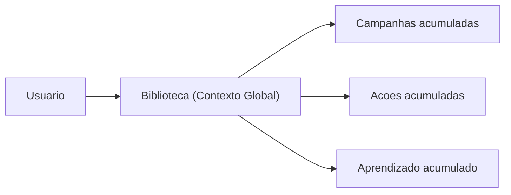
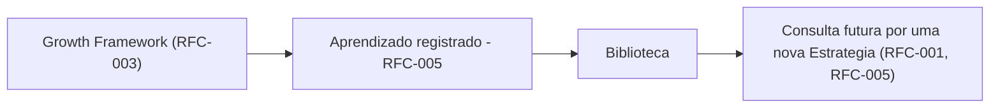
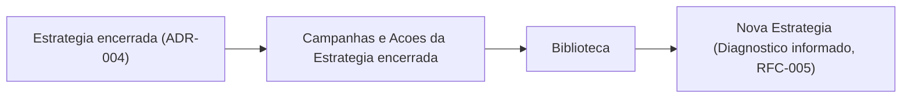
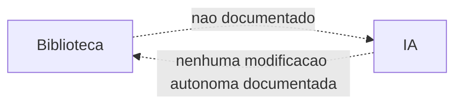

# RFC-006 — Biblioteca

**Status:** Draft
**Data:** 2026-07-26

Continuação natural da [RFC-005 — Aprendizado](./RFC-005-aprendizado.md), que registrou em "Revisão crítica": *"o módulo Biblioteca ainda não tem RFC própria, e esta RFC depende dele para cumprir a promessa de 'consulta futura' de Aprendizado (...) Recomendo uma RFC-006 dedicada a Biblioteca antes que qualquer implementação de busca/indexação de Aprendizado seja construída."* Esta é essa RFC.

# Objetivo

Definir completamente o módulo Biblioteca da VEKTOR. Biblioteca é responsável por preservar, organizar e disponibilizar conhecimento e ativos para reutilização futura (Blueprint, Cap. 3.5 — "Memória"). Ela **não** executa Estratégias, **não** executa Ações, **não** executa Experimentos, **não** produz Evidência e **não** interpreta Aprendizado — seu papel é disponibilizar informação já persistida para consulta e reutilização.

# Problema

Duas RFCs anteriores já dependem de Biblioteca sem ela estar especificada: a RFC-003 cita Biblioteca como onde Aprendizado "permanece na memória estratégica da empresa" (Blueprint, Cap. 6.6); a RFC-005 cita Biblioteca como a "base de conhecimento" que Estratégias futuras consultam. Nenhuma das duas define o que exatamente Biblioteca contém, quem a consulta, ou como ela se relaciona com os módulos que alimenta e é alimentada por ela. Esta RFC existe para fechar essa dependência pendente.

# Escopo

Biblioteca é responsável por acumular e disponibilizar para consulta o que os demais módulos já produziram — nunca por criar, executar ou interpretar esse conteúdo; essas responsabilidades pertencem a Execução, Estratégia e Growth/Aprendizado, respectivamente (Blueprint, Cap. 3.4 "Camadas do produto"; Cap. 3.5).

Esta RFC cobre:

- O que as fontes permitem afirmar que compõe o conteúdo de Biblioteca.
- A relação de Biblioteca com Aprendizado, Estratégia, Execução, Growth, Workspace e IA.
- Quem consulta Biblioteca, em quais momentos, e como ela apoia Estratégia e Aprendizado.
- Os limites de reutilização de conteúdo entre Workspaces.

# Fora do escopo

- Estrutura de pastas, categorias, tags ou qualquer forma de organização interna de conteúdo — nenhuma fonte define isso (ver "Conteúdo armazenado").
- Mecanismos de busca, filtro ou ranking — nenhuma fonte define isso (ver "Consulta").
- A interpretação de Evidência em Aprendizado (RFC-003, RFC-005) — Biblioteca recebe o resultado já interpretado, não participa da interpretação.
- A execução de Campanhas/Táticas/Ações (RFC-002) e a formulação de Estratégia (RFC-001) — Biblioteca apenas acumula o que esses módulos produzem.
- Máquina de estados de qualquer conteúdo em Biblioteca — a RFC-004 não cobriu Biblioteca porque seu conteúdo (Campanha, Ação, Aprendizado) já tem estado definido (ou lacuna registrada) em suas RFCs de origem; Biblioteca não introduz um estado adicional próprio.
- O módulo Relatórios (ADR-005) — distinto de Biblioteca por propósito (Blueprint, Cap. 3.5: Relatórios é "Comunicação", formal e compartilhável; Biblioteca é "Memória", para reutilização interna) — mencionado apenas para marcar a diferença.
- Schema de banco e decisões de interface visual — lacunas registradas abaixo.

# Experiência do usuário (UX)

Conforme Blueprint, Cap. 4: na "Chegada", Biblioteca já existe mas é secundária — "convidar equipe em Configurações, explorar Biblioteca" é descrito como algo que "pode esperar" frente à prioridade de iniciar a primeira Estratégia. Na "Segunda volta", a relação se inverte: "Biblioteca tem conteúdo real para reutilizar" — deixa de ser uma tela vazia e passa a ser memória útil.

**Lacuna registrada:** como nas RFCs anteriores, isso é narrativo. Nenhuma tela, componente ou wireframe de como o usuário navega ou visualiza o conteúdo de Biblioteca está definido nas fontes.

# Modelo de domínio impactado

Nenhuma entidade nova. Biblioteca **não é, ela própria, uma entidade de domínio** — não aparece em `architecture/domain.md`. É um módulo (Blueprint, Cap. 3.5) que acumula e expõe entidades que já existem, produzidas por outros módulos. Nesse sentido, Biblioteca se parece estruturalmente com Dashboard (ADR-001: "não tem domínio próprio") — com a diferença de que Dashboard não é sequer um módulo, enquanto Biblioteca é um dos sete módulos oficiais (Cap. 3.5), só que sem entidade própria.

| Conteúdo | Origem | Fonte da afirmação |
|---|---|---|
| Campanhas | Execução (RFC-002) | Blueprint, Cap. 3.5: "Acúmulo de Campanhas, Ações e Aprendizado de todos os ciclos" |
| Ações | Execução (RFC-002) | Idem |
| Aprendizado | Growth Framework / Aprendizado (RFC-003, RFC-005) | Blueprint, Cap. 3.5; Cap. 6.6: "Todo Aprendizado permanece na memória estratégica da empresa (Biblioteca...)" |

**Lacuna de escopo registrada:** o Blueprint dá duas descrições de abrangência diferentes. O Cap. 3.5 (Arquitetura da informação — a definição explícita e formal do módulo) lista apenas "Campanhas, Ações e Aprendizado". Já o Cap. 4 ("O estado ideal da VEKTOR") descreve a plataforma preservando sete coisas — Estratégias, Hipóteses, Campanhas, Experimentos, Evidências, Aprendizados, Evolução — sem afirmar explicitamente que todas elas vivem em Biblioteca especificamente. `architecture/ai.md` ("Memória") soma a ambiguidade ao dizer que "a memória da IA (...) é o mesmo Aprendizado e a mesma Biblioteca que compõem a memória estratégica da empresa (Blueprint, Cap. 3.5 e Cap. 4, 'O estado ideal da VEKTOR')" — citando os dois capítulos juntos, sem reconciliar a diferença de escopo entre eles. Esta RFC adota o Cap. 3.5 como definição primária (é a fonte explícita e formal), e registra a lacuna em vez de decidir se Hipótese, Experimento e Evidência também são expostos via Biblioteca ou permanecem apenas no domínio do Growth Framework.

**Relação com Aprendizado:** direta — Biblioteca é onde o Aprendizado "vive" (RFC-005; Blueprint, Cap. 3.5 e 6.6).

**Relação com Execução:** direta — Biblioteca acumula Campanhas e Ações de todos os ciclos (Blueprint, Cap. 3.5), diferente de Aprendizado, que RFC-002 já declarou não ter relação direta com Execução. Biblioteca é, portanto, o único módulo entre os documentados até aqui com relação direta e explícita tanto a Execução quanto a Aprendizado.

**Relação com Estratégia:** indireta. Biblioteca não existe "dentro de" uma Estratégia — é Contexto Global (`architecture/navigation.md`), e seu conteúdo atravessa todas as Estratégias, passadas e presente, de um Workspace. O conteúdo que ela acumula, porém, sempre pertence a alguma Estratégia específica (via Campanha/Ação/Aprendizado).

**Relação com Growth:** indireta — apenas através do Aprendizado que o Growth Framework produz (mesma natureza indireta já registrada na RFC-005).

**Relação com Workspace:** direta e definidora. Biblioteca é Contexto Global (`architecture/navigation.md`, Sidebar: "Biblioteca | Global") — escopada ao Workspace inteiro, nunca a uma Estratégia específica.

**Relação com IA:** ver "Participação da IA" abaixo — `architecture/ai.md` declara explicitamente que não há participação de IA definida para Biblioteca no Blueprint v1.

# Participação da IA

`architecture/ai.md`, tabela "Como a IA participa de cada módulo", é explícito: *"Relatórios, Biblioteca, Configurações — Sem participação de IA definida no Blueprint v1 — não inventar comportamento aqui até uma RFC específica tratar do tema."* Esta é essa RFC, e ela não inventa esse comportamento agora — apenas organiza o que isso significa para cada pergunta pedida:

- **Onde a IA consulta a Biblioteca:** não documentado. `architecture/ai.md` ("Context Builder") lista o que alimenta uma sugestão de IA — Workspace ativo, Estratégia ativa e Objetivos, posição no domínio, Evidência e Aprendizado acumulados — sem mencionar Biblioteca como fonte distinta. **Lacuna registrada:** não fica claro se "Aprendizado acumulado" no Context Builder já significa, na prática, consultar Biblioteca, ou se são coisas diferentes que ainda não foram reconciliadas.
- **Onde apenas auxilia:** não documentado.
- **Onde nunca modifica conteúdo autonomamente:** não há permissão documentada para a IA alterar, mover ou remover conteúdo de Biblioteca — na ausência de qualquer participação definida, o padrão mais seguro e mais consistente com o Product Canon ("a IA nunca é a protagonista") é que ela não modifica Biblioteca de forma autônoma até que uma RFC própria defina o contrário.
- **Quais decisões continuam sendo humanas:** todas, por ausência de qualquer participação de IA documentada.

**Lacuna geral registrada:** toda a participação de IA em Biblioteca é, hoje, indefinida. Esta RFC não a inventa.

# Fluxos

## Fluxo de consulta da Biblioteca

**Lacuna registrada:** este diagrama mostra apenas que o conteúdo existe e é acessível — nenhuma fonte descreve o mecanismo real de navegação, busca ou apresentação.

## Relação Biblioteca ↔ Aprendizado

## Relação Biblioteca ↔ Estratégia

Biblioteca não pertence a nenhuma Estratégia individualmente — ela é o que permite que o conteúdo de Estratégias passadas continue acessível depois que elas encerram (ADR-004), sem que isso signifique que a Estratégia encerrada "voltou" a receber Execução.

## Participação da IA

Diagrama intencionalmente mínimo — reflete que não há participação de IA documentada, não uma omissão desta RFC.

## Consulta

- **Quem consulta a Biblioteca:** o usuário humano, por inferência das menções narrativas (Blueprint, Cap. 4: "explorar Biblioteca"). Nenhuma fonte nomeia uma persona específica (Marina ou Rafael) como consulta típica de Biblioteca.
- **Em quais momentos do fluxo ela é utilizada:** mencionada como disponível desde a "Chegada" (secundária) e como relevante na "Segunda volta" (Blueprint, Cap. 4) — ou seja, seu valor cresce à medida que ciclos se acumulam, mas o momento exato de uso dentro do fluxo operacional do dia a dia não é detalhado.
- **Como ela apoia Estratégia e Aprendizado:** é o "histórico reutilizável, para não repetir evidência já coletada" (Blueprint, Cap. 3.5) e o lugar de onde uma nova Estratégia recebe o Aprendizado acumulado como ponto de partida do Diagnóstico (RFC-005).
- **Quais limites existem para reutilização:** isolamento por Workspace — mesma inferência já registrada na RFC-005 (Contexto Global nunca cruza Workspaces), não uma afirmação explícita específica para Biblioteca.

# Critérios de aceite

1. Biblioteca nunca executa Estratégias, Ações ou Experimentos, nem produz Evidência ou interpreta Aprendizado — sua única função é disponibilizar conteúdo já persistido.
2. Biblioteca é sempre escopada ao Workspace (Contexto Global) — nenhum conteúdo de outro Workspace é exibido.
3. Toda entrada de Aprendizado registrada (RFC-005), incluindo as originadas de Experimentos Refutados, fica acessível em Biblioteca — nenhuma é ocultada ou removida (Blueprint, Cap. 6.6).
4. Campanhas e Ações de uma Estratégia encerrada (ADR-004) permanecem acessíveis em Biblioteca mesmo depois de a Estratégia parar de receber Execução nova.
5. Nenhuma implementação assume participação de IA em Biblioteca além do que está aqui documentado como lacuna — qualquer comportamento de IA em Biblioteca requer uma RFC própria antes de ser construído.
6. Biblioteca e Relatórios não são fundidos em uma única superfície — permanecem módulos distintos por propósito (Blueprint, Cap. 3.5).
7. **Esta decisão reduz a complexidade para o usuário?** Sim — sem Biblioteca, o "histórico reutilizável" que o Blueprint promete (Cap. 3.5) não teria um lugar único e reconhecível, obrigando o usuário a lembrar ou procurar manualmente informação que o sistema já possui (Product Canon; Blueprint, Cap. 3.7).

# Impactos

- **Banco:** Biblioteca não requer tabelas próprias além das já necessárias para Campanha, Ação e Aprendizado (RFC-002, RFC-005) — seu papel é de consulta sobre dado que já existe. **Lacuna:** sem um mecanismo de indexação/busca definido (fora do escopo), não é possível avaliar se alguma estrutura adicional de banco (ex.: índices de texto completo) será necessária.
- **Backend:** lógica de leitura/agregação de Campanha, Ação e Aprendizado escopada ao Workspace. Nenhuma lógica de escrita própria — Biblioteca não cria conteúdo, apenas o expõe.
- **Frontend:** interface de navegação/consulta (Blueprint, Cap. 4), usando a stack de CLAUDE.md (Next.js, React, Tailwind CSS, shadcn/ui). **Lacuna:** nenhum wireframe está especificado.
- **IA:** nenhuma participação definida — ver "Participação da IA" acima.
- **Navegação:** Biblioteca vive no Contexto Global (ADR-007; `architecture/navigation.md`, Sidebar).
- **Product Canon:** esta RFC não contraria o Canon; a ausência de participação de IA respeita "a IA nunca é a protagonista" por omissão segura, não por decisão de produto tomada aqui.
- **Product Blueprint:** esta RFC detalha o Cap. 3.5 (definição do módulo) e pontos do Cap. 4 e 6.6 — não os substitui nem os contradiz. A lacuna de escopo entre Cap. 3.5 e Cap. 4 ("estado ideal") é registrada, não resolvida.

# Dependências

- RFC-002 — Execução: origem de Campanha e Ação que Biblioteca acumula.
- RFC-003 — Growth e RFC-005 — Aprendizado: origem do Aprendizado que Biblioteca acumula.
- RFC-001 — Estratégia: receptora do conteúdo de Biblioteca ao formular uma nova Estratégia (via Aprendizado, RFC-005).
- Resolução da lacuna de escopo (Cap. 3.5 vs. Cap. 4) é pré-requisito para qualquer trabalho de banco de dados que dependa de saber se Hipótese/Experimento/Evidência também precisam ser expostos via Biblioteca.

# Checklist

- [ ] Não contraria o Product Canon.
- [ ] Não contraria o Product Blueprint.
- [ ] Não contraria nenhuma decisão registrada em `DECISIONS.md`.
- [ ] Toda operação proposta nasce dentro de uma Estratégia (ADR-008), se aplicável.
- [ ] Participação de IA (se houver) respeita os limites de `architecture/ai.md`.
- [ ] Seção "Fora do escopo" preenchida — não deixar implícita.
- [ ] Critérios de aceite são verificáveis, não vagos.
- [ ] **Esta decisão reduz a complexidade para o usuário?** (Product Canon; Product Blueprint, Cap. 3.7) — resposta precisa ser sim.

---

## Revisão crítica desta RFC

Autorrevisão feita antes de considerar o documento concluído. A RFC permanece em **Draft**.

**Inconsistências com RFC-001 a RFC-005: nenhuma encontrada.** Verifiquei especificamente que Biblioteca não duplica a responsabilidade de Relatórios (ADR-005) — os dois são Contexto Global e lidam com histórico, mas por propósitos diferentes e explicitamente distintos no próprio Cap. 3.5 ("Comunicação" vs. "Memória"). Também verifiquei que esta RFC não contradiz a RFC-002 (relação Execução↔Aprendizado inexistente) — Biblioteca é precisamente o módulo que tem a relação direta com Execução que Aprendizado não tem, e isso está documentado como uma diferença, não uma inconsistência.

**Conflitos com o Product Blueprint: um identificado e registrado, não resolvido silenciosamente.** O Cap. 3.5 e o Cap. 4 dão escopos diferentes para o que Biblioteca contém (três tipos de conteúdo vs. sete). Não decidi qual prevalece além de adotar o Cap. 3.5 como definição primária por ser a fonte explícita e formal — registrei a tensão em vez de escondê-la atrás de uma escolha silenciosa.

**Decisão arquitetural implícita verificada e evitada:** a tentação, ao escrever "Participação da IA", era assumir que "nenhuma participação documentada" significa "a IA pode fazer sugestões genéricas de baixo risco aqui também, por analogia com outros módulos" — isso seria estender por inferência uma permissão que `architecture/ai.md` explicitamente reservou para uma RFC futura. Mantive a lacuna sem essa extensão.

**Duplicação avaliada:** os diagramas "Relação Biblioteca ↔ Aprendizado" e "Relação Biblioteca ↔ Estratégia" reutilizam nós conceituais já vistos na RFC-005 (Growth Framework, Aprendizado, nova Estratégia) — mantive porque o ângulo aqui é diferente (o papel de Biblioteca como intermediária persistente), não uma repetição do mesmo diagrama. Critérios de aceite e Checklist foram comparados linha a linha, sem sobreposição.

**Tema que mereceria RFC própria — registrado, não incorporado:** mesmo sendo esta a "RFC de Biblioteca" que a RFC-005 pediu, o mecanismo de busca/indexação de conteúdo continua sem nenhuma base documental para ser definido — nenhuma fonte disponível permite ir além de "o conteúdo existe e é acessível". Isso não é uma falha desta RFC; é o limite real do que as fontes autorizadas permitem afirmar hoje. Uma futura definição de produto (não documentada em nenhuma fonte atual) precisaria existir antes de uma RFC de mecanismo de busca fazer sentido — registrando a necessidade, sem inventar a solução.

**Outras lacunas registradas, sem solução inventada:**
- Se Hipótese, Experimento e Evidência também são expostos via Biblioteca, ou permanecem só no domínio do Growth Framework.
- Se "Aprendizado acumulado" no Context Builder da IA (`architecture/ai.md`) já implica consultar Biblioteca, ou se são conceitos ainda não reconciliados.
- Qual persona (ou se ambas) consulta Biblioteca no fluxo real de trabalho.

Nenhuma lacuna acima foi resolvida com uma decisão inventada — todas seguem abertas para Review.
