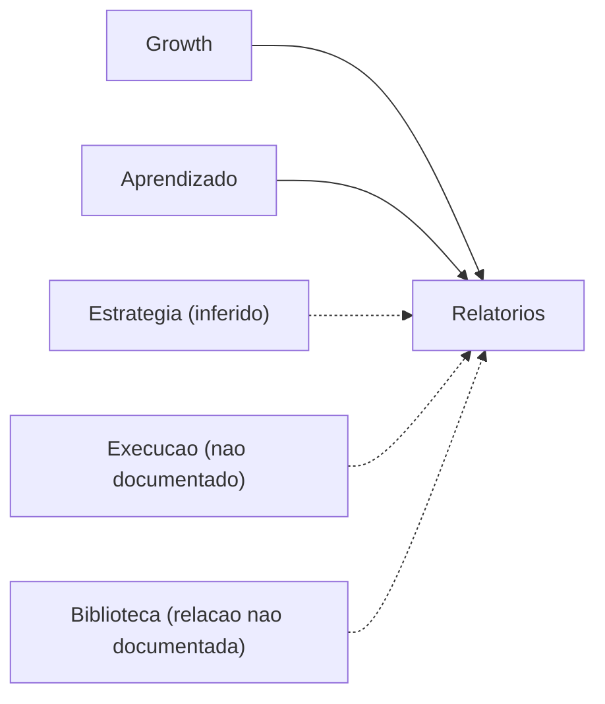
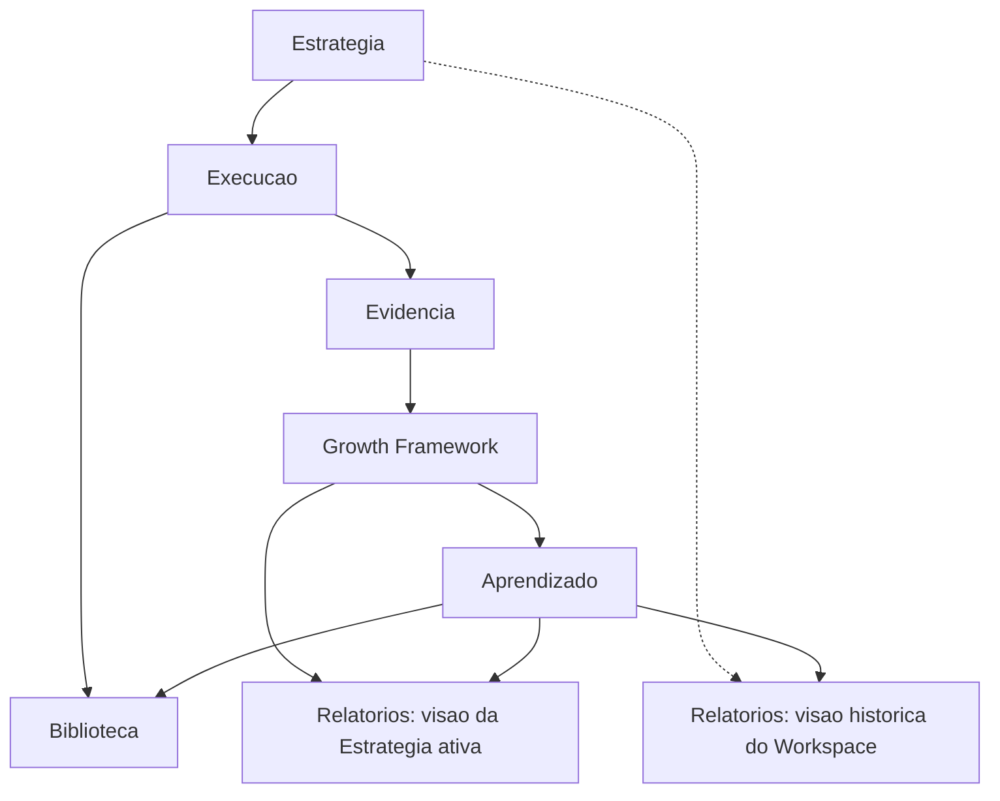
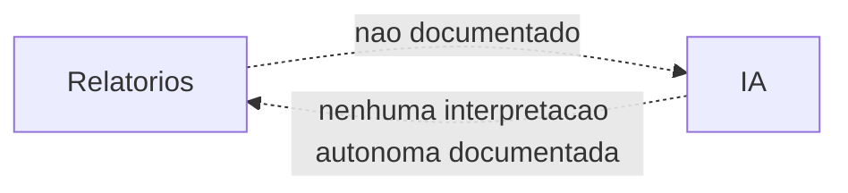

# RFC-007 — Relatórios

**Status:** Draft
**Data:** 2026-07-26

Continuação natural da [RFC-006 — Biblioteca](./RFC-006-biblioteca.md), que já registrou a distinção de propósito entre os dois módulos: *"Relatórios é 'Comunicação', formal e compartilhável; Biblioteca é 'Memória', para reutilização interna"* (Blueprint, Cap. 3.5). Esta RFC especifica o lado que a RFC-006 deixou de fora.

# Objetivo

Definir completamente o módulo Relatórios da VEKTOR. Relatórios é responsável **exclusivamente** por apresentar informações consolidadas ao usuário. Ele **não** produz Estratégias, **não** executa Campanhas, Táticas, Ações ou Experimentos, **não** produz Evidência e **não** interpreta Aprendizado. Seu papel é transformar informação já existente em visualizações compreensíveis para apoiar tomada de decisão (Blueprint, Cap. 3.5).

# Problema

RFC-003, RFC-005 e RFC-006 citaram Relatórios apenas como "consumidor indireto" e deferiram sua especificação completa. A ADR-005 (`DECISIONS.md`) já resolveu a principal inconsistência conhecida sobre este módulo — a existência de duas visões distintas — mas nenhuma RFC consolidou até agora responsabilidade, limites, fontes de informação e participação de IA em um único documento de implementação.

# Escopo

Relatórios é responsável por apresentar, de forma formal e compartilhável, informação que outros módulos já produziram — nunca por criar, executar ou interpretar essa informação; essas responsabilidades pertencem a Estratégia, Execução, Growth e Aprendizado, respectivamente (Blueprint, Cap. 3.4 "Camadas do produto"; Cap. 3.5).

Esta RFC cobre:

- As duas visões de Relatórios já decididas na ADR-005: da Estratégia ativa (Contexto Estratégico) e histórica do Workspace (Contexto Global).
- Quais módulos as fontes permitem afirmar que alimentam Relatórios.
- A relação de Relatórios com Estratégia, Execução, Growth, Aprendizado, Biblioteca, Workspace e IA.
- Quem consulta Relatórios, quando, e quais decisões apoia.

# Fora do escopo

- Indicadores, métricas ou tipos de visualização específicos — nenhuma fonte define isso (ver "Fontes de informação").
- Novos componentes de interface — o Objetivo desta RFC é responsabilidade e relação, não desenho de dashboard (ver "Visualização").
- A execução ou interpretação de qualquer conteúdo que Relatórios apresenta (RFC-001, RFC-002, RFC-003, RFC-005) — Relatórios apenas exibe.
- O módulo Biblioteca (RFC-006) — distinto por propósito, já registrado; mencionado aqui apenas onde a relação entre os dois é ambígua (ver "Modelo de domínio impactado").
- O módulo Configurações — não tem RFC própria ainda (ver Revisão crítica); não é tratado aqui.
- Schema de banco detalhado — lacuna registrada abaixo.

# Experiência do usuário (UX)

Conforme Blueprint, Cap. 4 ("A segunda volta — o que muda"): "Relatórios, na sua visão histórica do Workspace, tem ciclos inteiros para comparar, não uma folha em branco — é o momento em que a persona decisora leva ao C-level não uma opinião, mas uma narrativa de evolução: o que foi decidido, o que foi aprendido, o que mudou." A persona associada a essa necessidade é Marina (Blueprint, Cap. 2): "Precisa do VEKTOR para... confirmar que a execução está alinhada ao plano, e receber recomendação de IA em vez de número solto"; "Pergunta de todo dia: Estamos executando a estratégia certa, ou só estamos ocupados?"

A visão da Estratégia ativa, por outro lado, não tem uma narrativa própria detalhada nas fontes além de ser "o recorte de Growth + Aprendizado da Estratégia em curso" (`architecture/navigation.md`).

**Lacuna registrada:** como nas RFCs anteriores, isso é narrativo. Nenhuma tela, componente ou wireframe está definido.

# Modelo de domínio impactado

Nenhuma entidade nova. Relatórios **não é uma entidade de domínio** — não aparece em `architecture/domain.md`. É um módulo (Blueprint, Cap. 3.5) que apresenta informação de outros módulos, sem produzir dado próprio — estruturalmente semelhante a Biblioteca e a Dashboard nesse aspecto (nenhum dos três tem entidade própria), mas com propósito distinto de ambos (RFC-006).

| Fonte documentada | O que fornece a Relatórios | Onde está documentado |
|---|---|---|
| **Growth** | O "recorte de Growth" que compõe a visão da Estratégia ativa | `architecture/navigation.md`, "Relatórios nos dois níveis" |
| **Aprendizado** | O "recorte de... Aprendizado" (visão ativa) e "o que foi aprendido" (visão histórica) | Idem; Blueprint, Cap. 4 |
| **Estratégia** (implícito) | "O que foi decidido" na narrativa de evolução da visão histórica | Blueprint, Cap. 4 — inferência a partir da frase, não uma afirmação direta de que Estratégia é uma fonte técnica |

**Lacuna registrada — Execução:** nenhuma fonte documenta Execução como fonte de informação de Relatórios. Diferente de Biblioteca (RFC-006), que acumula Campanhas e Ações diretamente, Relatórios não tem essa relação documentada. Esta RFC não assume que ela existe.

**Lacuna registrada — Biblioteca:** nenhuma fonte documenta se Relatórios lê os mesmos dados de Execução/Aprendizado de forma independente, ou se passa "através" de Biblioteca para obtê-los. As duas coisas produzem o mesmo resultado observável, mas a arquitetura de acesso não está definida.

**Relação com Estratégia:** indireta, por inferência (ver tabela acima). A visão histórica compara Estratégias ao longo do tempo (ADR-005); a visão ativa é escopada à Estratégia ativa (`architecture/navigation.md`).

**Relação com Execução:** não documentada — ver lacuna acima.

**Relação com Growth:** direta e explícita — ver tabela acima.

**Relação com Aprendizado:** direta e explícita — ver tabela acima.

**Relação com Biblioteca:** não documentada como relação técnica direta — ver lacuna acima. Os dois módulos são distintos por propósito (RFC-006, Critério de aceite nº6).

**Relação com Workspace:** a visão histórica é Contexto Global, escopada ao Workspace inteiro (ADR-005; `architecture/navigation.md`). A visão da Estratégia ativa é Contexto Estratégico, mas ainda dentro do mesmo Workspace.

**Relação com IA:** ver "Participação da IA" abaixo.

# Participação da IA

`architecture/ai.md`, tabela "Como a IA participa de cada módulo", é explícito: *"Relatórios, Biblioteca, Configurações — Sem participação de IA definida no Blueprint v1 — não inventar comportamento aqui até uma RFC específica tratar do tema."* Esta é essa RFC para Relatórios, e ela não inventa esse comportamento:

- **Onde a IA participa:** não documentado.
- **Onde apenas auxilia:** não documentado.
- **Onde a IA nunca interpreta resultados autonomamente:** não há participação documentada para interpretar — mas, por extensão do princípio geral do Product Canon ("a IA nunca é a protagonista") e do fato de que a interpretação de Evidência em Aprendizado já é responsabilidade do Growth Framework (RFC-003, RFC-005), qualquer interpretação que apareça em Relatórios já chega interpretada de outro módulo. Relatórios, por definição desta RFC, apresenta — não reinterpreta.
- **Quais decisões continuam sendo humanas:** todas, por ausência de qualquer participação de IA documentada.

**Lacuna registrada:** não está definido se a IA participa da própria composição da "narrativa de evolução" citada no Blueprint Cap. 4 (Growth explica análises com CTR-type recommendations — Blueprint Cap. 1/4 — o exemplo de recomendação de Growth pode, em tese, aparecer dentro de um Relatório da Estratégia ativa, já que este é "o recorte de Growth"). Se isso conta como "participação de IA em Relatórios" ou apenas como conteúdo de Growth sendo exibido é uma distinção que as fontes não fazem. Esta RFC registra a ambiguidade em vez de decidir.

# Fluxos

## Fluxo de informações até Relatórios

Linhas sólidas = relação explicitamente documentada. Linhas tracejadas = inferência ou lacuna registrada, não afirmação de fonte.

## Relação entre Estratégia, Execução, Growth, Aprendizado, Biblioteca e Relatórios

Este diagrama deixa explícito que Biblioteca recebe de Execução e Aprendizado (RFC-006), enquanto Relatórios recebe apenas de Growth e Aprendizado (mais a inferência sobre Estratégia) — as duas setas para "Biblioteca" que não vão também para "Relatórios" (a partir de Execução) marcam exatamente a lacuna registrada acima.

## Participação da IA

Diagrama intencionalmente mínimo, pela mesma razão registrada na RFC-006 para Biblioteca: a ausência de participação de IA é o que as fontes afirmam, não uma omissão desta RFC.

## Visualização

- **Qual o papel dos Relatórios:** recorte formal e compartilhável, para quem não navega o sistema ao vivo (Blueprint, Cap. 3.5) — o oposto de Dashboard, que é para navegação ao vivo, e de Biblioteca, que é para reutilização, não comunicação.
- **Quando o usuário consulta Relatórios:** a visão da Estratégia ativa, presumivelmente durante o trabalho corrente (não detalhado); a visão histórica, de forma mais concreta, "na segunda volta" do ciclo — quando já existe mais de uma Estratégia para comparar (Blueprint, Cap. 4).
- **Quais decisões Relatórios apoia:** a pergunta de Marina, "Estamos executando a estratégia certa, ou só estamos ocupados?" (Blueprint, Cap. 2), e a comunicação de evolução ao C-level (Blueprint, Cap. 4).
- **Quais limites o módulo possui:** não executa, não interpreta, não decide — apresenta. Cada instância pertence a exatamente uma das duas visões da ADR-005, nunca a uma terceira "visão geral".

# Critérios de aceite

1. Relatórios nunca executa Estratégias, Campanhas, Táticas, Ações ou Experimentos, nem produz Evidência ou interpreta Aprendizado — sua única função é apresentar informação já existente.
2. Toda instância de Relatórios declara explicitamente a qual das duas visões pertence — da Estratégia ativa ou histórica do Workspace (ADR-005) — nunca uma terceira visão ambígua.
3. A visão da Estratégia ativa nunca mostra dado de uma Estratégia diferente da ativa.
4. A visão histórica do Workspace pode mostrar múltiplas Estratégias do mesmo Workspace, mas nunca de outro Workspace.
5. Nenhuma implementação assume que Relatórios lê diretamente de Execução ou de Biblioteca sem que essa relação seja antes documentada — permanece lacuna até Review resolver.
6. Nenhuma implementação assume participação de IA em Relatórios além do que está aqui documentado como lacuna.
7. Relatórios permanece distinto de Biblioteca (memória para reutilização) e de Dashboard (centro de decisão do dia a dia) por propósito (Blueprint, Cap. 3.5).
8. **Esta decisão reduz a complexidade para o usuário?** Sim — sem Relatórios, a persona decisora precisaria montar manualmente, fora do sistema, a narrativa de evolução que hoje o Blueprint promete como recorte já formal e compartilhável (Product Canon; Blueprint, Cap. 3.7 e Cap. 4).

# Impactos

- **Banco:** Relatórios provavelmente não requer tabelas próprias além das já necessárias para Estratégia, Growth e Aprendizado — seu papel é de apresentação sobre dado que já existe. **Lacuna:** sem indicadores ou métricas definidos, não é possível avaliar se alguma agregação pré-computada será necessária.
- **Backend:** lógica de leitura/agregação de Growth e Aprendizado, escopada à Estratégia ativa ou ao Workspace conforme a visão. Nenhuma lógica de escrita própria.
- **Frontend:** interface de apresentação (Blueprint, Cap. 4), usando a stack de CLAUDE.md. **Lacuna:** nenhum wireframe, indicador ou gráfico está especificado.
- **IA:** nenhuma participação definida — ver "Participação da IA" acima.
- **Navegação:** Relatórios é o único módulo com visão dupla de contexto (ADR-005; `architecture/navigation.md`) — Estratégico e Global simultaneamente, cada instância pertencendo a um dos dois.
- **Product Canon:** esta RFC não contraria o Canon; a ausência de participação de IA é registrada como lacuna, não como decisão de produto tomada aqui.
- **Product Blueprint:** esta RFC detalha o Cap. 3.5 e pontos do Cap. 2, 3.6 e 4 — não os substitui nem os contradiz.

# Dependências

- RFC-001 — Estratégia: fonte inferida da visão histórica ("o que foi decidido").
- RFC-003 — Growth e RFC-005 — Aprendizado: fontes diretas e explícitas de ambas as visões.
- RFC-006 — Biblioteca: módulo irmão por contexto (Global) e por lidar com histórico, mas sem relação técnica direta documentada.
- Resolução da lacuna "Relatórios lê de Execução/Biblioteca ou não" é pré-requisito para desenhar a lógica de backend com confiança.

# Checklist

- [ ] Não contraria o Product Canon.
- [ ] Não contraria o Product Blueprint.
- [ ] Não contraria nenhuma decisão registrada em `DECISIONS.md`.
- [ ] Toda operação proposta nasce dentro de uma Estratégia (ADR-008), se aplicável.
- [ ] Participação de IA (se houver) respeita os limites de `architecture/ai.md`.
- [ ] Seção "Fora do escopo" preenchida — não deixar implícita.
- [ ] Critérios de aceite são verificáveis, não vagos.
- [ ] **Esta decisão reduz a complexidade para o usuário?** (Product Canon; Product Blueprint, Cap. 3.7) — resposta precisa ser sim.

---

## Revisão crítica desta RFC

Autorrevisão feita antes de considerar o documento concluído. A RFC permanece em **Draft**.

**Verificação específica pedida: Relatórios permanece exclusivamente um módulo de apresentação.** Revisei cada seção procurando qualquer frase que atribuísse a Relatórios uma capacidade de criar, executar ou interpretar. Não encontrei nenhuma — inclusive removi, durante a escrita de "Participação da IA", uma formulação que dizia que a IA "poderia ajudar a destacar o que é mais relevante em um Relatório", por ser uma forma de interpretação não documentada. Mantive apenas que Relatórios apresenta o que já chega interpretado de Growth/Aprendizado.

**Inconsistências com RFC-001 a RFC-006: nenhuma encontrada.** Confirmei que a distinção Relatórios × Biblioteca desta RFC é idêntica à que a RFC-006 já havia estabelecido (Comunicação vs. Memória) — não a redefini, apenas a referenciei.

**Conflitos com o Product Blueprint: nenhum encontrado.**

**Decisão arquitetural implícita verificada e evitada:** ao desenhar "Fluxo de informações até Relatórios", a tentação inicial era desenhar uma seta direta de Execução para Relatórios, por analogia com Biblioteca — isso teria sido uma decisão de domínio não documentada. Corrigido para uma linha tracejada com a lacuna registrada explicitamente.

**Duplicação avaliada:** a citação da ADR-005 e da tabela "Relatórios nos dois níveis" (`architecture/navigation.md`) reaparece aqui como já está nesses documentos. Mantive porque são a definição central deste módulo — omiti-las tornaria esta RFC incompleta como referência de implementação. Critérios de aceite e Checklist foram comparados linha a linha, sem sobreposição.

**Tema grande demais para esta RFC — registrado, não incorporado:** dos sete módulos oficiais do Blueprint (Cap. 3.5), **Configurações** é agora o único sem RFC própria (Estratégia, Execução, Growth, Aprendizado, Biblioteca e Relatórios já têm). Diferente das lacunas transversais já registradas (máquina de estados, RFC-004), esta é a especificação de um módulo inteiro que ficou de fora — recomendo uma RFC-008 dedicada a Configurações para completar a cobertura dos sete módulos.

**Outras lacunas registradas, sem solução inventada:**
- Se Relatórios lê Execução e/ou Biblioteca diretamente, ou apenas Growth/Aprendizado.
- Se a "narrativa de evolução" citada no Blueprint Cap. 4 é composta com auxílio de IA ou é puramente uma apresentação do que outros módulos já produziram.
- Quais indicadores, métricas ou visualizações concretas compõem qualquer uma das duas visões — nenhuma fonte nomeia um único exemplo específico de Relatório.

Nenhuma lacuna acima foi resolvida com uma decisão inventada — todas seguem abertas para Review.
