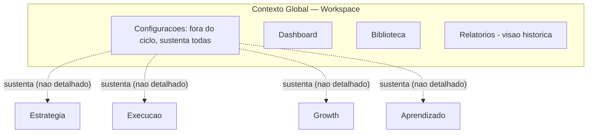
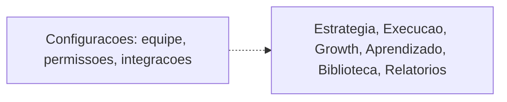

# RFC-008 — Configurações

**Status:** Draft
**Data:** 2026-07-26

Esta RFC fecha a especificação dos sete módulos oficiais definidos no Blueprint (Cap. 3.5). A RFC-007 registrou explicitamente: *"Configurações é agora o único sem RFC própria (...) recomendo uma RFC-008 dedicada a Configurações para completar a cobertura dos sete módulos."* Esta é essa RFC.

# Objetivo

Definir completamente o módulo Configurações da VEKTOR. Configurações é responsável **exclusivamente** pela parametrização do sistema. Não executa Estratégias, não executa Campanhas, Táticas, Ações ou Experimentos, não produz Evidência, não interpreta Aprendizado e não apresenta Relatórios. Seu papel é armazenar e disponibilizar parâmetros utilizados pelos demais módulos (Blueprint, Cap. 3.5).

# Problema

Configurações é citado no Blueprint desde a definição dos sete módulos (Cap. 3.5) e aparece na jornada inicial do usuário (Cap. 4, "Chegada"), mas nunca foi especificado como as demais seis. Sem esta RFC, a cobertura de RFCs dos módulos oficiais do Blueprint permaneceria incompleta.

# Escopo

Configurações é responsável por armazenar e disponibilizar os parâmetros que definem "a forma do próprio Workspace" (Blueprint, Cap. 3.5) — nunca por executar, formular, medir ou apresentar qualquer conteúdo desses parâmetros; essas responsabilidades pertencem exclusivamente aos outros seis módulos.

Esta RFC cobre:

- Os parâmetros explicitamente citados nas fontes: equipe, permissões e integrações (Blueprint, Cap. 3.5).
- A posição de Configurações como módulo "fora do ciclo", que "sustenta todas" as etapas sem pertencer a nenhuma (Blueprint, Cap. 3.5).
- A relação de Configurações com os demais seis módulos, com Workspace e com IA.
- O quadro de cobertura de RFCs dos módulos oficiais do Blueprint, agora completo.

# Fora do escopo

- Papéis além dos dois ratificados por ADR-012 (`admin`/`membro`), granularidade de permissão por módulo/ação individual, ou delegação por Campanha/Estratégia — nenhuma fonte pede isso além do mínimo de "ao menos dois níveis de autoridade" que ADR-012 já resolve (ver "Parâmetros").
- Tipos específicos de integração (o Blueprint usa apenas a palavra "integrações", sem exemplos).
- Preferências individuais de usuário (tema, idioma, notificações) — não documentadas em nenhuma fonte.
- Faturamento, cobrança ou qualquer aspecto comercial do Workspace — não mencionado em nenhuma fonte.
- A especificação completa dos outros seis módulos — já cobertos por RFC-001, RFC-002, RFC-003, RFC-005, RFC-006 e RFC-007.
- Schema de banco e decisões de interface visual — lacunas registradas abaixo.

# Experiência do usuário (UX)

A única menção narrativa a Configurações no Blueprint está no Cap. 4, "Chegada": ao criar um Workspace, "a única ação com peso real disponível é iniciar a formulação [da Estratégia] — tudo o mais (convidar equipe em Configurações, explorar Biblioteca) é secundário e pode esperar." Isso estabelece duas coisas com confiança: (1) convidar equipe é uma ação disponível em Configurações desde a criação do Workspace; (2) ela é explicitamente secundária frente à formulação da primeira Estratégia.

**Lacuna registrada:** nenhuma outra menção de experiência de uso existe em nenhuma fonte. Não há narrativa de como ou quando o usuário ajusta permissões ou integrações.

# Modelo de domínio impactado

Nenhuma das nove entidades de `architecture/domain.md` é alterada. Configurações continua sem entidade de domínio própria — mas passa a ter, por meio desta emenda, uma entidade de Identity/Access que a sustenta: **Membro**, ratificado por ADR-011 (`DECISIONS.md`) como "fora das nove entidades do ciclo" (`conceptual-model.md`), não como entidade de domínio nova.

| Relação | O que as fontes permitem afirmar |
|---|---|
| **Com Workspace** | Direta e definidora — Configurações é descrita como "a forma do próprio Workspace" (Blueprint, Cap. 3.5); Membro é uma tabela de junção Workspace↔identidade (ADR-011). |
| **Com Estratégia, Execução, Growth, Aprendizado, Biblioteca, Relatórios** | Concreta, via RBAC: cada operação sensível desses módulos (listada em ADR-012) passa a exigir checagem de `members.role`. Deixa de ser apenas a afirmação genérica "sustenta todas" (Blueprint, Cap. 3.5). |
| **Com IA** | Ver "Participação da IA" abaixo. |

**Lacuna fechada nesta rodada:** "sustenta todas" não era especificado tecnicamente — **resolvido por ADR-012**: o mecanismo é a checagem de `members.role` antes de toda operação sensível nomeada na tabela de ADR-012, verificada na camada Service de cada módulo.

## Parâmetros

| Categoria | Fonte | Estrutura |
|---|---|---|
| **Equipe** | Blueprint, Cap. 3.5 ("equipe"); Cap. 4 ("convidar equipe em Configurações") | **Resolvido por ADR-011:** Membro é `{id, workspace_id, user_id (nullable), email, status (convidado\|ativo\|removido), role, invited_by, invited_at, joined_at, created_at}`. Convite: cria linha com `status='convidado'`, `user_id=null`, `email` preenchido; aceite popula `user_id` e `joined_at`, muda `status` para `ativo`. Remoção muda `status` para `removido` (nunca exclusão física — Regra Absoluta nº8, `IMPLEMENTATION_STANDARDS.md`). |
| **Permissões** | Blueprint, Cap. 3.5 ("permissões") | **Resolvido por ADR-012:** exatamente dois papéis, `admin` e `membro`, sem granularidade adicional. Mapeamento completo de operação→papel mínimo está em ADR-012 (`DECISIONS.md`). |
| **Integrações** | Blueprint, Cap. 3.5 ("integrações") | Nenhum — não há exemplo de qual sistema externo, nem se são chaves de API, webhooks, ou outra forma. Fora do escopo desta rodada de decisão. |

**Nenhuma outra categoria de parâmetro é reconhecida.** Esta RFC não infere preferências de usuário, chaves de acesso, configurações de notificação, ou qualquer categoria não citada literalmente acima. Granularidade de permissão além dos dois papéis de ADR-012 permanece fora do escopo, sem base documental para ir além.

# Participação da IA

`architecture/ai.md`, tabela "Como a IA participa de cada módulo": *"Relatórios, Biblioteca, Configurações — Sem participação de IA definida no Blueprint v1 — não inventar comportamento aqui até uma RFC específica tratar do tema."* Esta é essa RFC para Configurações.

As fontes permitem afirmar apenas isto — e nada além disso é extrapolado de outros módulos:

- Nenhuma participação de IA em Configurações está documentada.
- Nenhuma fonte específica de Configurações contradiz ou confirma se o princípio geral do Product Canon ("a IA nunca é a protagonista") teria alguma manifestação particular aqui — não há base para além do princípio genérico, que já se aplica a toda a plataforma independentemente desta RFC.

**Lacuna registrada:** tudo sobre IA e Configurações é indefinido. Esta RFC não inventa uma resposta.

# Fluxos

## Posição do módulo Configurações na arquitetura

Linhas tracejadas: a relação "sustenta todas" é afirmada pelo Blueprint (Cap. 3.5), mas o mecanismo não é especificado — não é uma dependência técnica documentada em detalhe, por isso não é desenhada como uma seta sólida de fluxo de dado.

## Dependência dos demais módulos

**Lacuna registrada:** este diagrama representa a única afirmação disponível ("sustenta todas") — não uma dependência módulo-a-módulo detalhada, que nenhuma fonte fornece.

## Participação da IA

Diagrama mínimo por não haver base documental — não por omissão desta RFC.

# Critérios de aceite

1. Configurações nunca executa Estratégias, Campanhas, Táticas, Ações ou Experimentos, nem produz Evidência, interpreta Aprendizado ou apresenta Relatórios — sua única função é armazenar e disponibilizar parâmetros.
2. Configurações é sempre escopada ao Workspace (Contexto Global) — nenhum parâmetro de outro Workspace é acessível.
3. Os únicos parâmetros reconhecidos por esta RFC são equipe, permissões e integrações — nenhuma implementação introduz uma categoria adicional sem documentá-la primeiro.
4. Convidar um membro para a equipe está disponível desde a criação do Workspace, mesmo sem uma Estratégia ativa (Blueprint, Cap. 4) — exige Membro `admin` (ADR-012).
5. Nenhuma implementação assume participação de IA em Configurações.
6. Todo Workspace tem, desde sua criação, exatamente um Membro fundador com `role = 'admin'` — o usuário que o criou (ADR-013).
7. Nenhuma operação sensível de qualquer módulo (convidar/remover Membro, alterar Integrações, aprovar etapa/síntese de Estratégia, aprovar Experimento, disparar "Evoluir Estratégia") é executada por um Membro com `role = 'membro'` — apenas por `role = 'admin'` (ADR-012).
8. **Esta decisão reduz a complexidade para o usuário?** Sim — centralizar equipe, permissões e integrações em um único lugar "fora do ciclo" evita que o usuário precise procurar essas configurações espalhadas dentro de cada módulo operacional (Product Canon; Blueprint, Cap. 3.5 e 3.7).

# Impactos

- **Banco:** persistência de Membros do Workspace (`members`, ADR-011), seu `role` (ADR-012), e integrações configuradas. Schema de Membro e RBAC resolvidos por ADR — implementação (migration, FKs de `*_by`) permanece trabalho de implementação subsequente, não desta RFC.
- **Backend:** lógica de convite de membro; verificação de `role` antes de toda operação sensível listada em ADR-012, em cada Service de módulo (não apenas em Configurações). CLAUDE.md (Technology Stack) já define o motor de persistência; a implementação exata não é objeto desta RFC.
- **Frontend:** interface de gestão de equipe/permissões/integrações, usando a stack de CLAUDE.md. **Lacuna:** nenhum wireframe está especificado.
- **IA:** nenhuma participação definida — ver "Participação da IA" acima.
- **Navegação:** Configurações vive no Contexto Global (`architecture/navigation.md`, Sidebar).
- **Product Canon:** esta RFC não contraria o Canon.
- **Product Blueprint:** esta RFC detalha a única linha do Cap. 3.5 dedicada a Configurações e a menção do Cap. 4 — não os substitui nem os contradiz.

# Dependências

- RFC-003/RFC-004 dependem de ADR-012 (via esta emenda) para fechar o Bloqueador 3 ("quem aprova um Experimento").
- RFC-001 depende de ADR-012 para a aprovação de etapa/síntese.
- Granularidade de permissão além dos dois papéis de ADR-012 (ex.: delegação por Campanha) permanece sem base documental — pré-requisito de qualquer RFC futura que queira ir além do mínimo aqui ratificado.

# Checklist

- [ ] Não contraria o Product Canon.
- [ ] Não contraria o Product Blueprint.
- [ ] Não contraria nenhuma decisão registrada em `DECISIONS.md`.
- [ ] Toda operação proposta nasce dentro de uma Estratégia (ADR-008), se aplicável.
- [ ] Participação de IA (se houver) respeita os limites de `architecture/ai.md`.
- [ ] Seção "Fora do escopo" preenchida — não deixar implícita.
- [ ] Critérios de aceite são verificáveis, não vagos.
- [ ] **Esta decisão reduz a complexidade para o usuário?** (Product Canon; Product Blueprint, Cap. 3.7) — resposta precisa ser sim.

---

## Revisão crítica desta RFC

Autorrevisão feita antes de considerar o documento concluído. A RFC permanece em **Draft**.

**Verificação específica pedida: Configurações permanece exclusivamente um módulo de parametrização.** Revisei cada seção procurando qualquer atribuição de execução, formulação, medição ou apresentação a Configurações. Não encontrei nenhuma. Na seção "Participação da IA", resisti deliberadamente à tentação de reaproveitar o raciocínio usado nas RFC-006 e RFC-007 (que estenderam princípios gerais do Canon para preencher a ausência de documentação) — a instrução desta RFC pedia explicitamente para não extrapolar comportamento de outros módulos, então mantive a seção mais enxuta que as duas anteriores.

**Erro de estrutura encontrado e corrigido antes de finalizar:** a primeira versão desta RFC tinha "Parâmetros" como uma seção `#` de nível 1 própria — o template de `rfc/README.md` não prevê essa seção. Corrigido: o conteúdo foi movido para dentro de "Modelo de domínio impactado", como subseção, restaurando a aderência rigorosa às 12 seções do template.

**Inconsistências com RFC-001 a RFC-007: nenhuma encontrada.**

**Conflitos com o Product Blueprint: nenhum encontrado.** Esta é, de longe, a RFC com menor base documental de todas as oito — refleti isso no tamanho real das seções em vez de compensar com inferências.

**Decisão arquitetural implícita, originalmente evitada, hoje formalizada por ADR:** a versão original desta RFC evitou deliberadamente supor que "permissões" implicasse um sistema de papéis, por não haver base documental própria para inventar essa estrutura. Essa lacuna foi identificada em `ARCHITECTURE_RESOLUTION.md` (A2) como bloqueadora da camada Service e resolvida formalmente por **ADR-012** — não por esta RFC decidindo sozinha, mas por uma decisão de arquitetura registrada em `DECISIONS.md`, que esta RFC agora incorpora por referência (seção "Modelo de domínio impactado" → "Parâmetros"). O mesmo vale para Membro/Equipe, resolvido por **ADR-011**.

**Duplicação avaliada:** nenhuma duplicação relevante encontrada — esta RFC tem pouco conteúdo prévio para duplicar, dado quão pouco o Blueprint fala de Configurações. Critérios de aceite e Checklist foram comparados linha a linha, sem sobreposição.

**Tema antes grande demais para esta RFC, agora fechado por ADR:** a definição real de papéis e permissões (RBAC) foi resolvida por ADR-012, e a estrutura de Membro por ADR-011 — ambos fora desta RFC (que continua sem base documental própria para tê-los inventado sozinha), mas agora referenciáveis por ela.

### Quadro de cobertura — módulos oficiais do Blueprint

| Módulo (Blueprint, Cap. 3.5) | RFC |
|---|---|
| Estratégia | RFC-001 |
| Execução | RFC-002 |
| Growth | RFC-003 |
| Aprendizado | RFC-005 |
| Biblioteca | RFC-006 |
| Relatórios | RFC-007 |
| Configurações | RFC-008 (esta) |

Os sete módulos oficiais do Blueprint agora têm RFC própria. RFC-004 (Lifecycle & State Machine) permanece como a única RFC transversal, não ligada a um módulo específico.

### Lacunas transversais fechadas nesta rodada (ver `DECISIONS.md`, ADR-011 a ADR-015)

- ~~Quem aprova um Experimento para passar de Proposto a Aprovado~~ — **resolvido por ADR-012.**
- ~~Estrutura real de papéis/permissões de Configurações~~ — **resolvido por ADR-011 (Membro) e ADR-012 (RBAC).**
- ~~Modelo de criação de Workspace~~ — **resolvido por ADR-013** (não era uma lacuna desta RFC, mas de `ARCHITECTURE_RESOLUTION.md`, A5).
- ~~Propagação de contexto autenticado / uso de `service_role`~~ — **resolvido por ADR-014** (idem, A9).
- ~~Momento em que a Estratégia se torna ativa~~ — **resolvido por ADR-015** (RFC-001).

### Lacunas transversais que permanecem registradas, sem solução inventada

- Máquina de estados de Campanha e Tática (RFC-004) — quase sem base documental.
- Se ações de baixo risco (concluir uma Ação, registrar um Aprendizado) podem ser automatizadas pela IA ou sempre exigem confirmação humana (RFC-002, RFC-003, RFC-004, RFC-005).
- O que acontece com entidades em andamento quando a Estratégia-mãe é encerrada (RFC-002, RFC-004).
- Mecanismo de busca/indexação da Biblioteca (RFC-006).
- Se Relatórios lê Execução e/ou Biblioteca diretamente (RFC-007).
- Escopo exato do que Biblioteca contém — Cap. 3.5 (três tipos) vs. Cap. 4 "estado ideal" (sete tipos) (RFC-006).
- Indicadores e métricas concretas de Relatórios (RFC-007).
- LGPD (direito de exclusão) vs. imutabilidade de Evidência/Aprendizado (`ARCHITECTURE_RESOLUTION.md`, A13) — fora do escopo desta rodada.

Nenhuma dessas lacunas foi resolvida com uma decisão inventada em nenhuma das oito RFCs — todas seguem abertas para Review.
