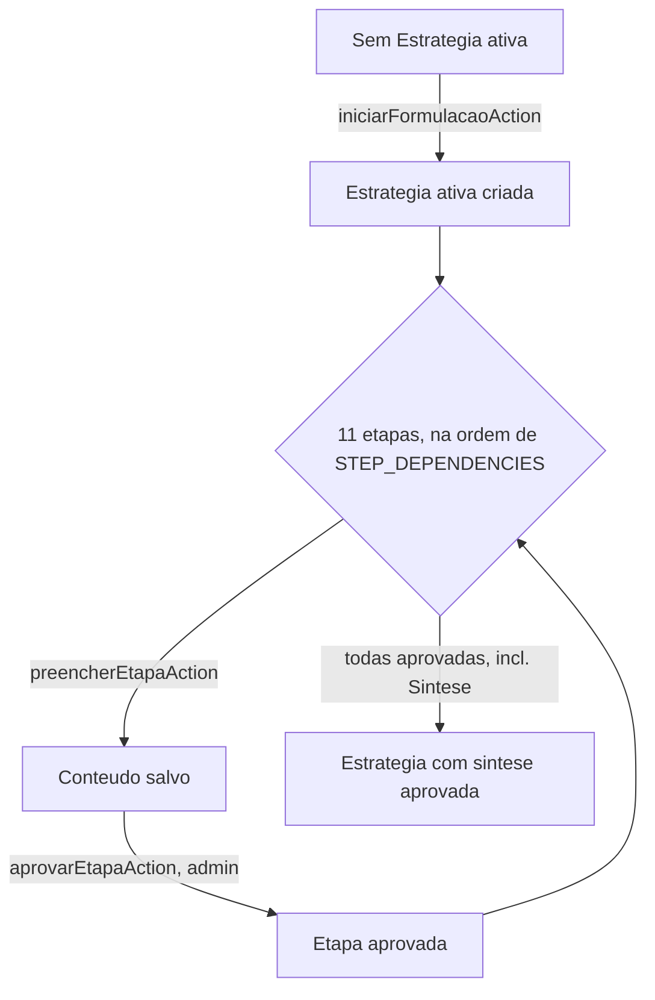
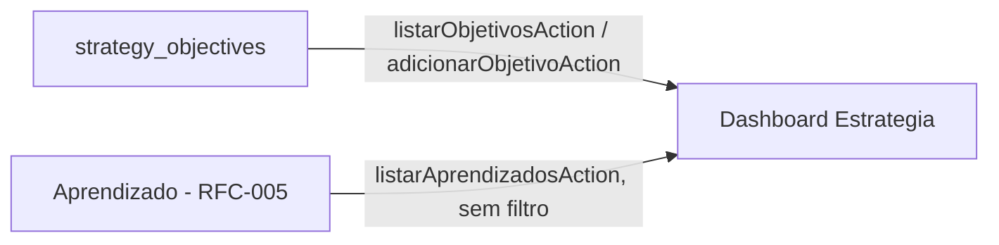

# RFC-009 — Fechamento das Lacunas de Produto

**Status:** Proposto
**Data:** 2026-07-29
**Prioridade:** Alta
**Dependências:** RFC-001 a RFC-008

Continuação direta da Auditoria Arquitetural do VEKTOR (realizada nesta sessão), que identificou duas lacunas — de produto, não de arquitetura — nos módulos Estratégia e Relatórios: backend implementado e validado, camada de apresentação ausente ou incompleta.

# Objetivo

Concluir a primeira versão funcional (MVP) do VEKTOR entregando a camada de apresentação dos dois módulos cujo backend já está implementado: Estratégia e Relatórios. Este RFC não altera arquitetura, domínio, RBAC ou máquina de estados — apenas conecta UI a Server Actions já existentes.

# Problema

A auditoria arquitetural confirmou: Services seguem a arquitetura definida, Repositories respeitam os limites dos módulos, Composition Root é consistente, os ADRs relevantes estão implementados. As duas lacunas restantes são exclusivamente de apresentação:

- **RFC-001 (Estratégia):** backend completo (`EstrategiaService`, 7 Server Actions), zero UI — nenhum diretório `app/w/[workspaceId]/estrategia` existe.
- **RFC-007 (Relatórios):** apenas a visão histórica tem UI; a visão da Estratégia ativa não existe, condicionada a uma decisão de arquitetura de leitura ainda não tomada.

# Escopo

Este RFC cobre exclusivamente:

- A UI das 11 etapas do Marketing Planning Framework já existentes no domínio (RFC-001; `strategy_step_type`, `packages/db/src/schema.ts`): Diagnóstico, Mercado, Concorrentes, SWOT, ICP, Personas, Jornada do Cliente, Funis, Objetivos, Posicionamento, Síntese.
- A UI de Objetivos estruturados (`strategy_objectives`), já usada por RFC-003/Growth para a dupla amarração de Experimento.
- A composição de Aprendizado (RFC-005) dentro do dashboard de Estratégia, reaproveitando `listarAprendizadosAction` sem nova relação de domínio.
- Confirmação de que a visão histórica de Relatórios (RFC-007), já construída, atende aos critérios de aceite revisados por este RFC.

# Fora do escopo

- **"Dores", "Diferenciais" e "Proposta de Valor" como etapas de Estratégia.** Não existem em `strategy_step_type`, não estão nas 11 etapas de RFC-001, não estão no Product Blueprint Cap. 5. Introduzi-las exigiria uma migration (novo `stepType`) e uma decisão de domínio — nenhuma das duas cabe neste RFC, que proíbe mudança de banco. Se o produto precisar delas no futuro, é objeto de um RFC/ADR de domínio específico, não uma emenda de UI aqui. **Decisão tomada explicitamente durante a revisão deste RFC** — a versão originalmente proposta incluía esses três itens; foram removidos após confronto direto com o schema.
- **Indicadores, KPIs, evolução temporal calculada, cards ou gráficos de métrica em Relatórios.** RFC-007, na sua própria Revisão crítica, já registra: "nenhuma fonte nomeia um único exemplo específico de Relatório." Construir qualquer indicador agora seria inventar conteúdo de produto sem base documental.
- **Exportação.** Nenhuma fonte documenta formato, destino ou mecanismo — busca textual em toda a `docs/` não retornou nenhuma menção a "exportação" em nenhum RFC, ADR ou capítulo do Blueprint.
- **Visão da Estratégia ativa de Relatórios.** Depende de um mecanismo de recorte por Estratégia específica em `GrowthService`/`AprendizadoService` que não existe hoje. Construir essa visão sem esse recorte violaria o critério de aceite nº3 da própria RFC-007 ("a visão ativa nunca mostra dado de uma Estratégia diferente da ativa"). Permanece lacuna registrada, não resolvida por este RFC.
- Qualquer alteração de Service, Repository, Composition Root, schema, ADR ou RBAC.
- Refatorações, melhorias cosméticas, novos módulos, novas entidades.

# Experiência do usuário (UX)

Estratégia: o dashboard lista as 11 etapas com status (não preenchida / preenchida / aprovada), refletindo visualmente `STEP_DEPENDENCIES` (RFC-001, `step-dependencies.ts`) — uma etapa aparece bloqueada até suas dependências estarem aprovadas. Cada etapa abre um formulário de conteúdo livre (mesmo padrão já usado em Growth/Aprendizado) com um botão de aprovação separado, sempre visível mas só efetivo para `admin` — o Service já impõe isso, a UI não replica a checagem. Objetivos estruturados e Aprendizado relevante aparecem como seções à parte no mesmo dashboard. Um link aponta para `/relatorios/historico` (RFC-007) para o histórico completo — essa tela não é duplicada aqui. "Evoluir Estratégia" não aparece neste módulo — permanece exclusivamente em Aprendizado (ADR-002).

Relatórios: sem mudança de experiência além da já entregue — a visão histórica já apresenta "ciclos inteiros para comparar" (Blueprint, Cap. 4) com o que já existe.

**Lacuna registrada:** como em toda RFC anterior, nenhuma fonte define wireframe exato — o desenho acima é a síntese mínima necessária para os critérios de aceite, não um layout aprovado.

# Modelo de domínio impactado

Nenhuma entidade nova, nenhuma coluna nova, nenhuma migration. Este RFC consome exclusivamente entidades e Server Actions já existentes: `Strategy`, `StrategyStep` (`strategy_step_type`, os 11 valores existentes), `StrategyObjective`, `Learning`.

# Participação da IA

Nenhuma nova. RFC-001 já documenta que a IA pode sugerir conteúdo em cada etapa — isso permanece fora do escopo de implementação deste RFC, consistente com o achado transversal da auditoria: nenhuma integração de IA existe em nenhum módulo da VEKTOR ainda.

# Fluxos

## Dashboard de Estratégia

## Objetivos e Aprendizado — composição, sem nova regra

# Critérios de aceite

1. A UI de Estratégia cobre exatamente as 11 etapas existentes em `strategy_step_type` — nenhuma etapa adicional (nenhum "Dores"/"Diferenciais"/"Proposta de Valor"), nenhuma das 11 omitida.
2. Uma etapa não pode ser aprovada na UI antes de suas dependências (`STEP_DEPENDENCIES`) estarem aprovadas — a UI reflete o que o Service já valida, nunca decide por conta própria.
3. Aprovação de etapa (incluindo síntese) exige Membro `admin` — verificado inteiramente por `EstrategiaService`, nunca replicado na UI.
4. Toda ação da UI usa exclusivamente Server Actions já existentes — nenhuma nova Action, Service, Repository ou query direta ao banco.
5. Workspace isolation preservado — nenhuma tela exibe dado de outro Workspace.
6. A UI de Relatórios permanece limitada à visão histórica já construída — nenhum indicador, KPI ou exportação introduzido.
7. Nenhuma lógica de negócio vive na UI — toda validação de domínio permanece no Service.
8. **Esta decisão reduz a complexidade para o usuário?** Sim — sem esta UI, a jornada do usuário não consegue nem começar (não existe hoje forma de formular uma Estratégia), o que torna todo o restante do VEKTOR inacessível organicamente (Product Canon; Blueprint, Cap. 3.7).

# Impactos

- **Banco:** nenhum.
- **Backend:** nenhum — Services, Repositories e Composition Root permanecem exatamente como estão.
- **Frontend:** UI nova sob `app/w/[workspaceId]/estrategia/**` (dashboard, 1 rota dinâmica `[stepType]` para as 11 etapas, rota de Objetivos) e componentes correspondentes. Nenhuma alteração em `relatorios/historico`.
- **IA:** nenhuma participação nova.
- **Navegação:** ativa o slug `estrategia` já reservado em `sidebar.tsx` (hoje resulta em 404).
- **Product Canon:** não contraria — reduz complexidade (critério nº8).
- **Product Blueprint:** implementa a experiência já narrada nos Cap. 4 e 5, sem substituí-la.

# Dependências

- RFC-001 — Estratégia: fonte de todas as 11 etapas e do RBAC consumidos.
- RFC-003 — Growth: `strategy_objectives` já usado por `proporExperimento` — este RFC só adiciona a UI de gestão, não a relação em si.
- RFC-005 — Aprendizado: fonte da seção "Aprendizado relevante", via `listarAprendizadosAction`, sem alteração.
- RFC-007 — Relatórios: a visão histórica já construída é reafirmada, não recriada; a visão ativa permanece dependência em aberto, não resolvida por este RFC.

# Checklist

- [ ] Não contraria o Product Canon.
- [ ] Não contraria o Product Blueprint.
- [ ] Não contraria nenhuma decisão registrada em `DECISIONS.md`.
- [ ] Toda operação proposta nasce dentro de uma Estratégia (ADR-008), se aplicável — N/A para a criação da própria Estratégia (nasce do Workspace); aplicável e respeitado para Objetivos.
- [ ] Participação de IA (se houver) respeita os limites de `architecture/ai.md` — N/A, nenhuma introduzida.
- [ ] Seção "Fora do escopo" preenchida.
- [ ] Critérios de aceite são verificáveis, não vagos.
- [ ] Esta decisão reduz a complexidade para o usuário? — sim, ver critério nº8.

---

## Revisão crítica desta RFC

Feita antes de considerar o documento concluído.

**Discrepância encontrada e corrigida antes desta versão:** a proposta inicial deste RFC incluía "Dores", "Diferenciais" e "Proposta de Valor" como etapas de Estratégia, e "Indicadores/KPIs/Exportação" como escopo de Relatórios. Nenhum dos cinco itens tem base em `strategy_step_type`, RFC-001, RFC-007 ou qualquer documento-fonte — confirmado por leitura direta do schema (`packages/db/src/schema.ts`) e busca textual em toda a `docs/`. Removidos do escopo por decisão explícita, não por omissão silenciosa — registrados acima em "Fora do escopo" com a justificativa completa.

**Inconsistências com RFC-001 a RFC-008:** nenhuma encontrada, após a correção acima. Verificado especificamente que este RFC não redefine nenhuma etapa, não reatribui responsabilidade de nenhum módulo, e não move "Evoluir Estratégia" para fora de Aprendizado (ADR-002 permanece intocado).

**Lacuna registrada, não resolvida:** a visão da Estratégia ativa de Relatórios permanece sem mecanismo de recorte por Estratégia específica — a mesma lacuna que a análise de convergência de RFC-007 já havia identificado. Este RFC não a inventa nem a resolve.

**Duplicação evitada:** o histórico de Estratégias (RFC-007, visão histórica) não é reconstruído dentro do módulo Estratégia — um link substitui a duplicação.

**Decisão de projeto — rota de Objetivos:** `stepType = 'objetivos'` continua representando exclusivamente a etapa nº9 do Marketing Planning Framework (RFC-001). A entidade `strategy_objectives` (objetivos estruturados, usados por RFC-003/Growth na dupla amarração de Experimento) é apresentada como uma seção complementar dentro da própria página `/estrategia/[stepType]` quando `stepType === 'objetivos'` — **não** como uma rota independente (`/estrategia/objetivos`). Motivos: (1) uma rota estática `/estrategia/objetivos` colidiria com a rota dinâmica `/estrategia/[stepType]` no App Router, tornando a etapa nº9 inacessível; (2) preserva a navegação das 11 etapas como o único eixo de organização do módulo Estratégia; (3) `strategy_objectives` permanece, em espírito, um detalhe de implementação a serviço do módulo Growth (RFC-003) — sua apresentação em Estratégia é derivada, não uma responsabilidade nova deste módulo.
